# BGP 模拟器

BGP 模拟器用于在本机启动 BGP 服务，配置对等体并生成测试路由。它适合协议联调、页面验证和实验场景，覆盖 Add-Path、SRv6 SID、MVPN、QP 和自定义 BGP 属性等高级能力。

## 已实现能力

- BGP 服务启动和停止。
- Local AS、Router ID、监听端口、地址族能力配置。
- IPv4 / IPv6 对等体配置。
- 对等体按地址族开启 Add-Path，并在路由列表中展示 `pathId`。
- 对等体按地址族开启 SRv6 Prefix-SID 能力。
- 对等体状态查看。
- IPv4 / IPv6 单播路由生成、删除、分页查看、Add-Path 批量生成和 SRv6 SID 下发。
- IPv4 MVPN 路由生成和删除。
- IPv4 / IPv6 QP 路由生成和删除。
- RouteViews MRT 文件导入。
- 路由详情查看。
- BGP Open 自定义能力和路由自定义属性。

## 页面

### BGP 配置

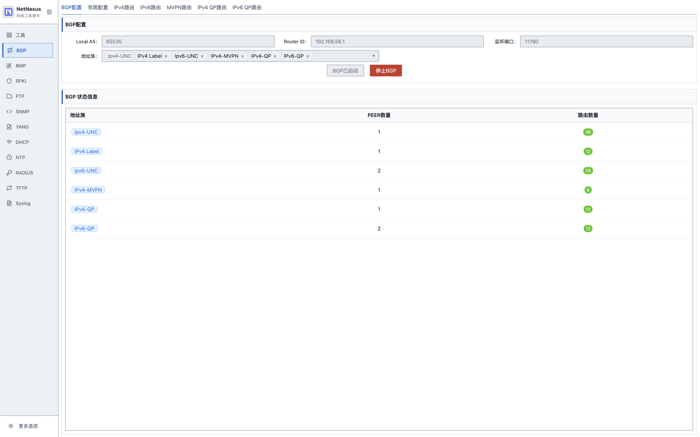

按钮说明：

| 按钮 | 功能 |
| --- | --- |
| 启动BGP / BGP已启动 | 按当前 Local AS、Router ID、监听端口和地址族启动 BGP 服务；启动后按钮进入禁用状态。 |
| 停止BGP | 停止当前 BGP 服务并关闭已建立的本地会话。 |

主要字段：

- Local AS。
- Router ID。
- 监听端口，默认 `179`，本地联调可改用高位端口。
- 地址族能力。

### 对等体配置

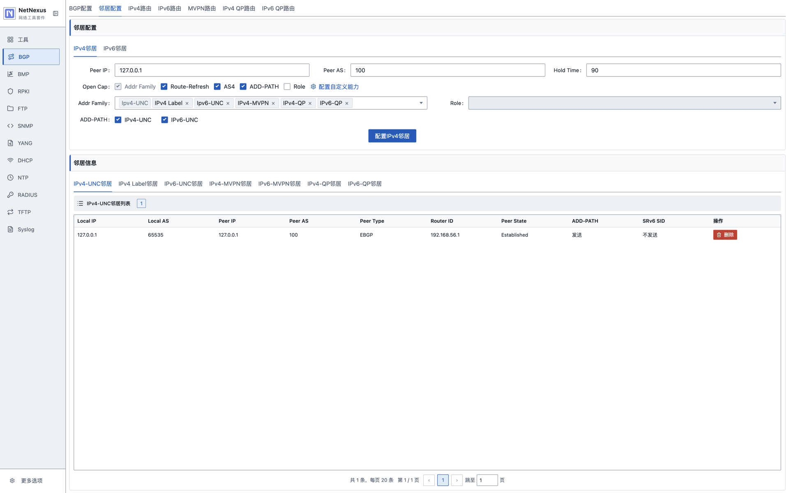

按钮说明：

| 按钮 | 功能 |
| --- | --- |
| 添加邻居 | 新增 IPv4 或 IPv6 BGP peer 配置。 |
| 编辑 | 修改已有 peer 的 AS、地址族、能力或自定义 Open 能力。 |
| 删除 | 删除对应 peer 配置。 |
| 自定义能力 | 打开 BGP Open 自定义 Capability 编辑区域。 |

支持配置 IPv4 / IPv6 peer，并查看 peer 状态。实际会话能否建立取决于对端地址、AS、端口、网络连通性和对端策略。

对等体亮点：

- `ADD-PATH` 可按 IPv4-UNC、IPv6-UNC、IPv4-MVPN、IPv6-MVPN、IPv4-QP、IPv6-QP 等地址族单独打开。
- `SRv6 SID` 可按地址族声明 Prefix-SID 能力，便于和支持 SRv6 的对端做能力协商。
- 自定义 Open Capability 可用于构造实验性 Capability、私有 Capability 或边界兼容性测试。

### 路由管理

IPv4 单播路由：

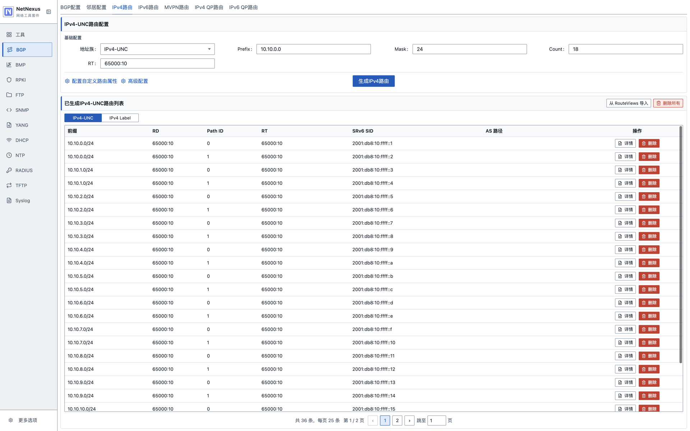

高级配置弹窗：

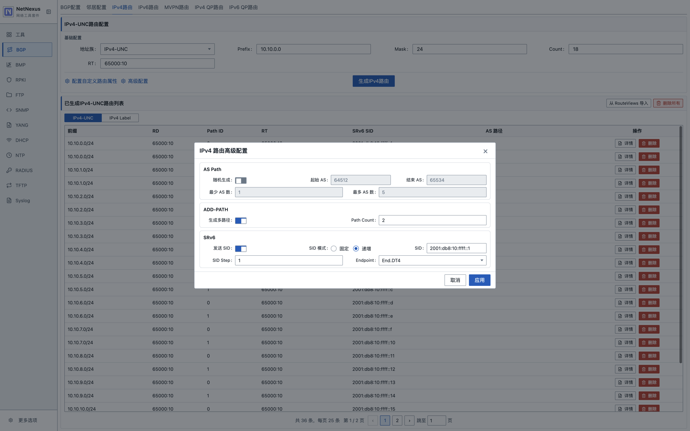

按钮说明：

| 按钮 | 功能 |
| --- | --- |
| 生成路由 | 按页面输入的前缀、数量和属性批量生成 IPv4 路由。 |
| 删除路由 | 删除匹配条件下的 IPv4 路由。 |
| 导入 RouteViews | 从 MRT 文件导入 IPv4 路由数据。 |
| 自定义属性 | 打开路由属性编辑抽屉，配置 AS Path、Community 等自定义属性。 |
| 详情 | 打开单条路由的 NLRI、下一跳和属性详情。 |

IPv4 单播路由支持：

- 随机 AS Path：可设置起始/结束 AS，以及最少/最多 AS 个数；每条路由会同时随机路径长度和路径中的 AS。IPv4/IPv6 单播、Label、MVPN 和 QP 路由统一支持。
- IPv4 高级配置：ADD-PATH、SRv6 和随机 AS Path 收纳到高级配置弹层，主页面保留常用基础字段，为路由表释放更多显示空间。
- Add-Path 批量生成：开启后按 `Add-Path数量` 为同一前缀生成多条路径，列表通过 `pathId` 区分。
- SRv6 SID：可选择固定或递增 SID，并设置 End.DT4、End.DX4、End.DT46 Endpoint 行为。
- Label Unicast：切换到 IPv4 Label 地址族后可配置标签起始值和步长。

IPv4 单播路由详情：

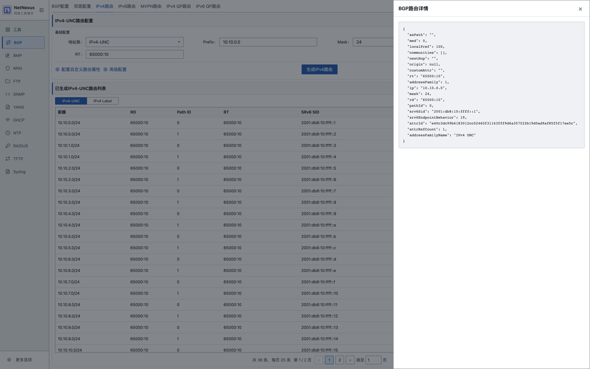

IPv6 单播路由：

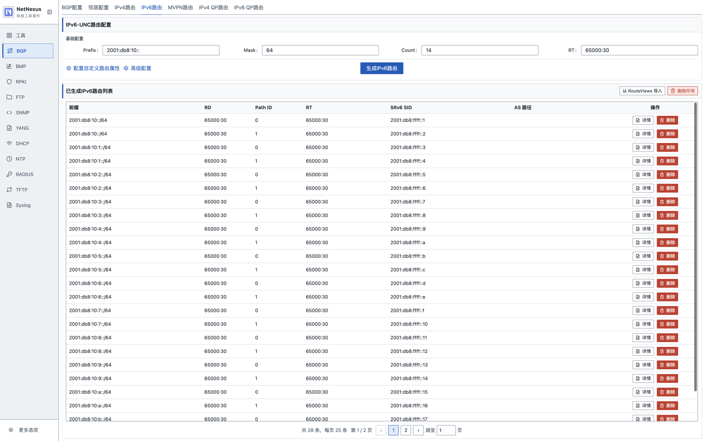

按钮说明：

| 按钮 | 功能 |
| --- | --- |
| 生成路由 | 按页面输入的 IPv6 前缀、数量和属性批量生成路由。 |
| 删除路由 | 删除匹配条件下的 IPv6 路由。 |
| 导入 RouteViews | 从 MRT 文件导入 IPv6 路由数据。 |
| 自定义属性 | 打开 IPv6 路由属性编辑抽屉。 |
| 详情 | 打开单条 IPv6 路由详情。 |

IPv6 单播路由支持：

- Add-Path 批量生成和 `pathId` 展示。
- SRv6 SID 固定或递增生成。
- End.DT6、End.DX6、End.DT46 Endpoint 行为配置。

IPv6 单播路由详情：

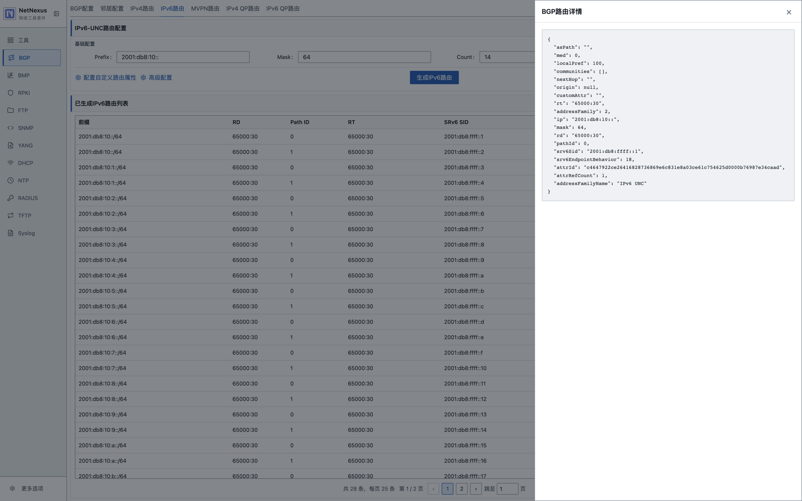

IPv4 MVPN 路由：

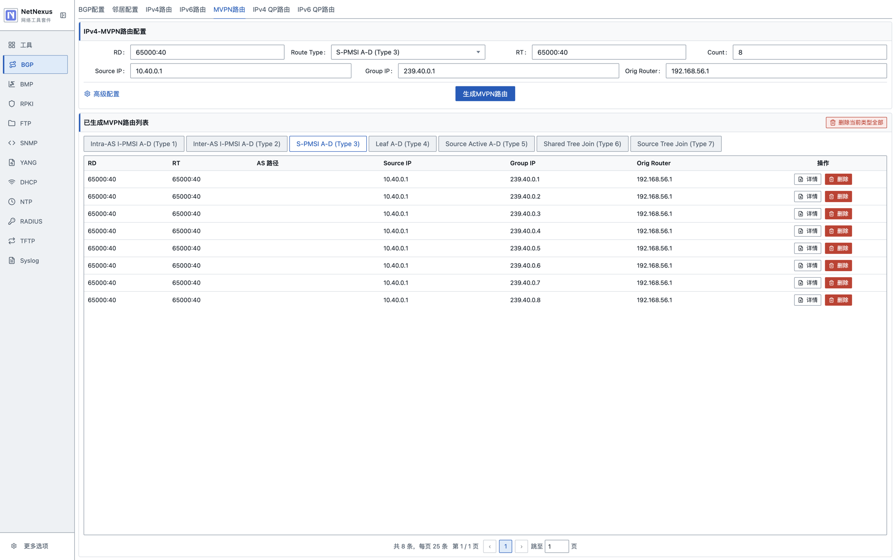

按钮说明：

| 按钮 | 功能 |
| --- | --- |
| 生成路由 | 按所选 MVPN Route Type 和 RD/AS/Source/Group 等字段生成 MVPN 路由。 |
| 删除路由 | 删除匹配条件下的 MVPN 路由。 |
| 详情 | 打开单条 MVPN 路由详情，查看 Route Type、NLRI 和扩展属性。 |

IPv4 MVPN 路由详情：

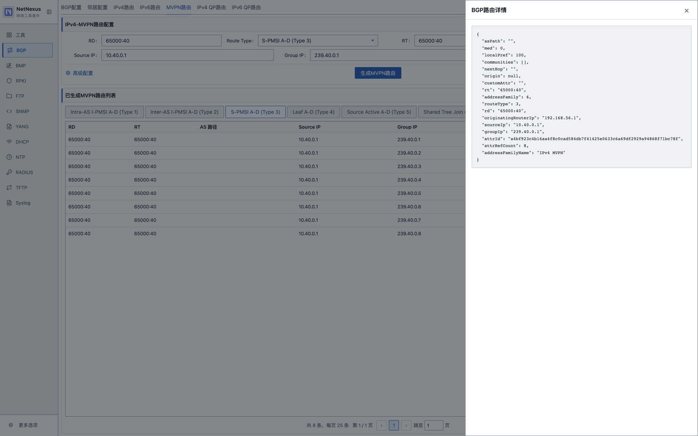

IPv4 QP 路由：

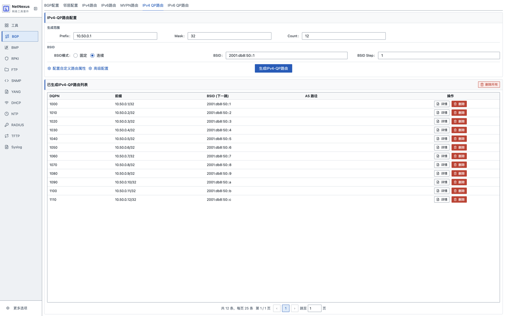

QP 高级配置弹窗：

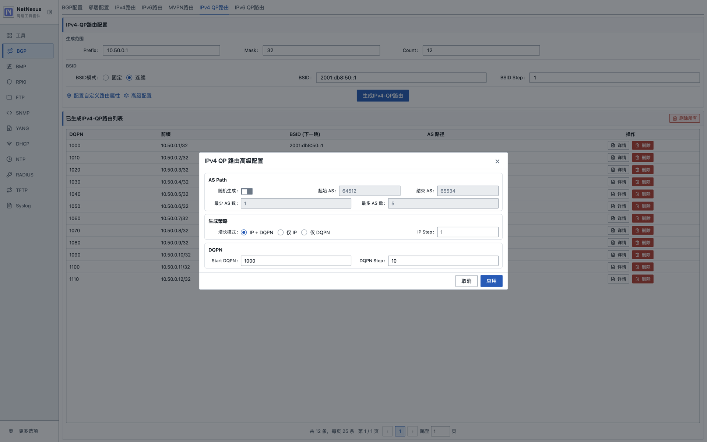

按钮说明：

| 按钮 | 功能 |
| --- | --- |
| 生成路由 | 生成 IPv4 QP 路由，并按配置附带 BSID、SRv6 或标签等信息。 |
| 删除路由 | 删除匹配条件下的 IPv4 QP 路由。 |
| 自定义属性 | 打开 QP 路由属性编辑抽屉。 |
| 详情 | 打开单条 IPv4 QP 路由详情。 |

IPv4 QP 路由详情：

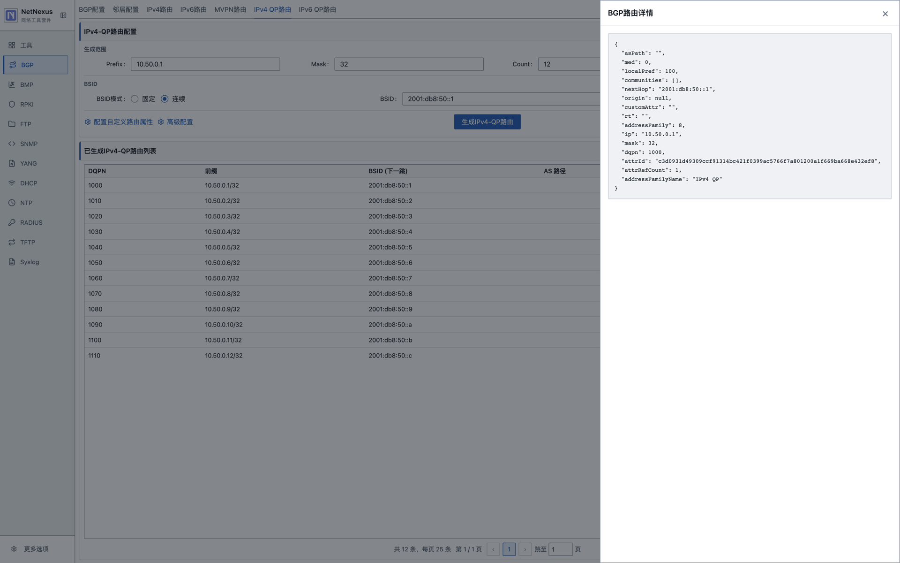

QP 主界面保留 Prefix、Mask、Count、RT、Next Hop 和 BSID 等常用字段；AS Path 随机生成、IP/DQPN 增长策略等低频参数统一在高级配置弹窗中设置。弹窗中的配置只属于当前路由页面，不受主界面生成模式联动影响。

IPv6 QP 路由：

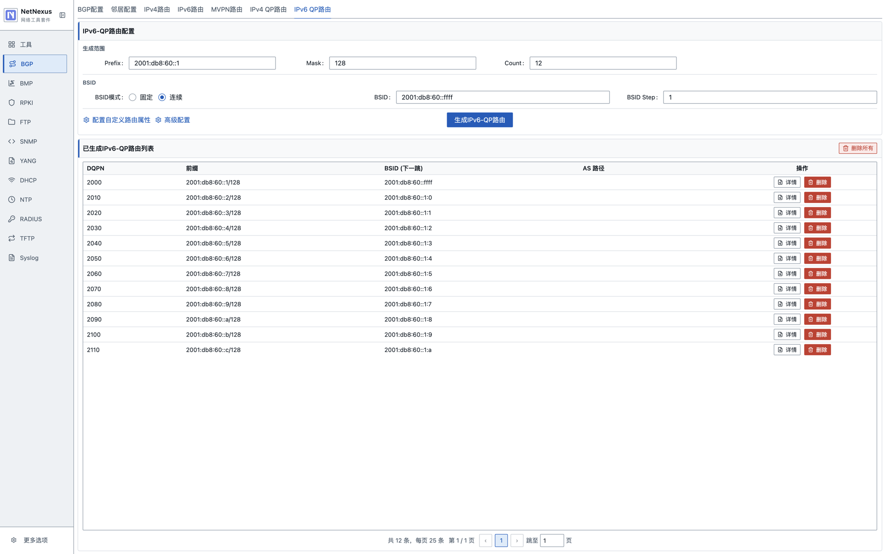

按钮说明：

| 按钮 | 功能 |
| --- | --- |
| 生成路由 | 生成 IPv6 QP 路由，并按配置附带 BSID、SRv6 或标签等信息。 |
| 删除路由 | 删除匹配条件下的 IPv6 QP 路由。 |
| 自定义属性 | 打开 QP 路由属性编辑抽屉。 |
| 详情 | 打开单条 IPv6 QP 路由详情。 |

IPv6 QP 路由详情：

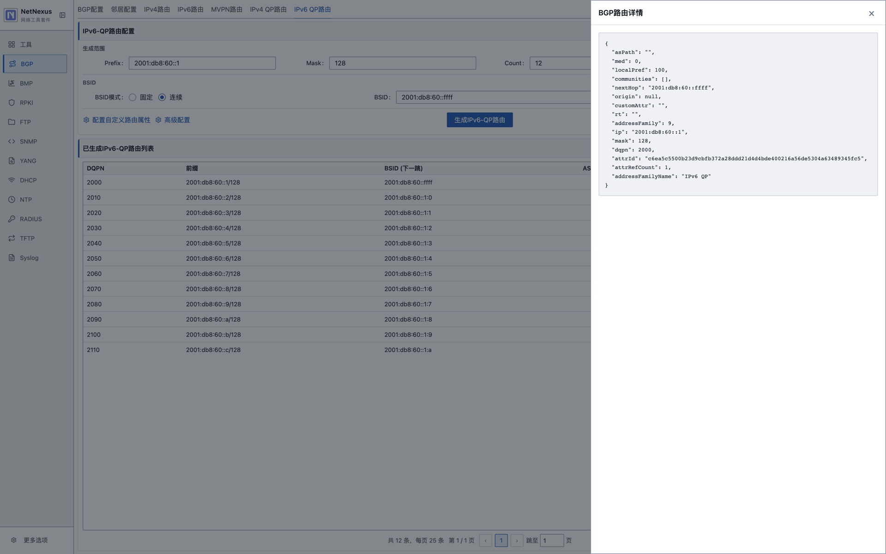

当前路由页面：

- IPv4 单播。
- IPv6 单播。
- IPv4 MVPN。
- IPv4 QP。
- IPv6 QP。

IPv4 / IPv6 单播支持批量生成、删除、分页查看、RouteViews 导入、Add-Path 和 SRv6 SID。QP 路由支持 BSID 连续生成，MVPN 路由支持 S-PMSI A-D 等 Route Type 的 NLRI 字段构造。

### 自定义属性

Open 消息支持自定义能力字段，路由生成支持自定义路由属性。该能力通过页面按钮打开编辑抽屉。

## 使用步骤

1. 进入 `BGP模拟器`。
2. 在 `BGP配置` 中设置 Local AS、Router ID、监听端口和地址族。
3. 启动 BGP 服务。
4. 在对等体页面配置 peer。
5. 在对应路由页面生成或导入路由。
6. 在 peer 和路由列表中观察状态。

## RouteViews 导入

RouteViews 导入用于把本地 MRT 文件转换为 BGP 路由数据。页面会读取项目内置默认文件或用户选择的 MRT 文件。

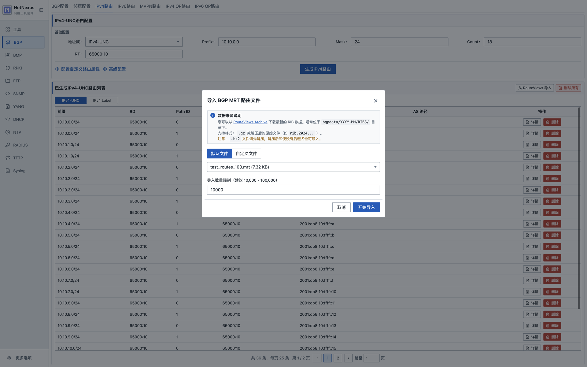

注意：

- 大文件导入会占用 CPU 和磁盘 IO。
- 导入结果受当前地址族和过滤参数影响。
- 导入不是在线同步，不会自动更新 RouteViews 数据。

## 注意事项

- 低位端口或被占用端口可能导致服务启动失败。
- 大量批量路由生成会增加内存、文件和事件处理压力。
- debug/info 日志会显著放大高频路由操作的 IO 开销。

## 常见问题

**Q: BGP 会话无法建立怎么办？**  
A: 检查本地服务是否启动、peer 地址和 AS 是否匹配、端口是否开放、对端是否允许连接。

**Q: 如何查看生成的路由？**  
A: 进入对应地址族路由页面，使用列表和详情查看。

**Q: 是否支持所有 BGP 地址族？**  
A: 地址族范围以当前页面列出的 IPv4/IPv6 单播、IPv4 MVPN、IPv4/IPv6 QP 为准。
