# BGP 模拟器

BGP 模拟器用于在本机启动 BGP 服务，配置对等体并生成测试路由。它适合协议联调、页面验证和实验场景，覆盖 VPNv4、VPNv6、EVPN、Add-Path、SRv6 SID、MVPN、QP 和自定义 BGP 属性等高级能力。

## 已实现能力

- BGP 服务启动和停止。
- Local AS、Router ID、监听端口、地址族能力配置。
- IPv4 / IPv6 对等体配置。
- 对等体按地址族开启 Add-Path，并在路由列表中展示 `pathId`。
- 对等体按地址族开启 SRv6 Prefix-SID 能力。
- 对等体状态查看。
- 向已建立的 IPv4 / IPv6 对等体发送原始 BGP 十六进制报文。
- IPv4 / IPv6 单播路由生成、删除、分页查看、Add-Path 批量生成和 SRv6 SID 下发。
- VPNv4 / VPNv6 邻居协商及带 RD、MPLS 标签的路由构造、发送和撤销。
- EVPN 邻居协商及 Type 1–5 路由构造，支持 MPLS、VXLAN/VNI 和 SRv6 Service SID。
- IPv4 MVPN 路由生成和删除。
- IPv4 / IPv6 QP 路由生成和删除。
- RouteViews MRT 文件导入。
- 路由详情查看。
- BGP Open 自定义能力和路由自定义属性。

## 页面

### BGP 配置

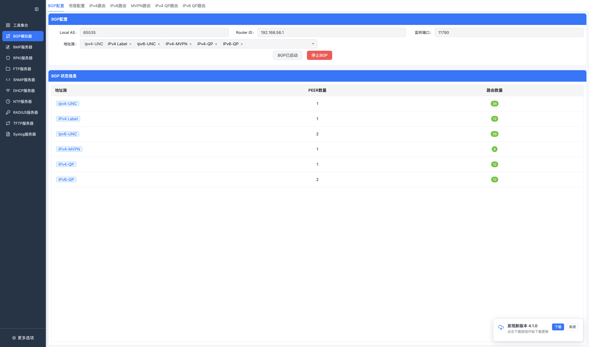

按钮说明：

| 按钮 | 功能 |
| --- | --- |
| 启动BGP / BGP已启动 | 按当前 Local AS、Router ID、监听端口和地址族启动 BGP 服务；启动后按钮进入禁用状态。 |
| 停止BGP | 停止当前 BGP 服务并关闭已建立的本地会话。 |

主要字段：

- Local AS。
- Router ID。
- 监听端口，默认 `179`。Linux `.deb` 安装/升级时会自动授予 NetNexus `CAP_NET_BIND_SERVICE`，因此普通用户可以直接监听标准 BGP 端口；源码运行需要按[开发与运行](DEVELOPMENT.md#安装和启动)完成一次 capability 配置。
- 地址族能力。

### 对等体配置

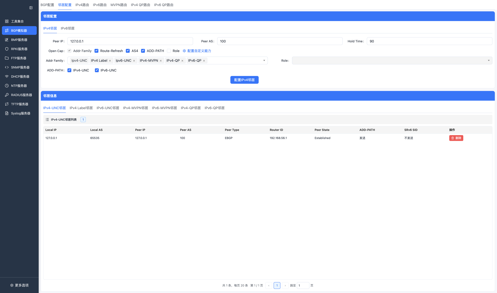

按钮说明：

| 按钮 | 功能 |
| --- | --- |
| 添加邻居 | 新增 IPv4 或 IPv6 BGP peer 配置。 |
| 编辑 | 修改已有 peer 的 AS、地址族、能力或自定义 Open 能力。 |
| 删除 | 删除对应 peer 配置。 |
| 自定义能力 | 打开 BGP Open 自定义 Capability 编辑区域。 |
| 发送原始报文 | 向对应 IPv4 / IPv6 邻居发送完整 BGP 十六进制报文，仅在 Established 状态可用。 |

支持配置 IPv4 / IPv6 peer，并查看 peer 状态。实际会话能否建立取决于对端地址、AS、端口、网络连通性和对端策略。

VPNv4、VPNv6 和 EVPN 均可使用 IPv4 或 IPv6 TCP 邻居。在 BGP 配置和邻居配置中同时启用目标地址族；对端未声明对应 MP-BGP 能力时，该地址族显示 `No Neg`，不会发送该族路由。

原始报文发送：

1. 等待目标邻居状态变为 `Established`，点击该行的“发送原始报文”。
2. 粘贴包含 19 字节 BGP 报文头的完整十六进制内容，可使用空格、换行分隔，也可连续粘贴多条完整 BGP 报文。不要包含 Ethernet、IP、TCP 头或抓包偏移列。
3. 点击发送。系统校验十六进制格式、Marker、类型和报文长度；单条报文最多 4096 字节。通过校验后，字节内容保持原样写入所选邻居的现有 TCP 连接，可用于 IPv4 UPDATE 和 IPv6 MP-BGP UPDATE 等报文。

发送时会再次检查会话状态和连接；未建立、已断开或邻居已删除时返回错误，不会等待重连后补发。报文不加入本地路由表，也不会重写属性或下一跳。发送成功表示本地连接完成写入，对端是否接受由其协议校验和策略决定。

对等体亮点：

- `ADD-PATH` 可按 IPv4-UNC、IPv6-UNC、IPv4-MVPN、IPv6-MVPN、IPv4-QP、IPv6-QP 等地址族单独打开。
- `SRv6 SID` 可按地址族声明 Prefix-SID 能力，便于和支持 SRv6 的对端做能力协商。
- 自定义 Open Capability 可用于构造实验性 Capability、私有 Capability 或边界兼容性测试。

### 路由管理

IPv4 单播路由：

`IPv4-UNC路由` 和 `IPv4 Label路由` 分为两个顶部 Tab，分别管理路由组、配置和列表。打开页面时，旧版混合工作区中的路由组会按地址族恢复到对应 Tab，保留组名和配置。

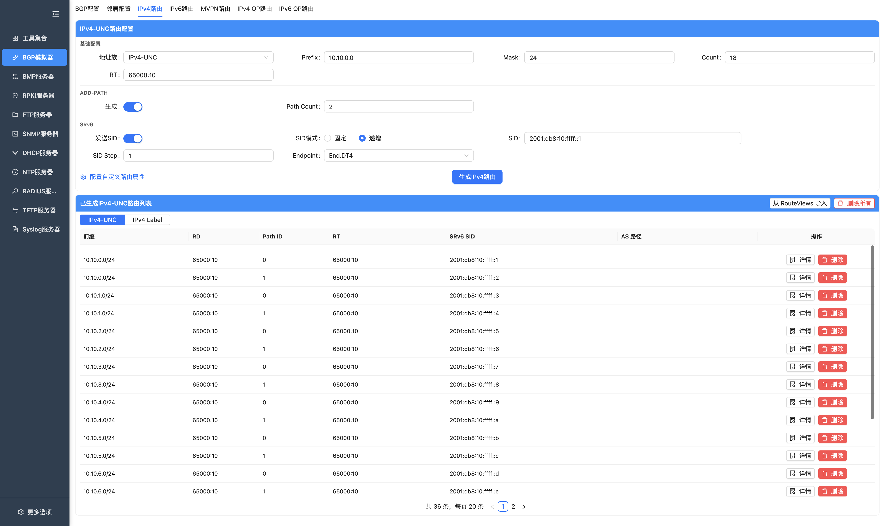

高级配置弹窗：

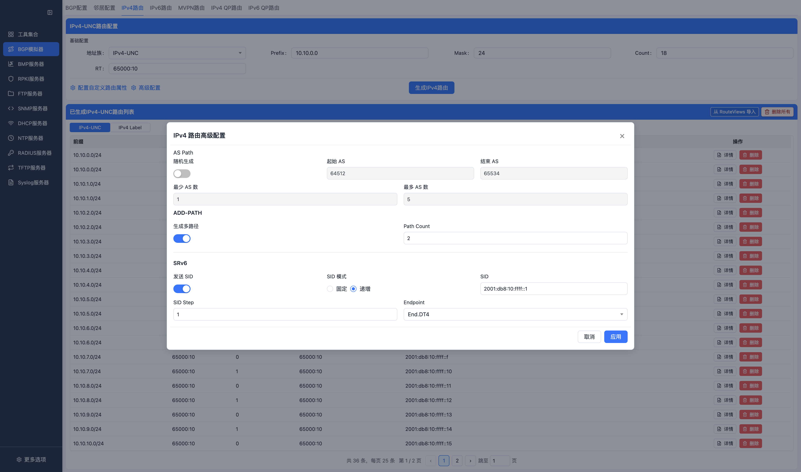

按钮说明：

| 按钮 | 功能 |
| --- | --- |
| 生成路由 | 按页面输入的前缀、数量和属性批量生成 IPv4 路由。 |
| 删除路由 | 删除匹配条件下的 IPv4 路由。 |
| 导入 RouteViews | 从 MRT 文件导入 IPv4 路由数据。 |
| 自定义属性 | 打开路由属性编辑抽屉，配置 AS Path、Community 等自定义属性。 |
| 详情 | 打开单条路由的 NLRI、下一跳和属性详情。 |

IPv4 单播路由支持：

- 随机 AS Path：可设置起始/结束 AS，以及最少/最多 AS 个数；每条路由会同时随机路径长度和路径中的 AS。IPv4/IPv6 单播、Label、MVPN 和 QP 路由统一支持。
- IPv4 高级配置：ADD-PATH、SRv6 和随机 AS Path 收纳到高级配置弹层，主页面保留常用基础字段，为路由表释放更多显示空间。
- Add-Path 批量生成：开启后按 `Add-Path数量` 为同一前缀生成多条路径，列表通过 `pathId` 区分。
- SRv6 SID：可选择固定或递增 SID，并设置 End.DT4、End.DX4、End.DT46 Endpoint 行为。
- Label Unicast：在 `IPv4 Label路由` Tab 中配置标签起始值和步长；路由使用 MP-BGP 编码。RouteViews 导入位于 `IPv4-UNC路由` Tab，两页均支持 MRT 导出。

IPv4 单播路由详情：

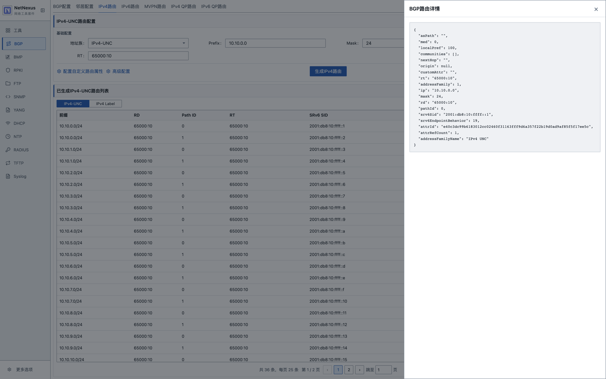

IPv6 单播路由：

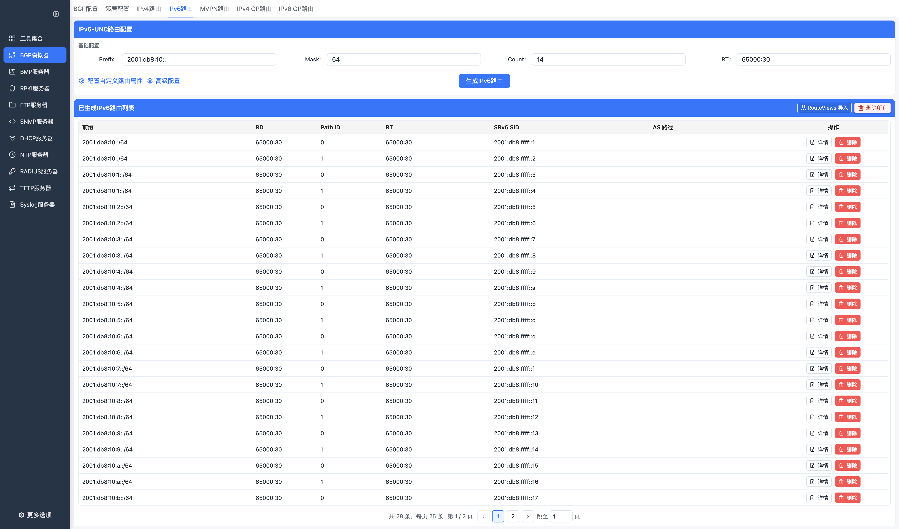

按钮说明：

| 按钮 | 功能 |
| --- | --- |
| 生成路由 | 按页面输入的 IPv6 前缀、数量和属性批量生成路由。 |
| 删除路由 | 删除匹配条件下的 IPv6 路由。 |
| 导入 RouteViews | 从 MRT 文件导入 IPv6 路由数据。 |
| 自定义属性 | 打开 IPv6 路由属性编辑抽屉。 |
| 详情 | 打开单条 IPv6 路由详情。 |

IPv6 单播路由支持：

- Add-Path 批量生成和 `pathId` 展示。
- SRv6 SID 固定或递增生成。
- End.DT6、End.DX6、End.DT46 Endpoint 行为配置。

IPv6 单播路由详情：

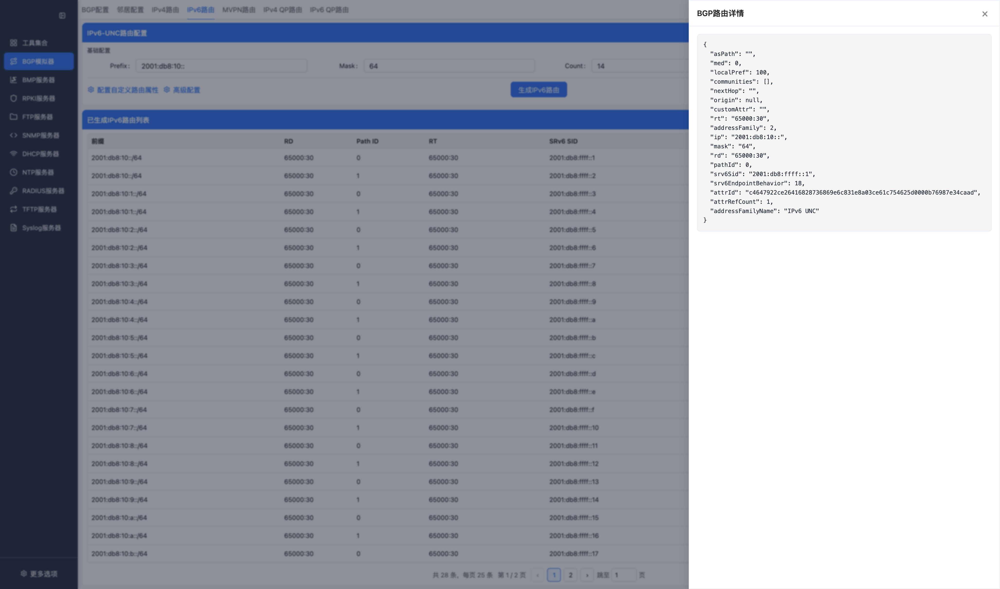

### VPNv4 / VPNv6 / EVPN 路由

进入对应路由页，在路由组编辑器中设置 NLRI 和属性，然后生成路由。已建立并协商对应地址族的邻居会收到 `MP_REACH_NLRI`；删除单条、撤销路由组或删除全部时发送 `MP_UNREACH_NLRI`。路由组配置和已生成路由分别保存，可在重启后恢复。

- VPNv4 / VPNv6：在 NLRI 下选择必选的 RD 或 MPLS Label 节点，分别配置固定值、递增、随机或值列表；这两个节点不能删除或重复添加。RD 支持 `65000:1` 或 `192.0.2.1:1`；递增和随机模式分别设置 ASN/IPv4 管理员及后半部分数值。标签范围为 `0–1048575`。前缀、掩码、数量和 IP 步长在 NLRI 路由范围中配置；不同 RD 可使用相同前缀。
- EVPN：支持 Type 1（Ethernet A-D）、Type 2（MAC/IP）、Type 3（IMET）、Type 4（Ethernet Segment）和 Type 5（IP Prefix）。RD 在 NLRI 下配置，支持固定、递增、随机和值列表，不能删除或重复添加。编辑器按类型显示 ESI、Ethernet Tag、MAC、IP、网关和源路由器地址等字段。
- EVPN 封装：选择 MPLS、VXLAN 或 SRv6。MPLS Label、VXLAN VNI（`0–16777215`）分别作为必选 NLRI 节点，支持四种生成方式；Type 2 可添加可选的第二个标签/VNI。切换封装或 Route Type 后仅保留适用节点。VXLAN 自动附加对应 Encapsulation 扩展团体，Type 3 自动附加 Ingress Replication PMSI Tunnel 属性。
- SRv6：Type 1/2 使用 L2 Service SID，Type 3 使用 L2 SID / End.DT2M，Type 5 使用 L3 Service SID；带 IP 的 Type 2 可追加 L3 SID。SID 支持固定、递增和值列表，必选节点不能删除。按 [RFC 9252](https://www.rfc-editor.org/rfc/rfc9252.html#section-6) 编码 Prefix-SID 属性，二层和三层 SID 聚合在同一个属性中。Type 4 不携带转发标签、VNI 或 SID。
- SRv6 当前使用完整 SID，转置长度和偏移均为 `0`，Argument Length 为 `0`；SID 结构之外的尾位须为零。Type 1 per-ES（Ethernet Tag `4294967295`）使用 Local Bias：SID `::` / End.DT2M、IPv4 格式 RD（后半部分非零）及非零 ESI。非零 ESI Filtering ARG 和 SID 转置暂不支持；结构约束遵循 [RFC 9819](https://www.rfc-editor.org/rfc/rfc9819.html)。
- Type 1 per-ES 的 MPLS Label / VXLAN VNI 固定为 `0`，RD 使用 IPv4 管理员且后半部分非零，ESI 不能全零。Type 4 使用 IPv4 格式 RD（如 `192.0.2.1:1`）和 ES-Import RT。ESI Type 1/2/3 可自动推导 ES-Import；其他 ESI 类型需填写 6 字节值（如 `02:00:00:00:00:01`）。Type 5 的 ESI 和 Gateway IP 不能同时非零。
- 属性树默认包含 RT 和 MP Next Hop，可设置 AS Path、Community、扩展团体和自定义属性。数量按类型递增前缀、MAC、Tag 或源路由器地址；MP Next Hop 可使用本地地址或显式配置。

VPNv6 下一跳使用 8 字节全零 RD 加 IPv6 地址；IPv4 下一跳转换为 IPv4-mapped IPv6。VPNv4 使用 IPv6 下一跳时，双方需启用对应地址族的 Extended Next Hop Encoding 能力；未协商时保留本地路由，但不向该邻居发送。EVPN SRv6 的 MP Next Hop 必须使用 IPv6 地址；IPv4 TCP 邻居可通过固定 IPv6 下一跳发送。当前这三个地址族不支持 Add-Path，VPNv4 / VPNv6 不支持 SRv6 属性节点。

BGP 路由数据库 schema 6 自动升级到 schema 7，保留既有路由和路由组，并增加 EVPN NLRI 字段存储。更早的主版本仍需按应用提示处理数据库版本兼容性。

### IPv4 MVPN 路由

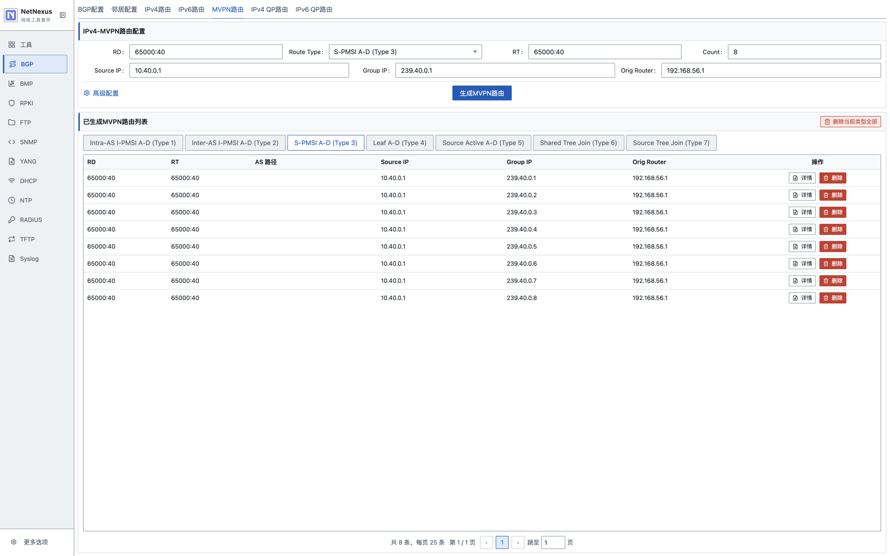

按钮说明：

| 按钮 | 功能 |
| --- | --- |
| 生成路由 | 按所选 MVPN Route Type 和 RD/AS/Source/Group 等字段生成 MVPN 路由。 |
| 删除路由 | 删除匹配条件下的 MVPN 路由。 |
| 详情 | 打开单条 MVPN 路由详情，查看 Route Type、NLRI 和扩展属性。 |

IPv4 MVPN 路由详情：

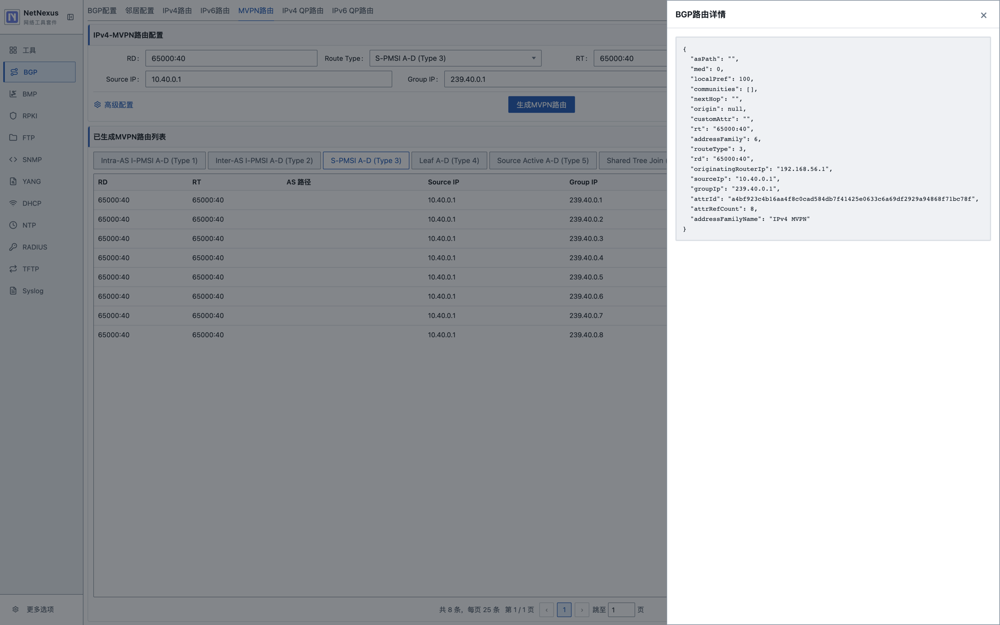

IPv4 QP 路由：

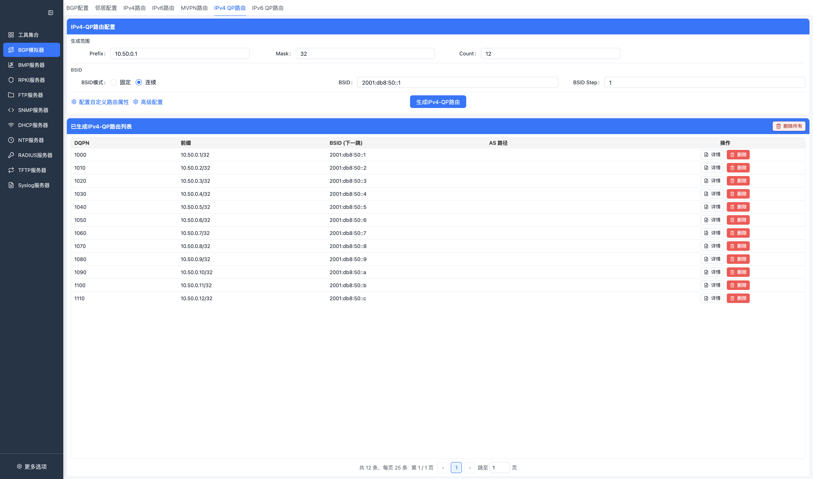

QP 高级配置弹窗：

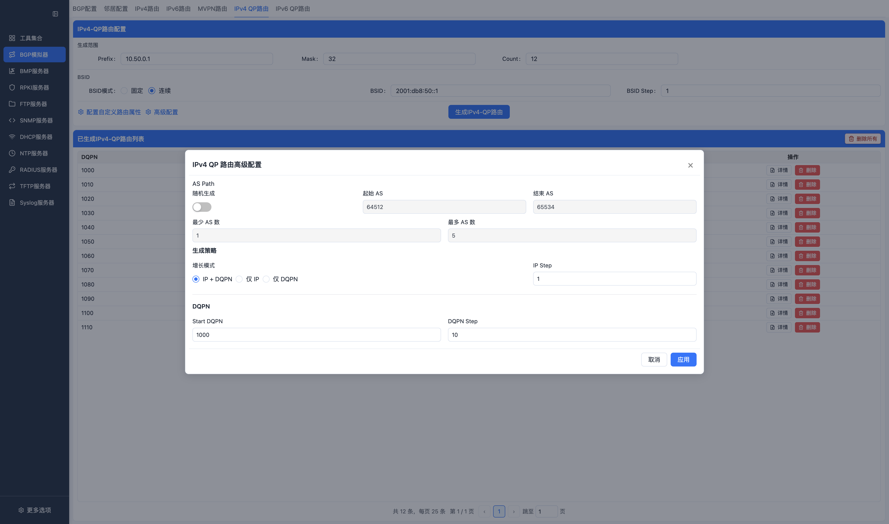

按钮说明：

| 按钮 | 功能 |
| --- | --- |
| 生成路由 | 生成 IPv4 QP 路由，并按配置附带 BSID、SRv6 或标签等信息。 |
| 删除路由 | 删除匹配条件下的 IPv4 QP 路由。 |
| 自定义属性 | 打开 QP 路由属性编辑抽屉。 |
| 详情 | 打开单条 IPv4 QP 路由详情。 |

IPv4 QP 路由详情：

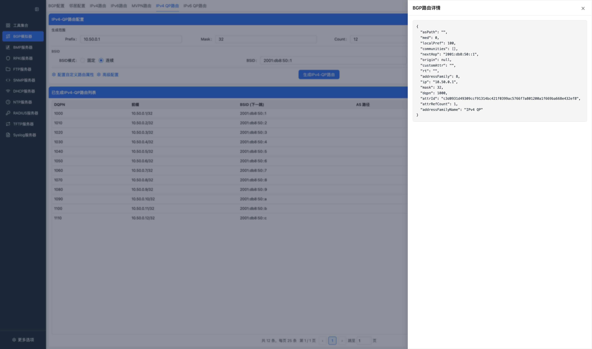

QP 主界面保留 Prefix、Mask、Count、RT、Next Hop 和 BSID 等常用字段；AS Path 随机生成、IP/DQPN 增长策略等低频参数统一在高级配置弹窗中设置。弹窗中的配置只属于当前路由页面，不受主界面生成模式联动影响。

IPv6 QP 路由：

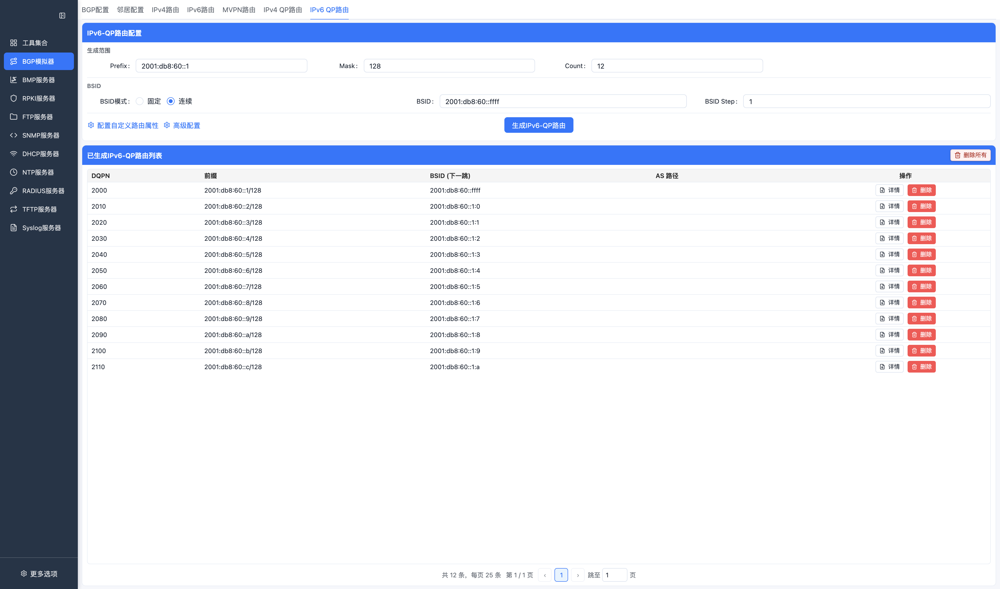

按钮说明：

| 按钮 | 功能 |
| --- | --- |
| 生成路由 | 生成 IPv6 QP 路由，并按配置附带 BSID、SRv6 或标签等信息。 |
| 删除路由 | 删除匹配条件下的 IPv6 QP 路由。 |
| 自定义属性 | 打开 QP 路由属性编辑抽屉。 |
| 详情 | 打开单条 IPv6 QP 路由详情。 |

IPv6 QP 路由详情：

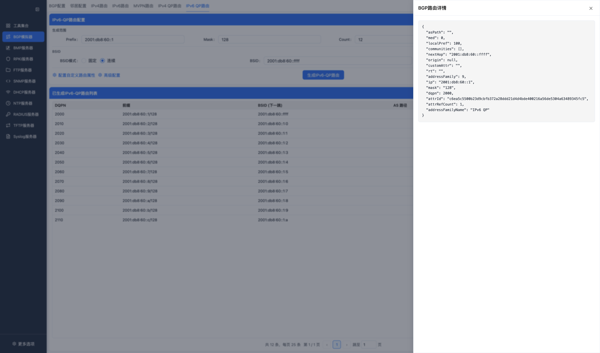

当前路由页面：

- IPv4-UNC 单播。
- IPv4 Label。
- IPv6 单播。
- VPNv4。
- VPNv6。
- EVPN。
- IPv4 MVPN。
- IPv4 QP。
- IPv6 QP。

IPv4 / IPv6 单播支持批量生成、删除、分页查看、RouteViews 导入、Add-Path 和 SRv6 SID。QP 路由支持 BSID 连续生成，MVPN 路由支持 S-PMSI A-D 等 Route Type 的 NLRI 字段构造。

### 自定义属性

Open 消息支持自定义能力字段，路由生成支持自定义路由属性。该能力通过页面按钮打开编辑抽屉。

## 使用步骤

1. 进入 `BGP模拟器`。
2. 在 `BGP配置` 中设置 Local AS、Router ID、监听端口和地址族。
3. 启动 BGP 服务。
4. 在对等体页面配置 peer。
5. 在对应路由页面生成或导入路由。
6. 在 peer 和路由列表中观察状态。

## RouteViews 导入

RouteViews 导入用于把本地 MRT 文件转换为 BGP 路由数据。页面会读取项目内置默认文件或用户选择的 MRT 文件。

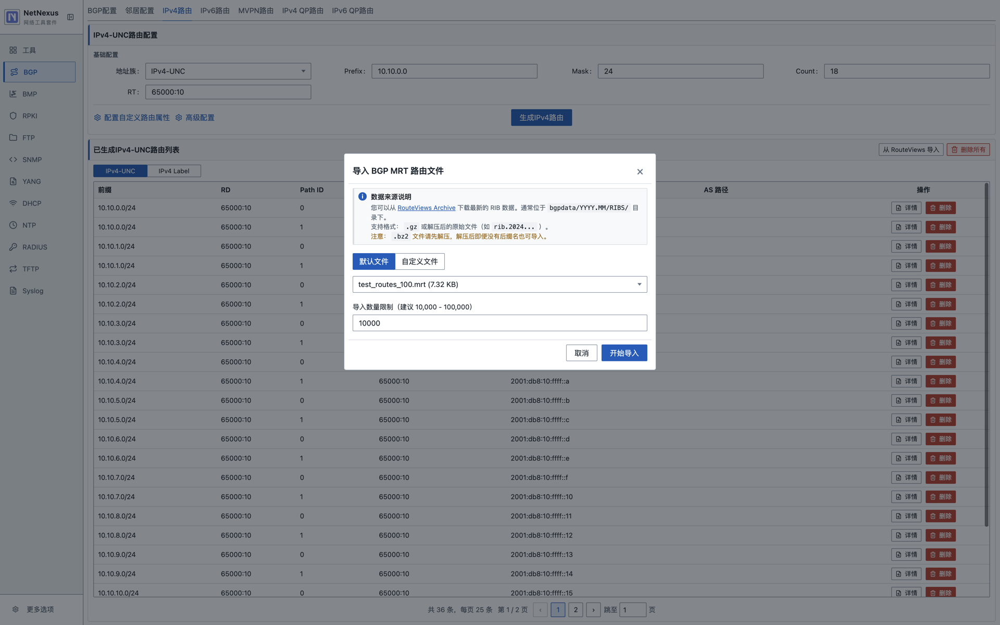

注意：

- 大文件导入会占用 CPU 和磁盘 IO。
- 导入结果受当前地址族和过滤参数影响。
- 导入不是在线同步，不会自动更新 RouteViews 数据。

## 注意事项

- 低位端口或被占用端口可能导致服务启动失败。
- 大量批量路由生成会增加内存、文件和事件处理压力。
- debug/info 日志会显著放大高频路由操作的 IO 开销。

## 常见问题

**Q: BGP 会话无法建立怎么办？**  
A: 检查本地服务是否启动、peer 地址和 AS 是否匹配、端口是否开放、对端是否允许连接。

**Q: 如何查看生成的路由？**  
A: 进入对应地址族路由页面，使用列表和详情查看。

**Q: 是否支持所有 BGP 地址族？**  
A: 地址族范围以当前页面列出的 IPv4/IPv6 单播、VPNv4、VPNv6、EVPN Type 1–5、IPv4 MVPN、IPv4/IPv6 QP 为准。
