# BMP 监控器

BMP 监控器用于接收路由器或测试客户端发送的 BMP 数据，并在本地查看客户端、BGP session、Loc-RIB、路由明细和统计报告。

## 已实现能力

- BMP v3 / v4 报文接收。
- BMPv4 TLV draft-19 / draft-20 可配置。
- Initiation、Termination、Peer Up、Peer Down、Route Monitoring、Statistics Report 处理。
- 客户端连接列表。
- BGP session 列表和 session RIB 路由列表。
- Loc-RIB instance 列表和 Loc-RIB 路由列表。
- BMP 路由按 AFI/SAFI 归类到页面地址组。
- IPv4 / IPv6 单播、VPN、Label Unicast、MVPN、FlowSpec、QP、L2VPN EVPN、BGP-LS、BGP-LS VPN 地址组解析。
- 路由状态过滤：active、stale、all。
- 前缀关键字过滤。
- 路由详情查询。
- BGP 原始报文解析摘要按需查询。
- BMPv4 Path Marking TLV 展示。
- 过期路由清理。
- 只读 HTTP API 查询。

核心亮点：

- 多地址组覆盖：BMP Route Monitoring 和 Loc-RIB 可识别 IPv4-UNC、IPv6-UNC、VPNv4、VPNv6、IPv4/IPv6 Label Unicast、IPv4/IPv6 MVPN、IPv4/IPv6 FlowSpec、IPv4/IPv6 QP、L2VPN EVPN、BGP-LS 和 BGP-LS VPN。
- Add-Path 友好：路由 key 和列表字段包含 `pathId`，同一 RD、前缀、掩码下的多路径可以分开查看。
- BMPv4 TLV：支持 draft-19 / draft-20 切换，Route Monitoring、Statistics Report 和 Path Marking TLV 可在列表或详情中查看。
- Loc-RIB instance：Local-RIB 按 instance 维度拆分，便于查看不同路由表实例的路由与统计项。

## 页面

### BMP 配置和客户端

配置 BMP 监听端口、BMPv4 TLV draft、Path Marking TLV 类型以及可选 MD5 认证参数。页面下方展示当前 BMP 客户端。

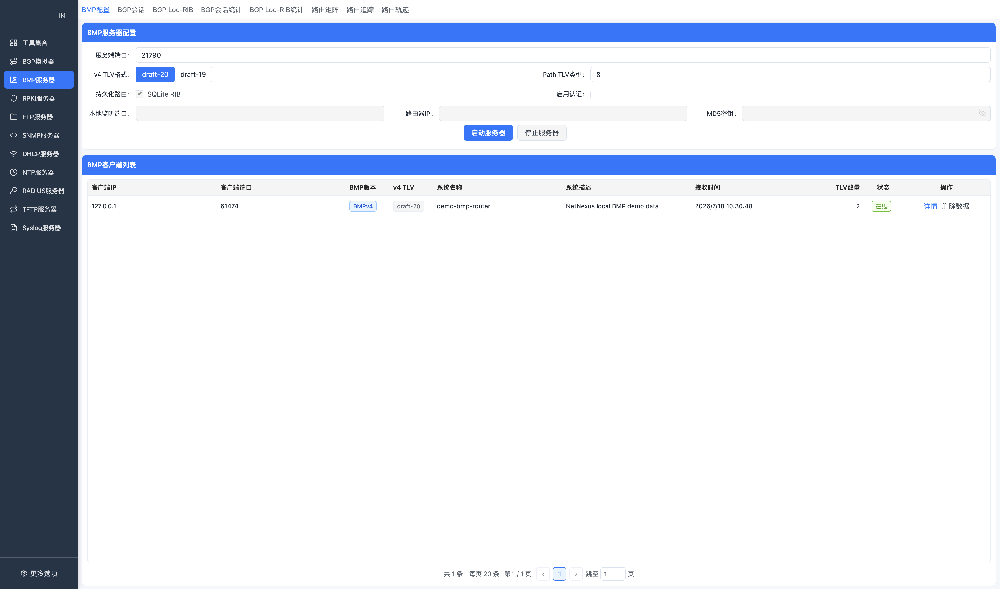

按钮说明：

| 按钮 | 功能 |
| --- | --- |
| 启动BMP / BMP已启动 | 按监听端口、TLV draft 和 MD5 参数启动 BMP 服务；启动后显示运行状态。 |
| 停止BMP | 停止 BMP 服务并断开当前客户端连接。 |
| 详情 | 打开当前 BMP 客户端的连接、Initiation TLV 和 Termination 信息。 |

客户端详情：

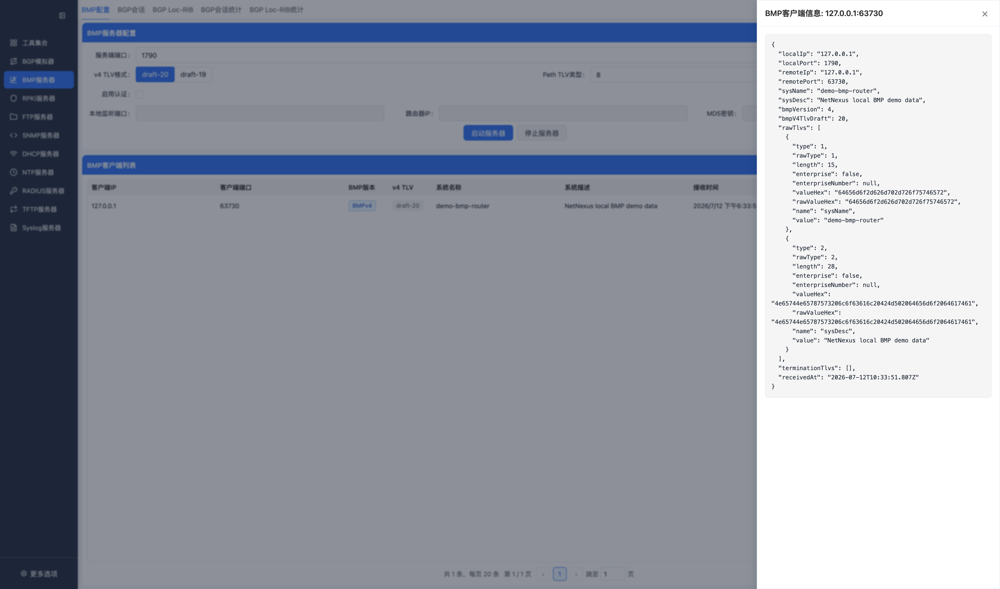

注意：

- `draft-20` 的 Route Monitoring `BGP Message TLV` 类型为 `7`。
- `draft-19` 的 Route Monitoring `BGP Message TLV` 类型为 `4`。
- 如果发送端的 draft 与页面配置不一致，日志可能出现 `does not contain mandatory BGP Message TLV`。

### BGP Session

展示指定 BMP 客户端下的 BGP peer session，以及 session RIB 路由。

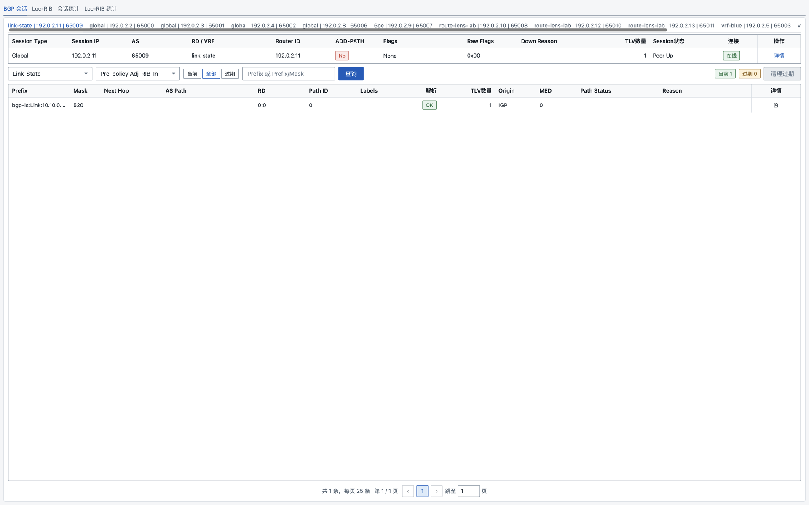

按钮说明：

| 按钮 | 功能 |
| --- | --- |
| 查询 / 刷新 | 按客户端和过滤条件重新加载 Session 或路由数据。 |
| 详情 | 在 Session 列表中查看 peer 详情；在路由列表中查看单条路由详情。 |
| 解析BGP | 按需解析并展示该路由携带的原始 BGP 报文摘要。 |
| 清理 stale | 清理当前过滤范围内的 stale 路由。 |

Session 详情：

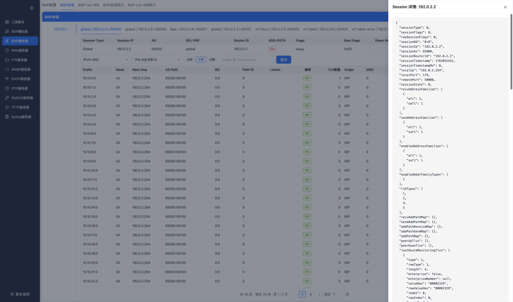

Session RIB 路由详情：

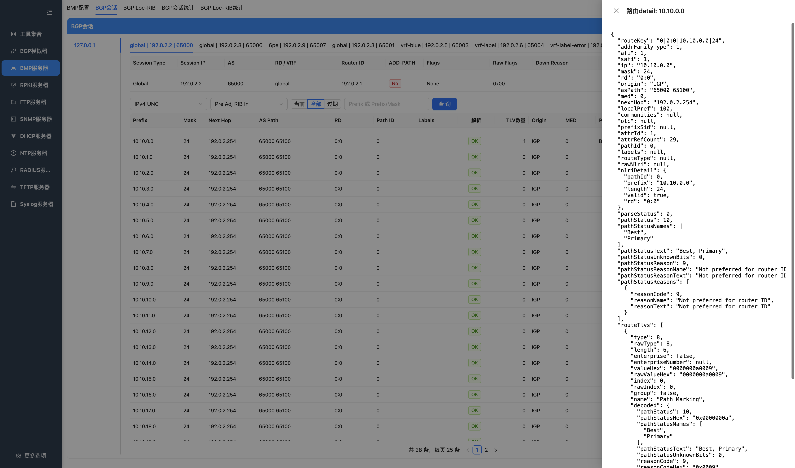

路由列表包含地址组、`pathId`、`rd`、前缀、掩码、下一跳、AS Path、路由状态等字段。IPv4/IPv6 单播没有携带 RD 时，页面和存储按 `0:0` 处理，避免路由 key 歧义。

路由操作：

- 查询路由详情。
- 查询 BGP 原始报文解析摘要。
- 清理 stale 路由。

Session RIB 适合检查：

- per-peer 的 Adj-RIB-In / Route Monitoring 数据。
- 同一前缀下不同 `pathId` 的 Add-Path 路由。
- VPN、MVPN、QP 等携带 RD 或扩展 NLRI 的地址组。

### Loc-RIB

展示 BMP Local-RIB instance 和 Loc-RIB 路由。

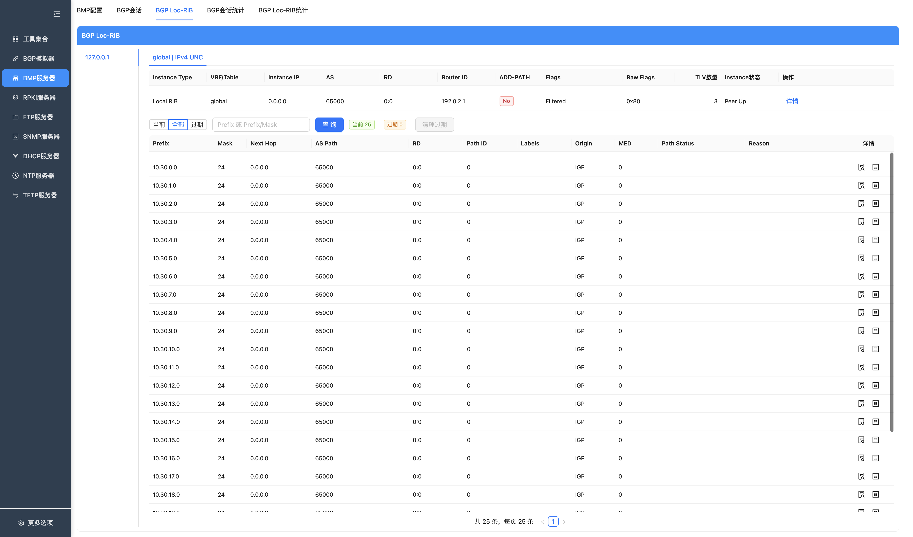

按钮说明：

| 按钮 | 功能 |
| --- | --- |
| 查询 / 刷新 | 按客户端、Instance 和过滤条件重新加载 Loc-RIB 数据。 |
| 详情 | 在 Instance 列表中查看 Loc-RIB instance 详情；在路由列表中查看单条路由详情。 |
| 解析BGP | 按需解析 Loc-RIB 路由携带的原始 BGP 报文摘要。 |
| 清理 stale | 清理当前 Instance 下的 stale Loc-RIB 路由。 |

Loc-RIB instance 详情：

Loc-RIB 路由详情：

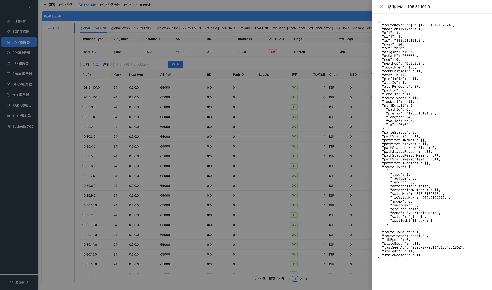

Loc-RIB 使用 instance 维度查询，支持路由列表、路由详情和 stale 路由清理。页面会保留 instance 名称、RD、地址组、`pathId` 和路由状态，便于对比不同 Loc-RIB 实例中的同一前缀。

### 统计报告

统计报告页展示 BMP Statistics Report 当前内存数据：

- session statistics
- Loc-RIB statistics
- BMPv4 TLV 信息
- per-AFI/SAFI 统计项

统计项中的 per-AFI/SAFI 数据用于观察不同地址组的路由量，例如 IPv4/IPv6 单播、VPN、MVPN、QP、EVPN 和 BGP-LS 类路由。

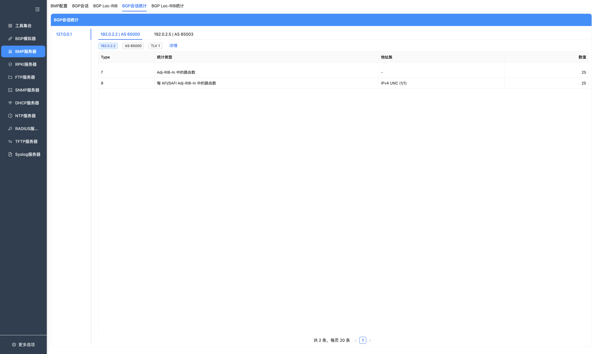

按钮说明：

| 按钮 | 功能 |
| --- | --- |
| 查询 / 刷新 | 重新加载指定客户端的 Session Statistics Report。 |
| 详情 | 打开单条 Statistics Report 详情，查看统计项和 TLV。 |

Session 统计详情：

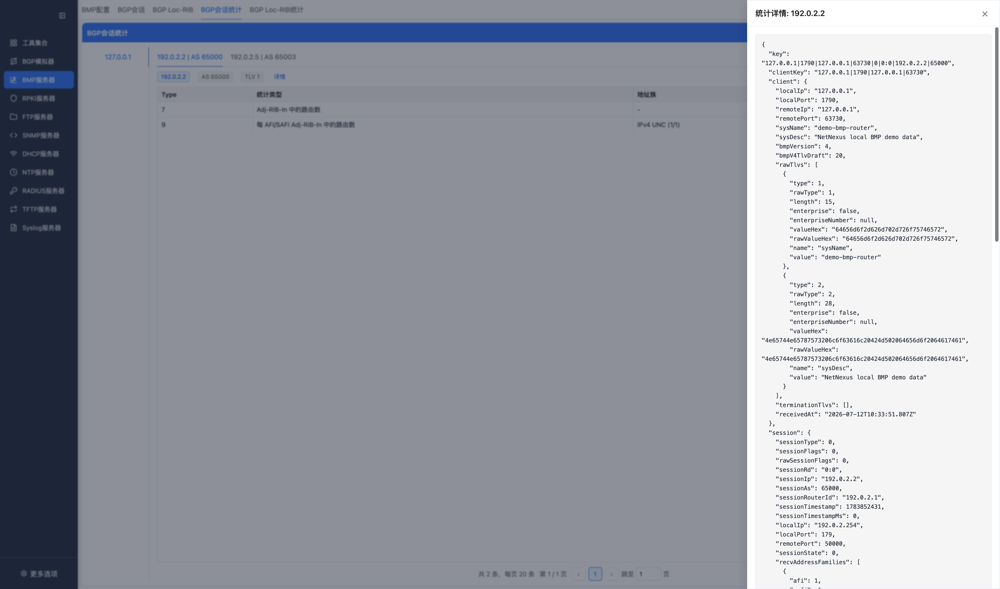

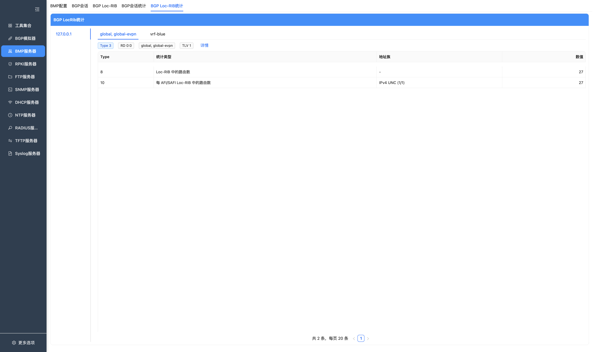

按钮说明：

| 按钮 | 功能 |
| --- | --- |
| 查询 / 刷新 | 重新加载指定客户端和 Instance 的 Loc-RIB Statistics Report。 |
| 详情 | 打开单条 Loc-RIB Statistics Report 详情。 |

Loc-RIB 统计详情：

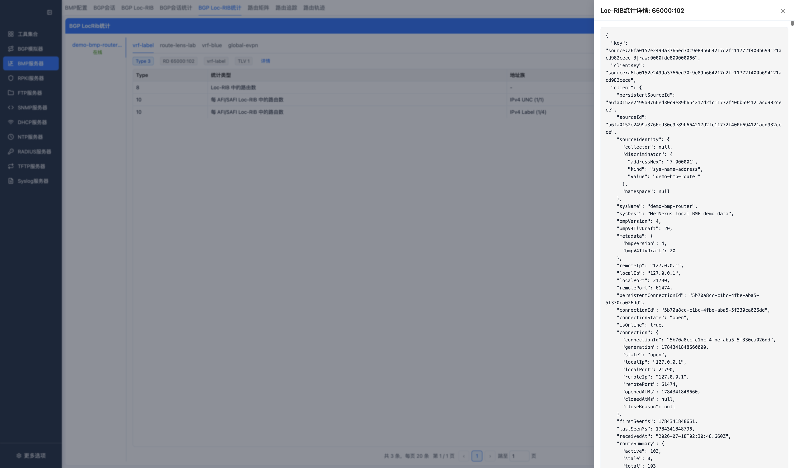

## 外部 API

BMP 查询接口由外部 HTTP API 提供。API 是只读的，不负责启动 BMP 服务。使用前需要在设置页启用 HTTP API，并在 BMP 页面启动 BMP。

详见 [外部 API 文档](API.md)。

## 注意事项

- SQLite 是 BMP RIB 的权威存储；完整路由不再保存在 worker 内存中。数据库表、字段、关联和自动清理规则详见 [BMP SQLite 数据库说明](BMP_SQLITE_DATABASE.md)。
- BMP 客户端断开后会保留为离线节点；Session、Loc-RIB 和未超过保留期的路由可在 BMP 重启后从 SQLite 恢复，并以 stale 状态展示。
- 打开 debug/info 日志时，高频 BMP Route Monitoring 会产生大量日志，可能影响 CPU 和磁盘 IO。
- MD5 认证依赖服务器部署页面中的 TCP MD5 代理能力。
