# BMP 监控器

BMP 监控器用于接收路由器或测试客户端发送的 BMP 数据，并在本地查看客户端、BGP session、Loc-RIB、路由明细和统计报告。

## 先选对页面

这几个页面都在看 BMP 路由，但回答的问题不同。最容易混淆的是“路由追踪”和“路由轨迹”：前者横向比较当前 RIB 阶段，后者纵向还原同一 Scope 内的保留事件。

| 页面 | 最适合回答的问题 | 主要数据范围 | 能否看到已撤销路由 |
| --- | --- | --- | --- |
| BGP 会话 | 某个 Peer、地址族、RIB 阶段当前有哪些路由？ | 一个 Peer Scope 的 current RIB | 不能；入口来自 current route |
| BGP Loc-RIB | 某个 Loc-RIB Instance 当前有哪些路由？ | 一个 Loc-RIB Scope 的 current RIB | 不能；入口来自 current route |
| 路由矩阵 | 当前全局五阶段哪里存在缺口或属性不一致？ | 当前/ stale 路由快照，跨 Scope 分析 | 不能；它不是历史分析 |
| 路由追踪 | 一个 Prefix / NLRI 在 Pre-In 到 Post-Out 各阶段是什么样？ | 当前/ stale 路由，按五阶段横向组装 | 不能；成功撤销后应改查路由轨迹 |
| 路由轨迹 | 这条路由在某个 Scope 内何时宣告、变更、撤销或清理？ | `bmp_route_events` 的保留窗口 | 能，同时也包含仍在 RIB 的路由 |
| 会话/Loc-RIB 统计 | 设备上报的 Statistics Report 当前值是什么？ | Statistics Report 最新投影 | 不适用 |

典型排障顺序是：先在“路由矩阵”发现异常候选，点击“追踪”进入“路由追踪”核对五阶段，再从路由卡片详情打开“事件轨迹”；如果路由已经撤销、无法从 current RIB 打开详情，则直接到“路由轨迹”按 Prefix / NLRI 查询。

## 已实现能力

- BMP v3 / v4 报文接收。
- BMPv4 TLV draft-19 / draft-20 可配置。
- Initiation、Termination、Peer Up、Peer Down、Route Monitoring、Statistics Report 处理。
- 客户端连接列表。
- BGP session 列表和 session RIB 路由列表。
- Loc-RIB instance 列表和 Loc-RIB 路由列表。
- BMP 路由按 AFI/SAFI 归类到页面地址组。
- IPv4 / IPv6 单播、VPN、Label Unicast、MVPN、FlowSpec、QP、L2VPN EVPN、BGP-LS、BGP-LS VPN 地址组解析。
- 路由状态过滤：active、stale、all。
- 前缀关键字过滤。
- 路由详情查询。
- BGP 原始报文解析摘要按需查询。
- BMPv4 Path Marking TLV 展示。
- 路由矩阵：五阶段 RIB 漏斗、异常候选和证据等级。
- 路由追踪：按 IP、CIDR 或复杂 NLRI 横向关联 Pre-In、Post-In、Loc-RIB、Pre-Out、Post-Out。
- 路由轨迹：按 Scope 隔离查询仍在 RIB、已撤销或已清理路由的保留事件。
- 事件时间线：展示 announce、refresh、replace、withdraw、purge 等事件和关键属性变化。
- 非 IP NLRI 查询：EVPN、BGP-LS、FlowSpec 等使用 parser 生成的可读语义标识。
- 过期路由清理。
- 只读 HTTP API 查询。

核心亮点：

- 多地址组覆盖：BMP Route Monitoring 和 Loc-RIB 可识别 IPv4-UNC、IPv6-UNC、VPNv4、VPNv6、IPv4/IPv6 Label Unicast、IPv4/IPv6 MVPN、IPv4/IPv6 FlowSpec、IPv4/IPv6 QP、L2VPN EVPN、BGP-LS 和 BGP-LS VPN。
- Add-Path 友好：路由 key 和列表字段包含 `pathId`，同一 RD、前缀、掩码下的多路径可以分开查看。
- BMPv4 TLV：支持 draft-19 / draft-20 切换，Route Monitoring、Statistics Report 和 Path Marking TLV 可在列表或详情中查看。
- Loc-RIB instance：Local-RIB 按 instance 维度拆分，便于查看不同路由表实例的路由与统计项。
- 事件与 current 分离：current 分区回答“现在有没有”，`bmp_route_events` 回答“保留期内发生过什么”；已撤销路由不会伪装成 current row。
- 证据分级：路由矩阵和路由追踪区分“设备上报”“观测事实”“推测分析”，避免把跨 Scope 关联误写成设备真实策略日志。

## 页面

### BMP 配置和客户端

配置 BMP 监听端口、BMPv4 TLV draft 和 Path Marking TLV 类型。页面下方展示当前 BMP 客户端。


按钮说明：

| 按钮 | 功能 |
| --- | --- |
| 启动BMP / BMP已启动 | 按监听端口和 TLV draft 启动 BMP 服务；启动后显示运行状态。 |
| 停止BMP | 停止 BMP 服务并断开当前客户端连接。 |
| 详情 | 打开当前 BMP 客户端的连接、Initiation TLV 和 Termination 信息。 |

客户端详情：


注意：

- `draft-20` 的 Route Monitoring `BGP Message TLV` 类型为 `7`。
- `draft-19` 的 Route Monitoring `BGP Message TLV` 类型为 `4`。
- 如果发送端的 draft 与页面配置不一致，日志可能出现 `does not contain mandatory BGP Message TLV`。

### BGP Session

展示指定 BMP 客户端下的 BGP peer session，以及 session RIB 路由。


按钮说明：

| 按钮 | 功能 |
| --- | --- |
| 查询 / 刷新 | 按客户端和过滤条件重新加载 Session 或路由数据。 |
| 详情 | 在 Session 列表中查看 peer 详情；在路由列表中查看单条路由详情。 |
| 解析BGP | 按需解析并展示该路由携带的原始 BGP 报文摘要。 |
| 清理 stale | 清理当前过滤范围内的 stale 路由。 |

Session 详情：


Session RIB 路由详情：


路由详情抽屉分为两个页签：

- “路由详情”展示由 NLRI identity、payload、Path Attributes、Scope 和连接信息组装出的完整对象。
- “事件轨迹”使用当前路由的 `scope_id + route_id` 查询保留事件，避免把同一 NLRI 在其他 Peer、RIB 阶段或 Loc-RIB 中的事件混进来。

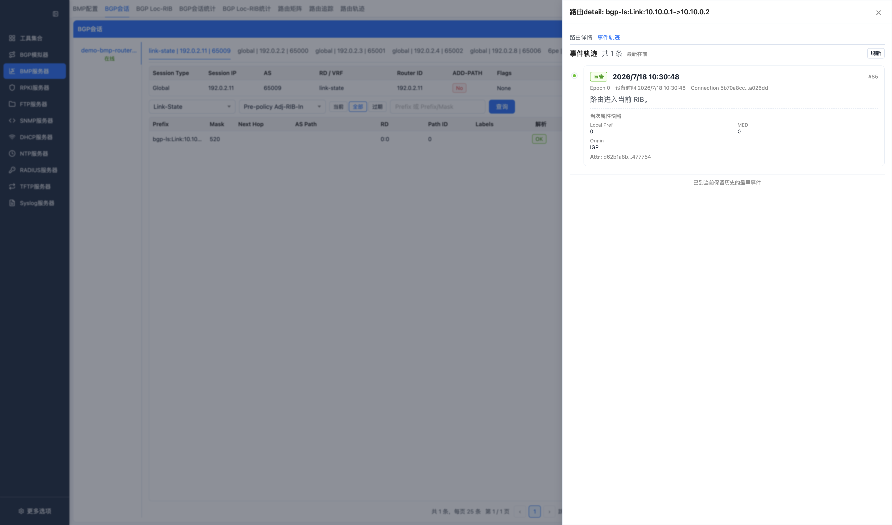

路由列表包含地址组、`pathId`、`rd`、前缀、掩码、下一跳、AS Path、路由状态等字段。IPv4/IPv6 单播没有携带 RD 时，页面和存储按 `0:0` 处理，避免路由 key 歧义。

路由操作：

- 查询路由详情。
- 查询 BGP 原始报文解析摘要。
- 清理 stale 路由。

Session RIB 适合检查：

- per-peer 的 Adj-RIB-In / Route Monitoring 数据。
- 同一前缀下不同 `pathId` 的 Add-Path 路由。
- VPN、MVPN、QP 等携带 RD 或扩展 NLRI 的地址组。

### Loc-RIB

展示 BMP Local-RIB instance 和 Loc-RIB 路由。


按钮说明：

| 按钮 | 功能 |
| --- | --- |
| 查询 / 刷新 | 按客户端、Instance 和过滤条件重新加载 Loc-RIB 数据。 |
| 详情 | 在 Instance 列表中查看 Loc-RIB instance 详情；在路由列表中查看单条路由详情。 |
| 解析BGP | 按需解析 Loc-RIB 路由携带的原始 BGP 报文摘要。 |
| 清理 stale | 清理当前 Instance 下的 stale Loc-RIB 路由。 |

Loc-RIB instance 详情：


Loc-RIB 路由详情：


Loc-RIB 路由详情同样提供按当前 Instance Scope 隔离的“事件轨迹”页签：

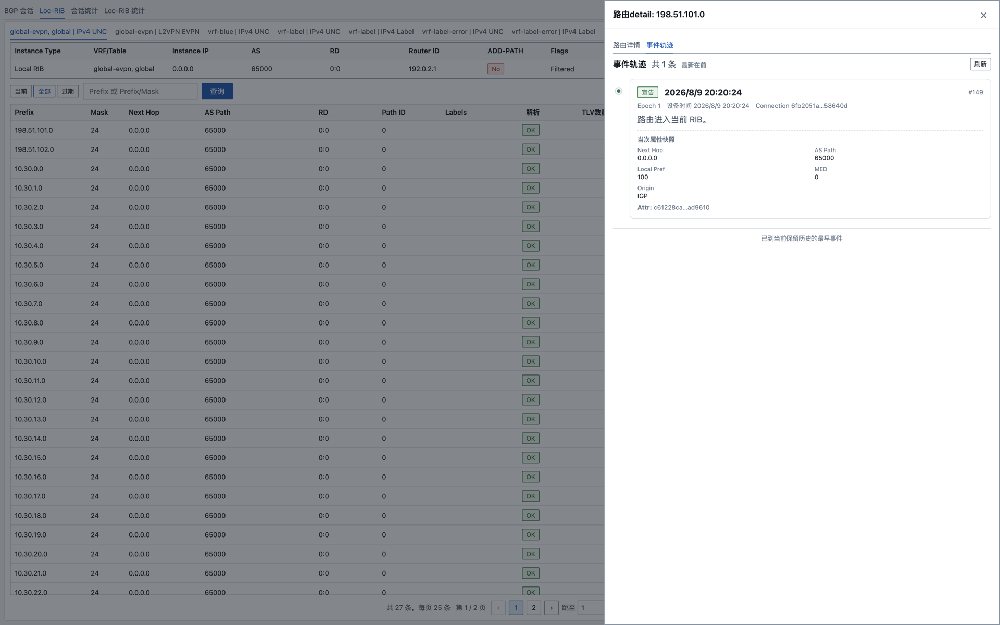

Loc-RIB 使用 instance 维度查询，支持路由列表、路由详情和 stale 路由清理。页面会保留 instance 名称、RD、地址组、`pathId` 和路由状态，便于对比不同 Loc-RIB 实例中的同一前缀。

Session 和 Loc-RIB 的详情入口都来自 current route。路由成功 withdraw 或 purge 且没有重新宣告后，不会继续留在列表中；此时应使用“路由轨迹”查询保留事件。

### 路由矩阵

“路由矩阵”面向全局 current RIB 快照，不要求先知道某个 Peer。开启右上角“分析”开关后，页面按 Client、VRF / Table、地址族、异常类型、路由状态和 Prefix / NLRI 过滤数据，并同时生成五阶段漏斗和异常矩阵。

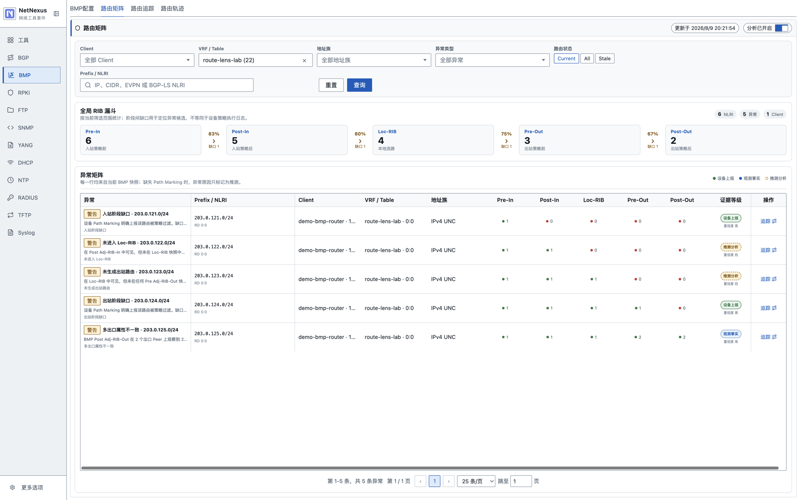

五个阶段的标准含义：

| 页面阶段 | BMP RIB 视图 | 含义 |
| --- | --- | --- |
| Pre-In | Pre-policy Adj-RIB-In | 入站策略处理前收到的路由 |
| Post-In | Post-policy Adj-RIB-In | 入站策略处理后的路由 |
| Loc-RIB | Local RIB | 设备上报的本地选路结果 |
| Pre-Out | Pre-policy Adj-RIB-Out | 出站策略处理前准备发布的路由 |
| Post-Out | Post-policy Adj-RIB-Out | 出站策略处理后的路由 |

漏斗的数量差用于快速缩小排障范围，但“前一阶段有、后一阶段没有”本身不能证明设备执行了某条策略。设备也可能没有启用对应 BMP RIB 视图，或者不同阶段来自无法确定配对关系的 Peer / Instance。

异常矩阵当前识别的候选类型：

| 异常类型 | 页面含义 | 典型后续动作 |
| --- | --- | --- |
| 入站策略后缺失 | Pre-In 有、Post-In 无 | 检查 Path Marking、入站策略和 BMP 视图配置 |
| 收到但未选中 | Post-In 有、Loc-RIB 无 | 检查选路条件；没有 Path Marking 时只作为推测 |
| 已选中但未生成出口 | Loc-RIB 有、Pre-Out 无 | 检查目标 Peer、地址族和出口生成条件 |
| 出站策略后缺失 | Pre-Out 有、Post-Out 无 | 检查 Path Marking 和出站策略 |
| 多出口属性不一致 | 同一 NLRI 的多个 Post-Out 属性不同 | 比较 Next Hop、AS Path、Community 等出口属性 |

证据标签必须按下面口径理解：

- “设备上报”：结论直接使用设备携带的 Path Marking TLV 等字段。
- “观测事实”：数据库确实观测到了路由或属性差异，但不声明设备内部原因。
- “推测分析”：根据跨 Scope、跨阶段快照关联得到的排障线索，需要回到设备策略和选路日志核验。

矩阵没有单独的详情抽屉。每行的“追踪”按钮会携带 Prefix / NLRI 和状态条件跳转到“路由追踪”，用五阶段路由卡片继续核对。

### 路由追踪

“路由追踪”用于回答“同一个查询目标在各个 RIB 阶段分别是什么样”。输入 IP、CIDR 或复杂 NLRI 标识后，页面把命中路由按 Pre-In、Post-In、Loc-RIB、Pre-Out、Post-Out 横向排列，并展示相邻阶段的属性差异和证据等级。

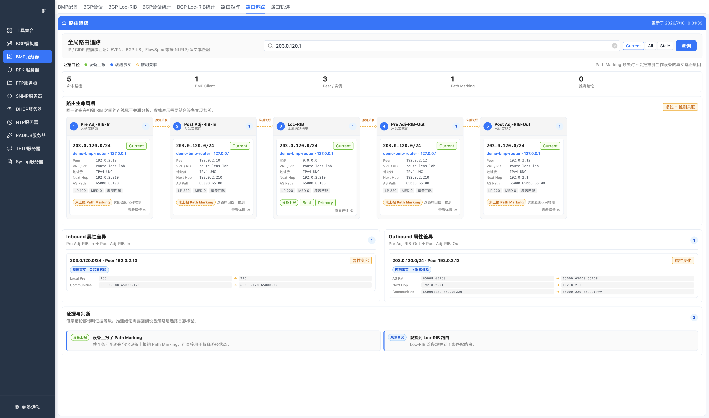

查询规则：

- IP / CIDR 使用网络前缀语义匹配。
- EVPN、BGP-LS、FlowSpec 等使用 parser 生成的 NLRI 可读标识做文本匹配。
- `Current` 只看 active route，`Stale` 只看 stale route，`All` 同时包含两者。
- 成功 withdraw 后 current row 已删除，不会继续出现在追踪结果中；需要到“路由轨迹”查撤销事件。

图中的连线表示页面尝试把同一查询目标在相邻阶段进行关联。不同阶段属于不同 Scope，数据库没有一个“设备内部策略流水号”可以天然串起五段，因此连线和属性配对属于观测关联，不是原始策略执行日志。

点击任一路由卡片可打开完整路由详情：

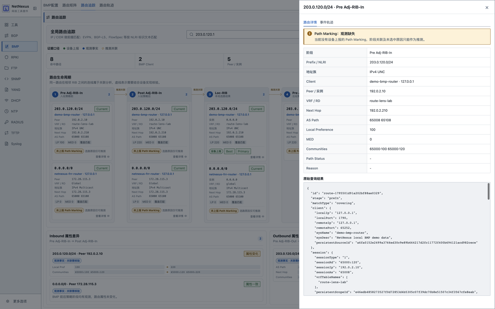

详情抽屉的“事件轨迹”仍按该卡片自身的 Scope 隔离，而不是把五个阶段的事件合成一条伪时间线：

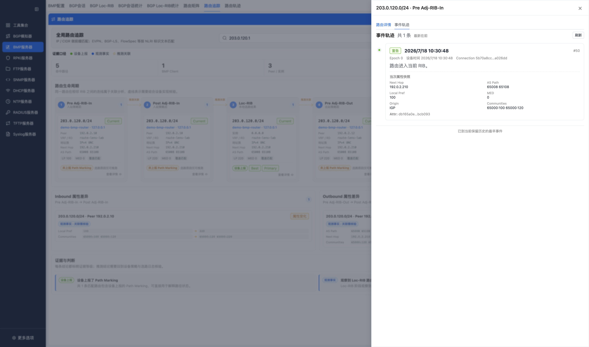

点击 Inbound / Outbound 属性差异卡片，可查看参与比较的原始关联对象和差异字段：

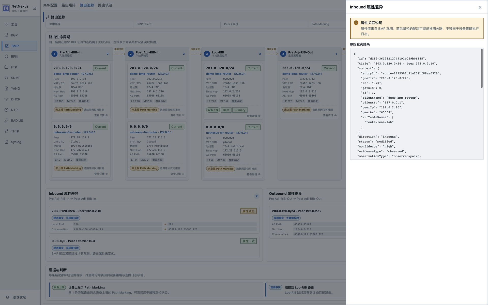

### 路由轨迹

“路由轨迹”不是只查询“过去已经消失的路由”。它直接聚合事件保留窗口内的 `bmp_route_events`，因此仍在 current RIB 的路由、已撤销路由和已清理路由都能命中。每一行按 `(scope_id, route_id)` 隔离；同一 NLRI 在 Pre-In、Post-In、Loc-RIB 或不同 Peer 中会形成不同轨迹。

下面的示例在 BGP Peer RIB、Post-policy Adj-RIB-In 中查询 `198.18.250.0/24`。列表显示最近保留事件为“撤销”，并显示该 Scope 内保留的事件数和时间范围：

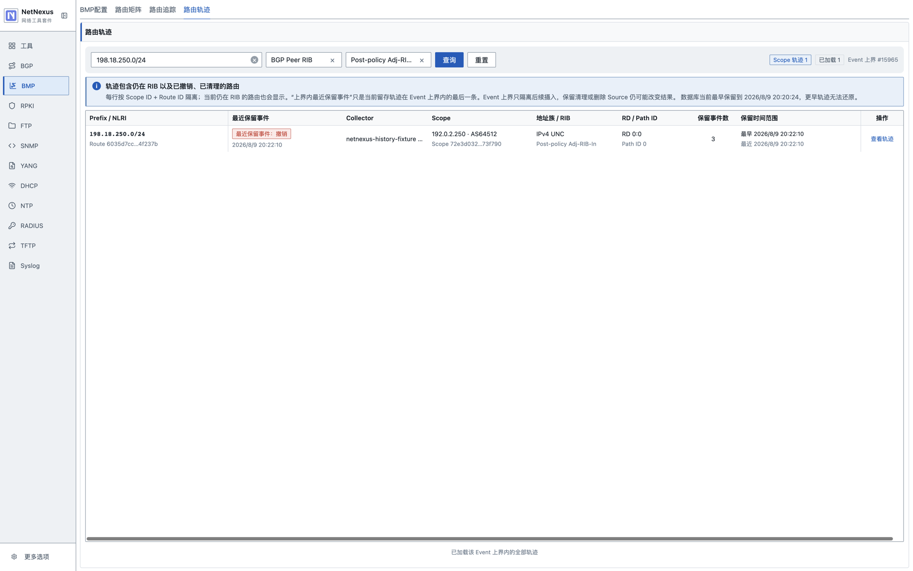

点击“查看轨迹”后，抽屉展示完整的 announce → replace → withdraw 生命周期；页面按最新在前排列，因此视觉顺序是 withdraw → replace → announce。页面还会比较相邻可用快照中的 Next Hop、AS Path、Local Preference、MED 和 Community 等关键属性：

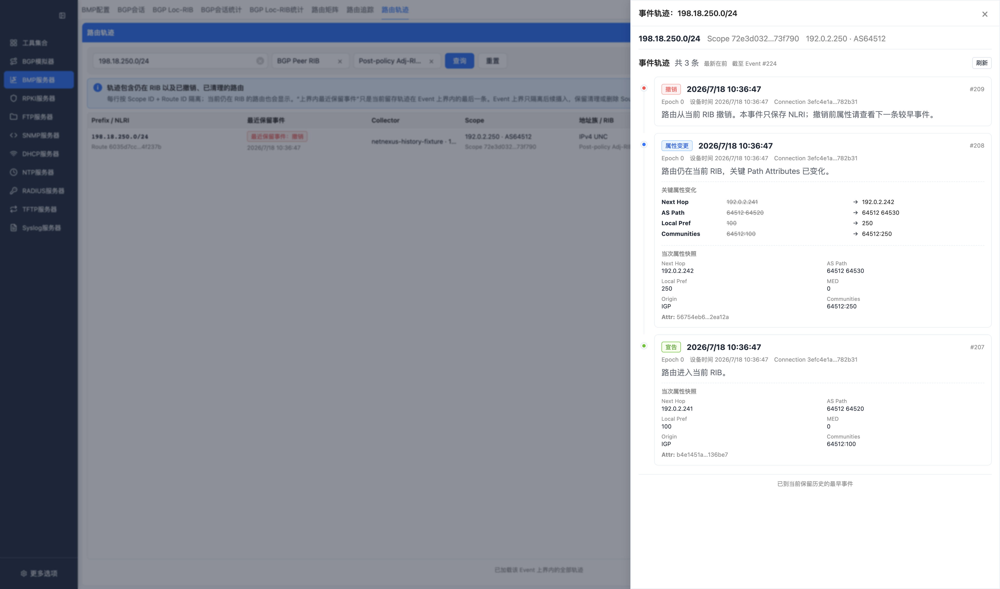

查询控件：

| 控件 | 作用 |
| --- | --- |
| Prefix / NLRI | IP、CIDR 或复杂 NLRI 可读标识；不能为空 |
| Scope | 可限制为 BGP Peer RIB 或 Loc-RIB |
| RIB 阶段 | Peer Scope 可选四个标准 Adj-RIB-In/Out 阶段；Loc-RIB 只允许 Loc-RIB |
| Event 上界 | 首屏查询记录 `asOfEventId`，后续游标和抽屉查询固定到该摄入上界 |

主要事件类型：

| 事件 | 含义 |
| --- | --- |
| `announce` | 该 Scope 当前没有该路由，收到首次宣告 |
| `replace` | 同一 Scope 和 route identity 已存在，但属性或 payload 发生变化 |
| `refresh` | RIB refresh / epoch 中重新确认路由 |
| `upsert-noop` | 重复上报后 current 内容没有变化 |
| `withdraw` | 有效撤销并删除 current row |
| `withdraw-noop` | 收到撤销，但当前有效 epoch / connection 下没有可删除的 current row |
| `purge` | stale 清理、保留清理或显式清理产生的删除事件 |

#### 非 IP NLRI 轨迹

复杂 NLRI 不应被拼接成伪 CIDR Mask。页面直接显示 parser 生成的语义标识，并支持输入完整标识或从开头匹配：

| 地址族 | 可输入的查询示例 | 说明 |
| --- | --- | --- |
| EVPN | `evpn:mac-ip:` | 可继续输入 RD、Ethernet Tag、MAC 和 IP 的完整标识 |
| BGP-LS | `bgp-ls:` | 可查询 Node、Link、Prefix 等 BGP-LS NLRI 标识 |
| IPv4 FlowSpec | `dst=198.18.253.0/24` | 继续匹配 protocol、port 等规则组件 |

EVPN 宣告、属性变更和撤销详情：

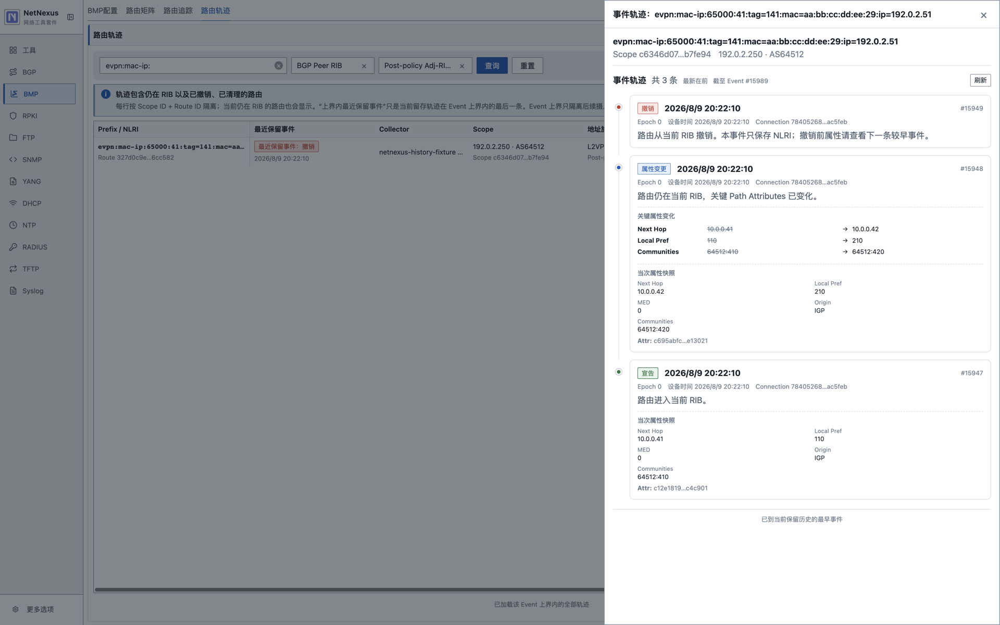

BGP-LS 宣告、属性变更和撤销详情：

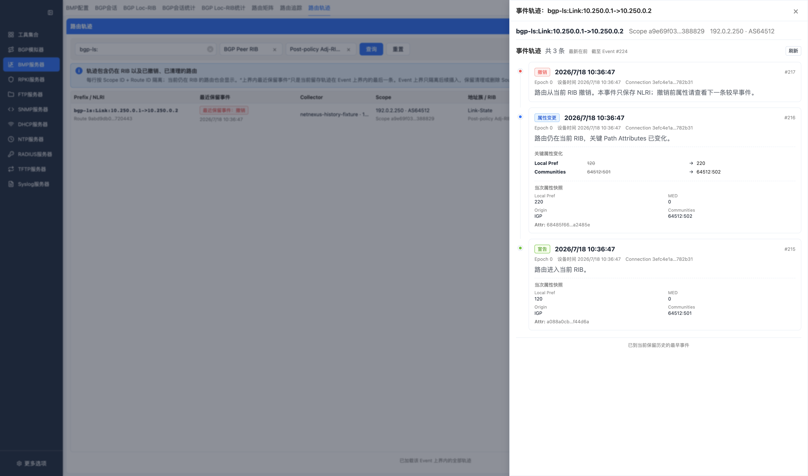

FlowSpec 宣告、属性变更和撤销详情：

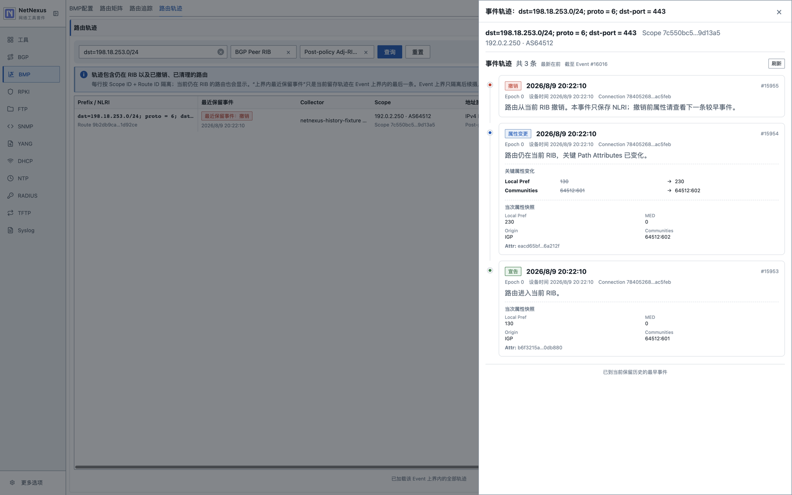

这三类示例对应的完整 fixture 标识分别是：

```text
evpn:mac-ip:65000:41:tag=141:mac=aa:bb:cc:dd:ee:29:ip=192.0.2.51
bgp-ls:Link:10.250.0.1->10.250.0.2
dst=198.18.253.0/24; proto = 6; dst-port = 443
```

复杂 NLRI 在 parser 中可能带有编码长度元数据，但它不是 IP Prefix Length。页面不会把 EVPN、BGP-LS 或 FlowSpec 标识显示成 `/37`、`/520`、`/12` 一类伪 Mask。

轨迹边界：

- 时间线是规范化路由生命周期，不是原始 BMP/BGP 报文逐字节回放。
- withdraw 通常只有 NLRI identity；撤销前属性应查看更早一次 announce、replace 或 refresh 快照。
- 事件受保留天数、事件条数和磁盘压力清理影响。空结果只表示当前保留窗口没有命中，不证明路由从未出现。
- Event 上界隔离查询开始之后的新摄入，但不会冻结物理删除；保留 sweep 或删除 Source 仍可能移除上界内的数据。

### 统计报告

统计报告页展示 BMP Statistics Report 当前内存数据：

- session statistics（同一 peer 使用唯一会话页签，在 Pre/Post Adj-RIB-In/Out 四个 RIB 阶段间切换）
- Loc-RIB statistics
- BMPv4 TLV 信息
- per-AFI/SAFI 统计项

统计项中的 per-AFI/SAFI 数据用于观察不同地址组的路由量，例如 IPv4/IPv6 单播、VPN、MVPN、QP、EVPN 和 BGP-LS 类路由。


按钮说明：

| 按钮 | 功能 |
| --- | --- |
| 查询 / 刷新 | 重新加载指定客户端的 Session Statistics Report。 |
| 详情 | 打开单条 Statistics Report 详情，查看统计项和 TLV。 |

Session 统计详情：


按钮说明：

| 按钮 | 功能 |
| --- | --- |
| 查询 / 刷新 | 重新加载指定客户端和 Instance 的 Loc-RIB Statistics Report。 |
| 详情 | 打开单条 Loc-RIB Statistics Report 详情。 |

Loc-RIB 统计详情：


## 页面数据从哪里来

页面上没有一张“全字段路由表”。current 路由在查询时由 Scope、current 分区行、NLRI identity、扩展 payload、Path Attributes、Source 和 Connection 组装；事件时间线则从事件表开始关联这些对象。

| 页面/操作 | 首要定位键 | 主要读取范围 |
| --- | --- | --- |
| Session 路由列表和详情 | `scope_id` | Scope 对应的一张 `bmp_current_routes_peer_*` 分区 |
| Loc-RIB 路由列表和详情 | `scope_id` | Scope 对应的一张 `bmp_current_routes_loc_rib_*` 分区 |
| 路由矩阵 | 页面筛选条件 | 跨 current 分区读取当前快照并生成五阶段异常候选 |
| 路由追踪 | IP / CIDR / NLRI + route state | 按地址族剪枝后跨 Scope 组装五阶段结果 |
| 路由轨迹列表 | Prefix / NLRI + Scope / RIB 筛选 | 从 `bmp_route_events` 按 `(scope_id, route_pk)` 聚合 |
| 事件轨迹抽屉 | `scope_id + route_id` | 从 `bmp_route_events` 读取单 Scope 生命周期 |

完整表结构、JOIN、字段来源、事务、固定分区和清理规则见 [BMP SQLite 数据库说明](BMP_SQLITE_DATABASE.md)，其中“0. 先看这一节”按实际页面调用链给出了等价 SQL 和组装顺序。

## 外部 API

BMP 查询接口由外部 HTTP API 提供。API 是只读的，不负责启动 BMP 服务。使用前需要在设置页启用 HTTP API，并在 BMP 页面启动 BMP。

详见 [外部 API 文档](API.md)。

## 注意事项

- SQLite 是 BMP RIB 的权威存储；完整路由不再保存在 worker 内存中。数据库表、字段、关联和自动清理规则详见 [BMP SQLite 数据库说明](BMP_SQLITE_DATABASE.md)。
- BMP 客户端断开后会保留为离线节点；Session、Loc-RIB 和未超过保留期的路由可在 BMP 重启后从 SQLite 恢复，并以 stale 状态展示。
- 路由矩阵和路由追踪基于 current/stale 快照，不等价于设备内部策略执行日志；缺少 Path Marking 时尤其不能把推测关联当成设备上报原因。
- 路由轨迹受事件保留窗口约束；同一 NLRI 必须按 Scope 隔离理解。
- 打开 debug/info 日志时，高频 BMP Route Monitoring 会产生大量日志，可能影响 CPU 和磁盘 IO。
