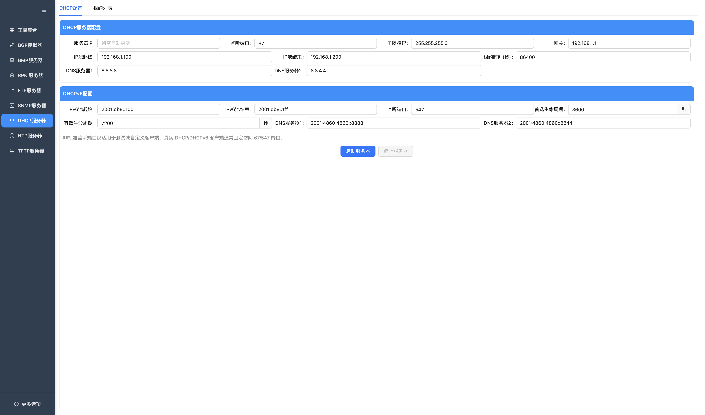
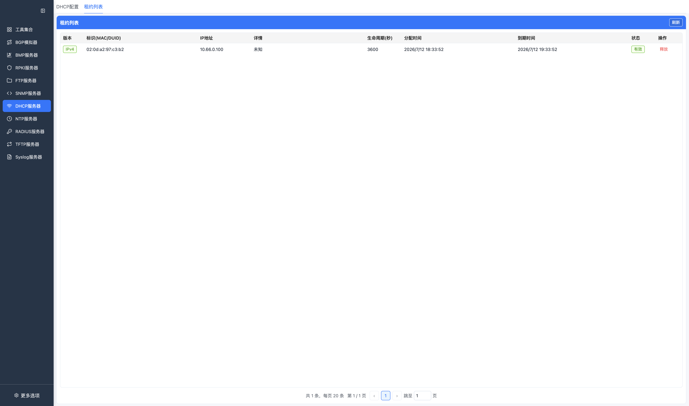

# DHCP 服务器

NetNexus 内置了 DHCPv4 和 DHCPv6 服务器，适合在本地实验、联调验证和协议测试场景中快速发放地址、查看租约变化。

## 功能概览

- 支持 DHCPv4 地址池分配和标准四步交互：`DISCOVER -> OFFER -> REQUEST -> ACK`
- 支持 DHCPv6 地址池分配和标准四步交互：`SOLICIT -> ADVERTISE -> REQUEST -> REPLY`
- 支持分别配置 DHCPv4 / DHCPv6 监听端口，默认分别为 `67` / `547`
- 支持配置 DHCPv4 的服务器 IP、地址池、子网掩码、网关、DNS、租约时间
- 支持配置 DHCPv6 的地址池、首选生命周期、有效生命周期、DNS
- 支持统一查看 IPv4 / IPv6 租约列表，并支持手工释放租约

## 页面说明

### DHCP服务器配置

DHCP 配置页分为两部分：

- `DHCP服务器配置`：DHCPv4 参数
- `DHCPv6配置`：DHCPv6 参数

按钮说明：

| 按钮 | 功能 |
| --- | --- |
| 启动服务器 / 已启动 | 按 DHCPv4/DHCPv6 配置启动服务。 |
| 停止服务器 | 停止 DHCPv4 和 DHCPv6 服务。 |

DHCPv4 支持以下字段：

- `服务器IP`：用于 DHCP Option 54。留空时会自动探测本机第一个非回环 IPv4 地址；如果探测失败，回退为 `127.0.0.1`
- `监听端口`：默认 `67`
- `子网掩码`
- `网关`
- `IP池起始` / `IP池结束`
- `租约时间(秒)`
- `DNS服务器1` / `DNS服务器2`

DHCPv6 支持以下字段：

- `IPv6池起始` / `IPv6池结束`
- `监听端口`：默认 `547`
- `首选生命周期`
- `有效生命周期`
- `DNS服务器1` / `DNS服务器2`

页面底部的 `启动服务器` / `停止服务器` 会同时控制 DHCPv4 和 DHCPv6：

- DHCPv4 先启动
- 若配置了 DHCPv6，则继续尝试启动 DHCPv6
- DHCPv6 启动失败不会影响 DHCPv4 已经启动的服务

### 租约列表

`租约列表` 页面会合并展示 DHCPv4 和 DHCPv6 租约，主要字段包括：

按钮说明：

| 按钮 | 功能 |
| --- | --- |
| 刷新 | 重新加载 DHCPv4/DHCPv6 租约列表。 |
| 释放 | 对单条租约发送释放操作并回收地址。 |

- `版本`：IPv4 / IPv6
- `标识(MAC/DUID)`：DHCPv4 显示 MAC，DHCPv6 显示 DUID
- `IP地址`
- `详情`：DHCPv4 显示主机名，DHCPv6 显示 IAID
- `生命周期(秒)`
- `分配时间`
- `到期时间`
- `状态`

页面支持：

- 手动刷新租约列表
- 对单条租约执行 `释放`
- 实时接收租约新增、更新、过期和删除事件

## 使用指南

1. 在主界面进入 `DHCP服务器`
2. 打开 `DHCP服务器配置`
3. 配置 DHCPv4 地址池、子网掩码、网关和 DNS
4. 如果需要，同时配置 DHCPv6 地址池、生命周期和 DNS
5. 点击 `启动服务器`
6. 使用外部客户端发起 DHCP / DHCPv6 请求
7. 打开 `租约列表` 查看当前分配结果
8. 如需回收地址，可在列表中直接释放对应租约

## 运行机制

DHCPv4 与 DHCPv6 运行在同一个 DHCP 协议进程中，但各自使用独立的 UDP socket、地址池、租约表和过期定时器。

### DHCPv4

- 监听地址固定为 `0.0.0.0:<port>`
- 地址从 `IP池起始` 到 `IP池结束` 顺序分配
- 已有租约再次申请时，会优先返回同一个地址
- DHCPv4 引擎每 `60` 秒扫描一次租约是否过期
- 支持处理 `DISCOVER`、`REQUEST`、`RELEASE`

### DHCPv6

- 监听地址固定为 `[::]:<port>`
- 地址从 `IPv6池起始` 到 `IPv6池结束` 顺序分配
- 自动生成服务端 DUID
- 启动后会尝试在所有非回环 IPv6 接口上加入多播组 `ff02::1:2`
- DHCPv6 引擎每 `60` 秒扫描一次租约是否过期
- 支持处理 `SOLICIT`、`REQUEST`、`RENEW`、`REBIND`、`CONFIRM`、`RELEASE`

## 注意事项

- 标准端口 `67/547` 在部分系统上需要更高权限
- 标准端口也可能被系统服务占用，启动失败时可改用高位端口测试
- 非标准端口适合自定义客户端验证；真实 DHCP / DHCPv6 客户端通常固定访问 `67/547`
- `服务器IP` 仅影响 DHCPv4 响应里的服务器标识，不影响实际监听地址
- DHCPv6 启动失败时，页面仍可继续使用 DHCPv4

## 常见问题

**Q: 服务器 IP 留空时会发生什么？**  
A: DHCPv4 引擎会自动探测本机第一个非回环 IPv4 地址，并将其写入 `Server Identifier`。若未探测到，会使用 `127.0.0.1`。

**Q: 为什么改成高位端口后，真实客户端仍然拿不到地址？**  
A: 大多数真实客户端默认只访问标准 DHCP 端口 `67/547`。高位端口主要用于自定义客户端验证。

**Q: DHCPv6 启动失败为什么页面还能显示服务可用？**  
A: 当前实现里 DHCPv4 是主流程，DHCPv6 属于附加启动步骤；DHCPv6 失败不会回滚已启动的 DHCPv4。

**Q: 租约列表里的“详情”字段为什么有时是主机名，有时是 IAID？**  
A: DHCPv4 和 DHCPv6 共用一个列表。DHCPv4 显示客户端主机名，DHCPv6 显示 IAID。
