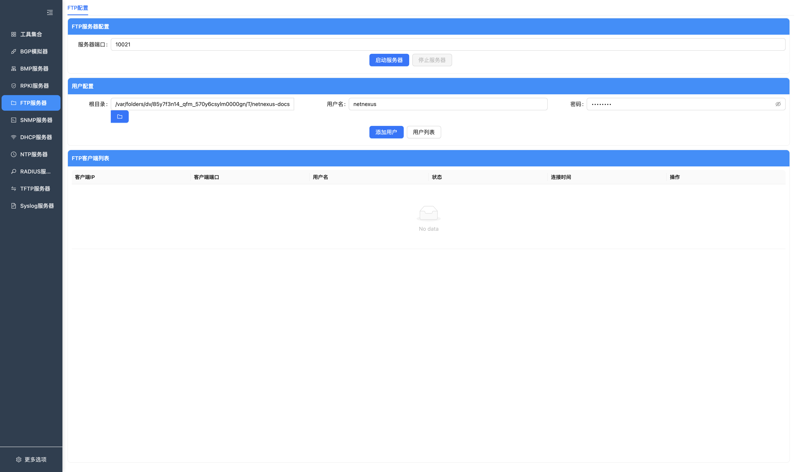
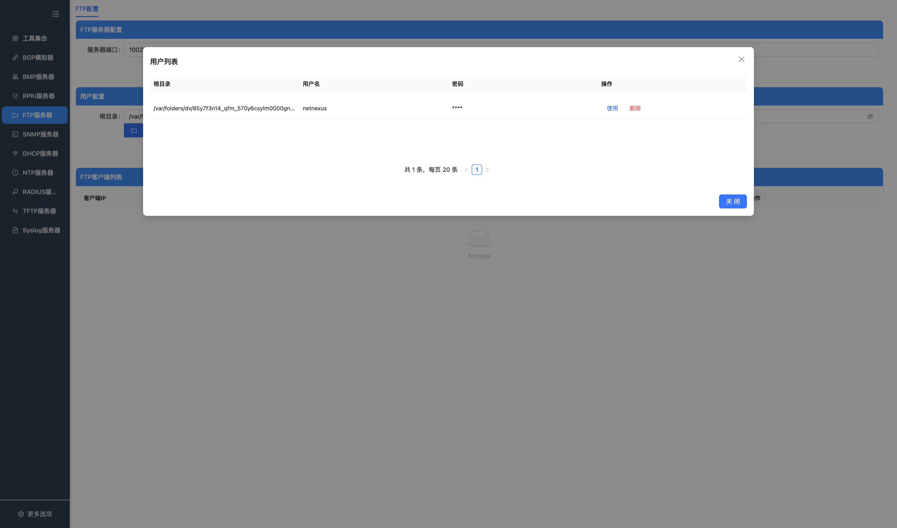

# FTP 服务器

FTP 模块提供一个本地 FTP 服务，用于联调和临时文件传输。当前实现重点是端口配置、用户配置和客户端连接查看。

## 已实现能力

- FTP 服务启动和停止。
- 监听端口配置。
- 多用户配置。
- 每个用户配置根目录、用户名、密码。
- 用户列表查看、使用和删除。
- 客户端连接列表。
- 客户端详情查看。

## 页面

### FTP 配置和客户端

按钮说明：

| 按钮 | 功能 |
| --- | --- |
| 启动服务器 / 已启动 | 按当前监听端口和用户配置启动 FTP 服务。 |
| 停止服务器 | 停止 FTP 服务并断开客户端连接。 |
| 选择目录 | 打开本机目录选择器，设置用户根目录。 |
| 添加用户 | 将当前根目录、用户名和密码保存为 FTP 用户。 |
| 用户列表 | 打开用户管理弹窗，查看、使用或删除已有用户。 |
| 详情 | 打开当前 FTP 客户端连接详情。 |

页面分为三部分：

- `FTP服务器配置`：设置服务端口并启动/停止服务。
- `用户配置`：选择根目录，填写用户名和密码，添加用户。
- `FTP客户端列表`：展示当前连接的客户端。

### 用户管理

用户通过配置页的 `用户列表` 弹窗维护。

按钮说明：

| 按钮 | 功能 |
| --- | --- |
| 使用 | 将选中用户回填到用户配置表单。 |
| 删除 | 删除选中的 FTP 用户。 |
| 显示 / 隐藏密码 | 切换密码明文展示。 |
| 关闭 | 关闭用户列表弹窗。 |

支持：

- 添加用户。
- 删除用户。
- 选择已有用户回填表单。
- 点击显示或隐藏密码。

## 使用步骤

1. 进入 `FTP服务器`。
2. 设置 FTP 服务端口。
3. 在用户配置中选择根目录。
4. 填写用户名和密码。
5. 点击 `添加用户`。
6. 点击 `启动服务器`。
7. 使用 FTP 客户端连接。

## 注意事项

- 低位端口在部分系统上需要管理员/root 权限，测试时可改用高位端口。
- 用户根目录必须存在。
- 文件操作能力以当前 FTP worker 实现和客户端兼容性为准。

## 常见问题

**Q: 用户无法登录怎么办？**  
A: 检查用户名、密码、根目录是否正确，并确认服务已经启动。

**Q: 为什么选择不了目录？**  
A: 目录选择依赖 Electron 原生对话框；如果系统权限受限，需要先给应用相应文件访问权限。

**Q: 支持哪些 FTP 客户端？**  
A: 目标是兼容常见标准 FTP 客户端，但不同客户端命令组合不同，遇到问题时以日志和实际命令支持为准。
