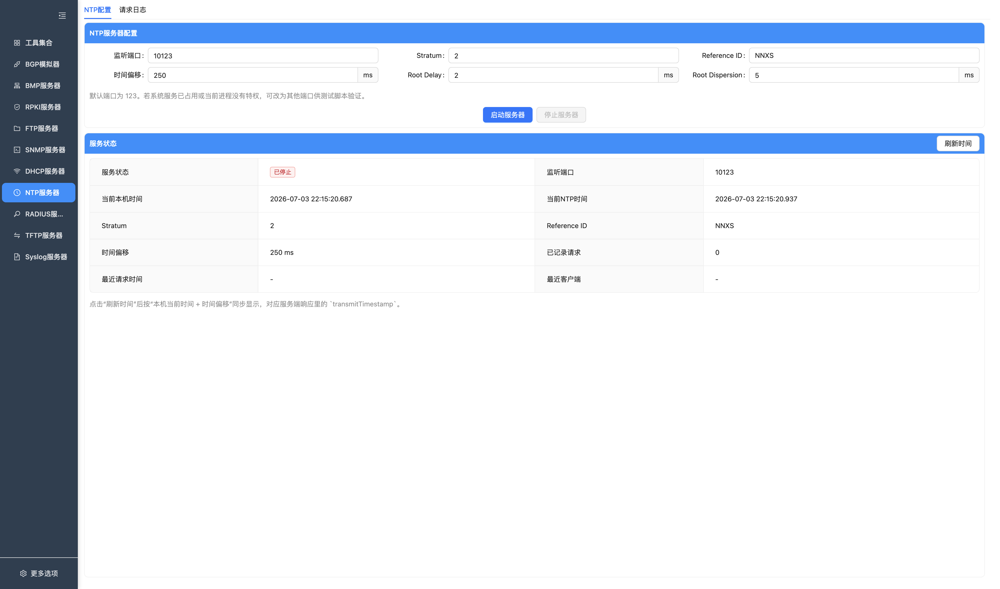
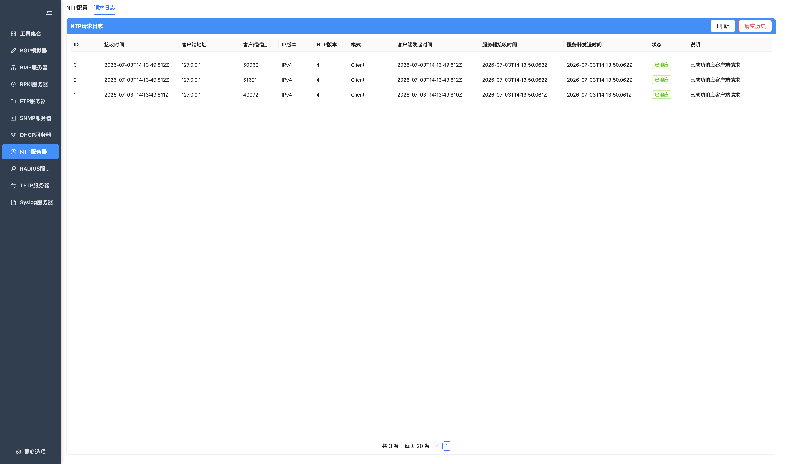

# NTP 服务器

NetNexus 内置了一个轻量级 NTP 服务器，支持通过 UDP 提供标准 NTP 时间响应，并可实时查看请求日志。

## 功能概览

- 支持自定义监听端口，默认 `123`
- 支持配置 `Stratum`、`Reference ID`
- 支持配置时间偏移，便于实验和测试
- 支持查看实时请求日志
- 支持清空请求历史

## 页面说明

### NTP 配置

按钮说明：

| 按钮 | 功能 |
| --- | --- |
| 启动服务器 / 已启动 | 按监听端口、Stratum、Reference ID 和时间偏移启动 NTP 服务。 |
| 停止服务器 | 停止 NTP 服务。 |

- 配置监听端口
- 配置 `Stratum`
- 配置 `Reference ID`
- 配置时间偏移和 Root Delay / Root Dispersion
- 启动或停止 NTP 服务

### 请求日志

按钮说明：

| 按钮 | 功能 |
| --- | --- |
| 刷新 | 重新加载当前运行期内的 NTP 请求日志。 |
| 清空 | 清空当前运行期内的 NTP 请求历史。 |

- 查看每次客户端请求的来源地址、端口、版本、模式
- 查看客户端发起时间、服务器接收时间、服务器发送时间
- 查看请求状态和处理说明

## 使用指南

1. 在主界面选择 `NTP服务器`
2. 打开 `NTP配置`
3. 设置监听端口和时间参数
4. 点击 `启动服务器`
5. 使用外部 NTP 客户端发起请求
6. 在 `请求日志` 页面查看服务记录

## 注意事项

- 默认端口 `123` 在部分系统上需要更高权限
- 若系统已有 NTP 服务占用端口，可改用高位端口进行测试
- `Reference ID` 需要为 1-4 位 ASCII 字符
