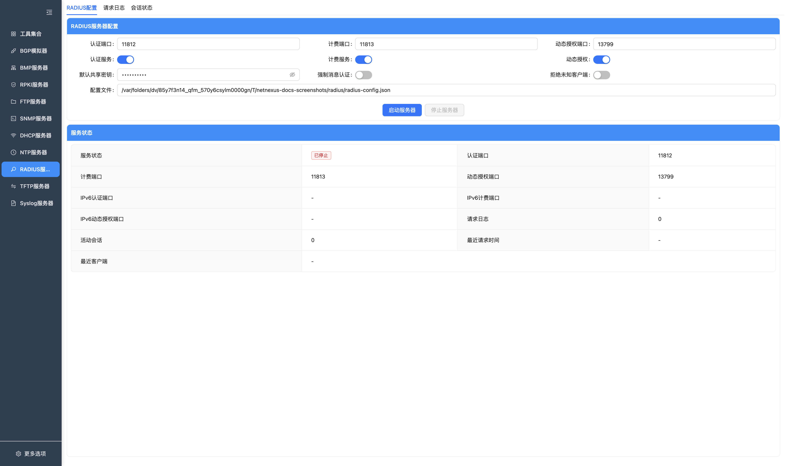
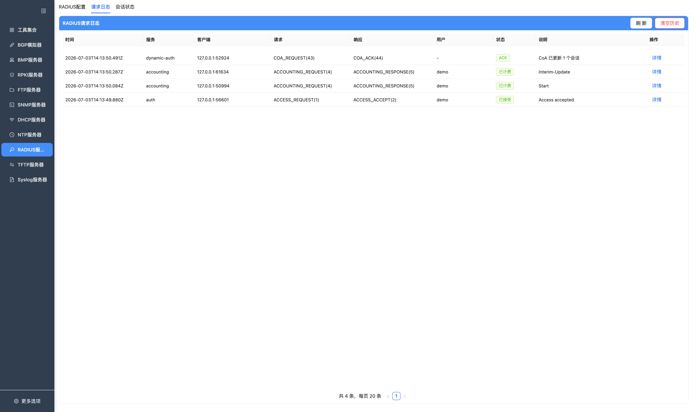
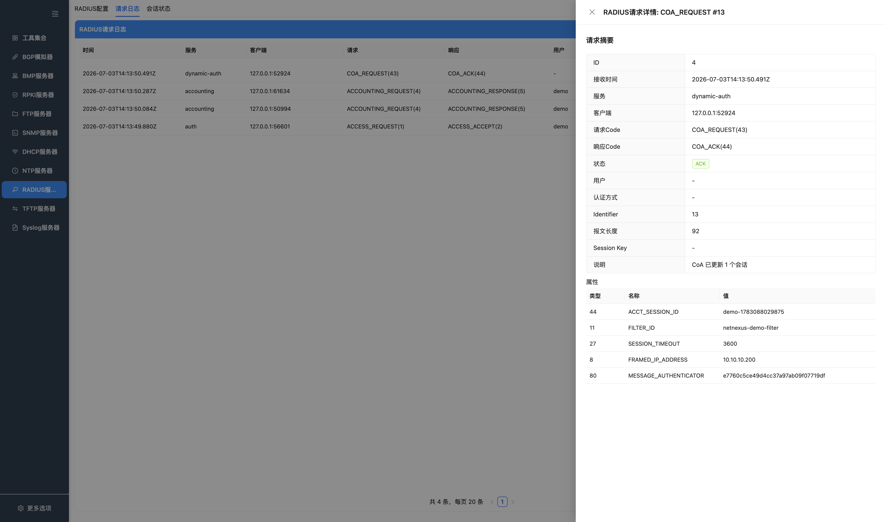
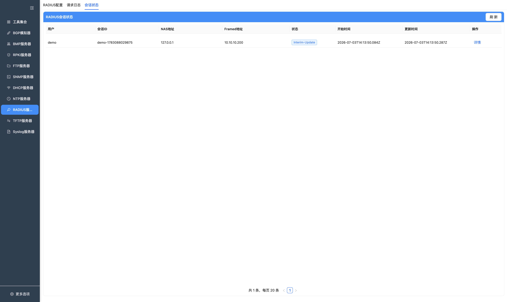
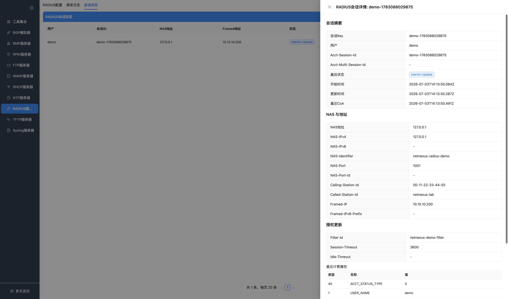

# RADIUS 服务器

NetNexus RADIUS 服务器面向实验室和协议验证场景，实现了 RADIUS 的核心流程：

- RFC 2865 接入认证：`Access-Request`、`Access-Accept`、`Access-Reject`、`Access-Challenge`、PAP `User-Password`、CHAP `CHAP-Password`、`Proxy-State`、响应认证器。
- RFC 2866 计费：`Accounting-Request`、`Accounting-Response`、请求认证器校验，以及 Start、Stop、Interim-Update、Accounting-On、Accounting-Off 的会话跟踪。
- RFC 2869 扩展：`Message-Authenticator` 校验和生成。
- RFC 3162 IPv6 属性：`NAS-IPv6-Address`、`Framed-IPv6-Prefix`，并支持 IPv6 UDP 监听。
- RFC 5176 动态授权：`CoA-Request`、`CoA-ACK`、`CoA-NAK`、`Disconnect-Request`、`Disconnect-ACK`、`Disconnect-NAK`、重复请求重放、`Error-Cause` 和会话匹配。

服务器默认监听 UDP 1812、1813 和 3799。端口可以在 RADIUS 配置页修改，监听地址固定使用默认 IPv4 `0.0.0.0` 和 IPv6 `::`。客户端、用户和共享密钥等协议配置固定从默认 JSON 文件读取；首次打开 RADIUS 配置页或启动服务器时，主进程会在应用用户数据目录下自动生成 `radius/radius-config.json`，并写入默认客户端和默认用户。每次启动服务器时都会重新读取该文件，并将文件内容合并为本次运行配置。支持配置多个客户端，并为每个客户端指定独立共享密钥；如果没有配置客户端列表，则使用默认共享密钥。

用户条目支持 PAP、CHAP 和 Challenge/Response。`Access-Accept` 响应可以携带常见授权属性，例如 `Service-Type`、`Framed-Protocol`、`Framed-IP-Address`、`Framed-IP-Netmask`、`Session-Timeout`、`Idle-Timeout`、`Class`、`Filter-Id` 和 Vendor-Specific 属性。

## 页面

### RADIUS 配置



按钮说明：

| 按钮 | 功能 |
| --- | --- |
| 启动服务器 / 已启动 | 按认证、计费和动态授权端口启动 RADIUS 服务。 |
| 停止服务器 | 停止 RADIUS 服务。 |

配置页用于设置认证端口、计费端口、动态授权端口、共享密钥和服务启停状态。服务启动后会展示运行状态，并实时累计收到的请求。

### 请求日志



按钮说明：

| 按钮 | 功能 |
| --- | --- |
| 刷新 | 重新加载当前运行期内的 RADIUS 请求日志。 |
| 清空 | 清空请求日志。 |
| 详情 | 打开单条请求的报文属性、响应和处理结果。 |

请求详情：



请求日志展示 `Access-Request`、`Accounting-Request`、`CoA-Request` 和 `Disconnect-Request` 等报文，包含来源、Code、Identifier、状态、用户、NAS 地址和处理时间。点击详情可查看 RADIUS 属性和处理结果。

### 会话状态



按钮说明：

| 按钮 | 功能 |
| --- | --- |
| 刷新 | 重新加载当前在线会话。 |
| 清空 | 清空当前运行期内维护的会话状态。 |
| 详情 | 打开单条会话的 Accounting 和动态授权状态详情。 |

会话详情：



会话状态页展示 Accounting 和动态授权流程中维护的在线会话，包含用户、NAS、Framed-IP、Acct-Session-Id、开始时间、最近更新时间和当前状态。

## 默认配置文件

首次打开 RADIUS 配置页或启动服务器时，应用会生成默认配置文件，结构如下：

```json
{
  "sharedSecret": "testing123",
  "clients": [
    {
      "name": "lab-nas",
      "ipAddress": "127.0.0.1",
      "secret": "testing123",
      "enabled": true
    },
    {
      "name": "lab-nas-v6",
      "ipAddress": "::1",
      "secret": "testing123",
      "enabled": true
    }
  ],
  "users": [
    {
      "username": "demo",
      "password": "demo",
      "enabled": true,
      "authType": "PAP",
      "serviceType": 2,
      "framedProtocol": 1,
      "framedIpAddress": "255.255.255.254",
      "framedIpv6Prefix": "2001:db8:100::/64",
      "replyMessage": "Access accepted"
    },
    {
      "username": "chap",
      "password": "chap",
      "enabled": true,
      "authType": "CHAP",
      "serviceType": 2,
      "framedProtocol": 1
    }
  ]
}
```

- 动态授权只作用于当前运行进程内通过 Accounting 报文学到的会话。
