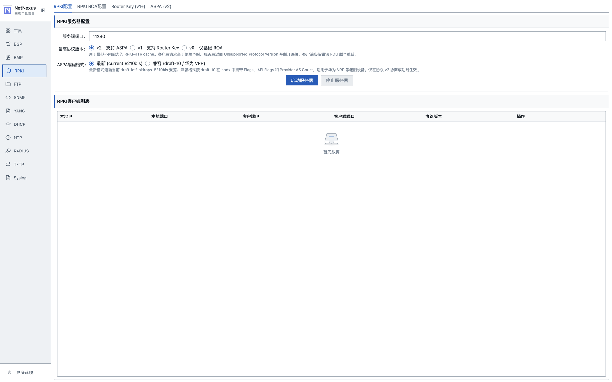
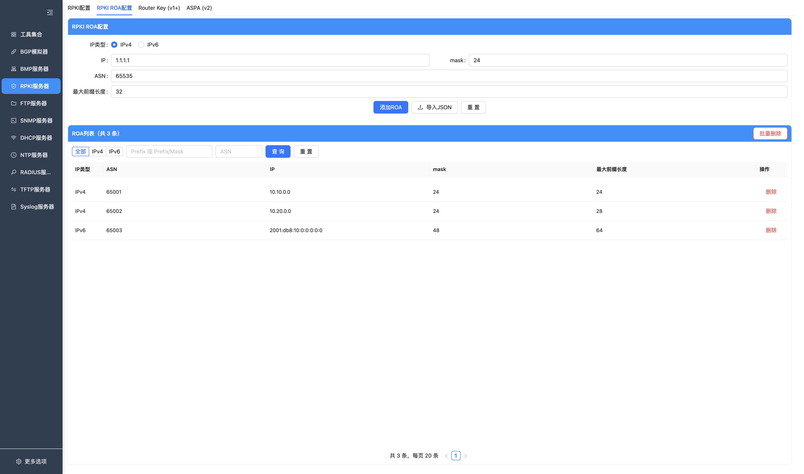
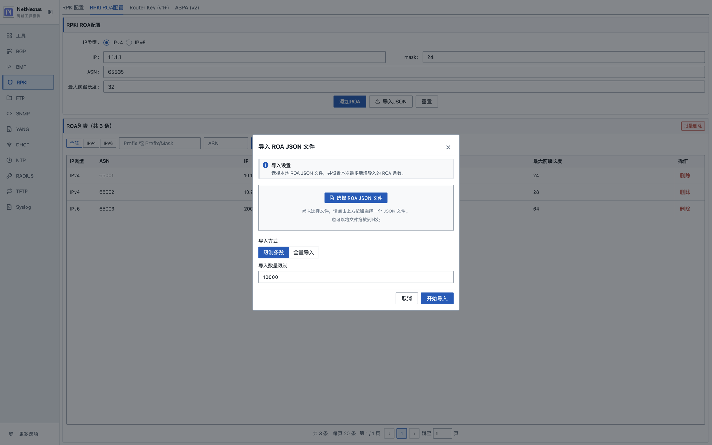
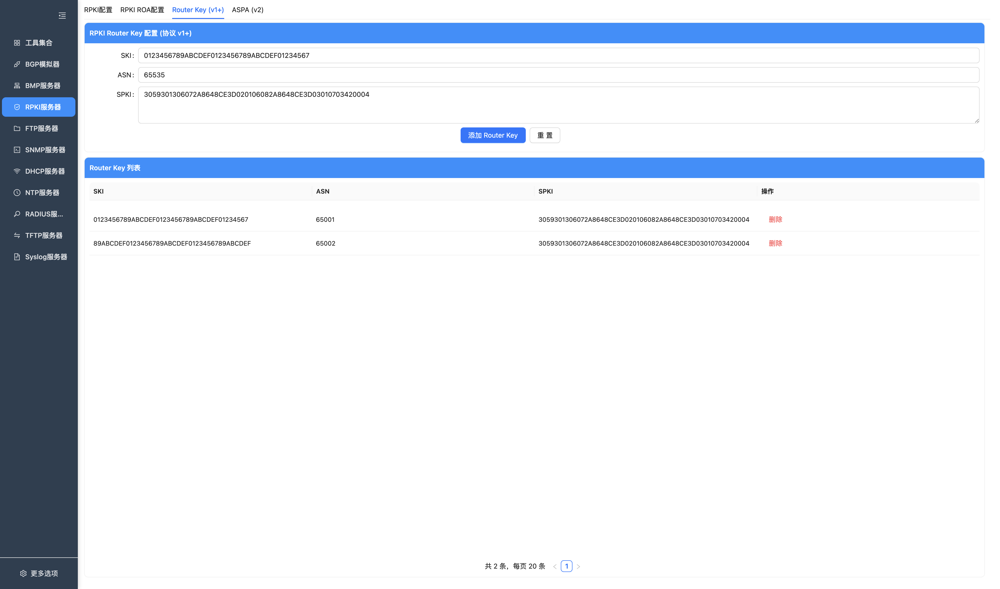
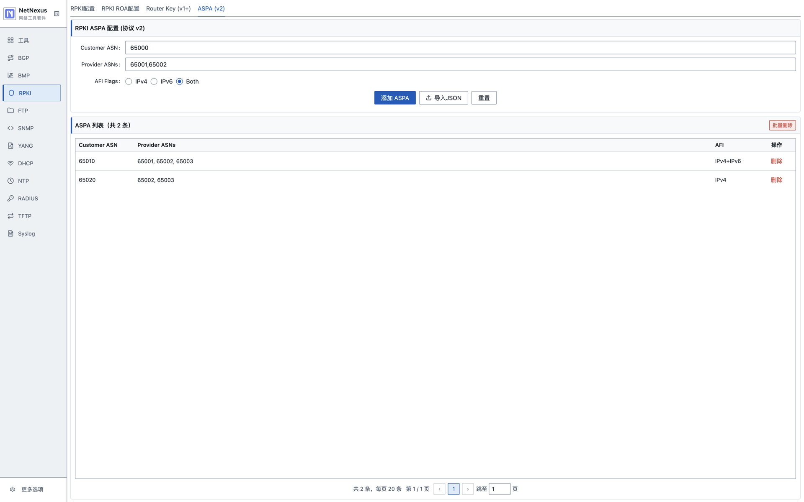
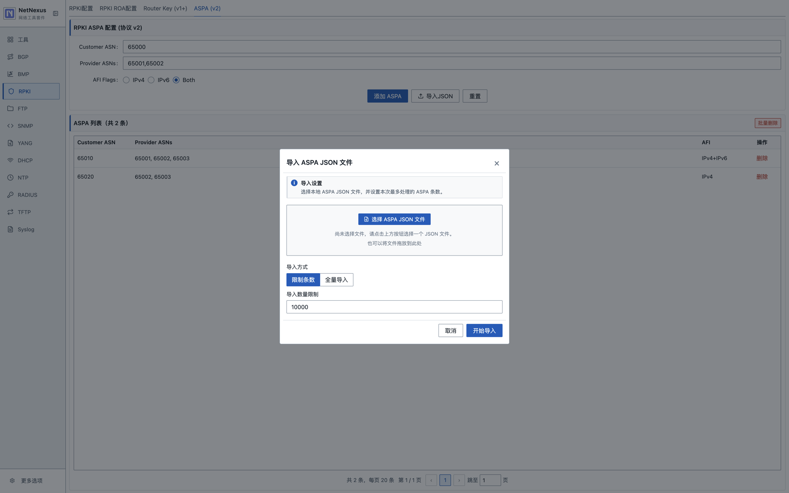

# RPKI RTR 服务

RPKI 模块当前实现的是本地 RPKI-RTR cache/server，用于向路由器提供 ROA、Router Key 和 ASPA 数据。它不是完整的 RPKI 仓库同步器，也不会自动从 Trust Anchor 拉取证书链、Manifest、CRL 或 ROA 对象。

## 已实现能力

- RPKI-RTR 服务端启动和停止。
- 协议版本上限可配置：v0、v1、v2。
- ROA 记录增删、分页查询、JSON 导入。
- Router Key 记录增删和查询。
- ASPA 记录增删、分页查询、JSON 导入。
- ASPA 编码格式可选：
  - `latest`：当前 8210bis 风格。
  - `legacy`：兼容 draft-10 风格，含 AFI Flags 和 Provider AS Count。
- Serial Query / Reset Query 响应。
- 运行时 client 列表。
- Linux 6.7+ 上的 TCP-AO 认证，并支持按与 BMP 共享的 Profile 轮换多把密钥。
- Linux 上的 TCP MD5 兼容认证，与 BMP 共享独立的 TCP MD5 Profile。

## 页面

### RPKI 配置

配置 RPKI-RTR 服务端口、最高协议版本、ASPA 编码格式和认证方式。TCP-AO 和 TCP MD5 分别引用“设置 → TCP-AO”与“设置 → TCP MD5”中的 Profile；两者都与 BMP 共用，但 RPKI-RTR 每次只选择一个。RPKI 页面提交的配置和启动参数只包含 Profile ID，不包含密钥明文。

按钮说明：

| 按钮 | 功能 |
| --- | --- |
| 启动服务 / 已启动 | 按端口、协议版本和 ASPA 编码启动 RPKI-RTR 服务。 |
| 停止服务 | 停止 RPKI-RTR 服务并断开客户端连接。 |
| 前往 TCP-AO 设置 | 打开 TCP-AO Profile 和密钥轮换设置。 |
| 前往 TCP MD5 设置 | 打开 TCP MD5 对端与共享密钥 Profile。 |

说明：

- v0 只发送 ROA。
- v1 支持 Router Key。
- v2 支持 ASPA。
- TCP-AO 仅支持 Ubuntu 24.04+、Linux kernel 6.7+ 且 `CONFIG_TCP_AO=y` 的桌面环境，详细时间边界和轮换规则见 [TCP-AO 设置](SETTINGS.md#tcp-ao-设置)。
- TCP MD5 仅支持具备 TCP MD5 Signature Option 的 Linux 环境，不在应用内在线轮换密钥；修改后需重启服务。详见 [TCP MD5 设置](SETTINGS.md#tcp-md5-设置)。

### ROA

ROA 页面用于维护当前运行中的 RPKI 服务所使用的本地 ROA 数据。服务未启动时页面不查询或展示 SQLite
中的历史记录；停止服务会立即清空页面缓存，但不会删除 SQLite 中的数据。重新启动后，首次进入该页面时会重新加载。

ROA JSON 导入：

按钮说明：

| 按钮 | 功能 |
| --- | --- |
| 新增 | 新增一条 ROA/VRP 记录。 |
| 删除 | 删除选中的 ROA 记录。 |
| 删除全部 | 清空当前本地 ROA 数据。 |
| JSON导入 | 从 JSON 文件导入 ROA/VRP 数据。 |
| 查询 | 按 IP 类型、Prefix、Max Length 或 ASN 过滤列表。 |
| 重置 | 清空过滤条件并重新加载列表。 |

支持：

- 新增 ROA。
- 删除 ROA。
- 删除全部 ROA。
- JSON 导入。
- 按 IP 类型、Prefix/Prefix Mask、ASN 查询。
- 分页加载。

JSON 导入支持常见 ROA/VRP 结构：

- 根数组。
- `roas`。
- `vrps`。
- SLURM `prefixAssertions`。

字段兼容：

- ASN：`asn`、`ASN`。
- Prefix：`prefix`、`IP Prefix`。
- Max Length：`maxLength`、`max_length`、`maxPrefixLength`。

导入时会跳过重复 ROA，并将主机地址归一化为网络地址。ROA 与 ASPA 数据统一保存在 SQLite 中，分页、精确 Prefix、ASN 和 IP 类型查询直接使用数据库索引，不再为全部记录维护运行时内存索引。SQLite 数据会跨运行周期保留，但 ROA/ASPA 页面只展示当前已启动服务的数据视图；同一运行周期内切换标签页会复用已加载的页面缓存。

### Router Key

Router Key 页面用于维护 RPKI-RTR v1+ 的 Router Key PDU 数据。

Router Key 是持久化配置，不采用 ROA/ASPA 的运行周期列表清理规则，服务停止时仍可查看和维护。

按钮说明：

| 按钮 | 功能 |
| --- | --- |
| 新增 | 新增一条 Router Key 记录。 |
| 删除 | 删除选中的 Router Key 记录。 |
| 查询 | 按 ASN 或 SKI 条件过滤列表。 |
| 重置 | 清空过滤条件并重新加载列表。 |

支持字段：

- ASN。
- Subject Key Identifier。
- Subject Public Key Info。

### ASPA

ASPA 页面用于维护当前运行中的 RPKI-RTR v2 服务所使用的 ASPA PDU 数据。与 ROA 页面相同，停止服务会清空页面列表缓存，重新启动后的首次访问会从 SQLite 重新加载。

ASPA JSON 导入：

按钮说明：

| 按钮 | 功能 |
| --- | --- |
| 新增 | 新增一条 ASPA 记录。 |
| 删除 | 删除选中的 ASPA 记录。 |
| 删除全部 | 清空当前本地 ASPA 数据。 |
| JSON导入 | 从 JSON 文件导入 ASPA 数据。 |
| 查询 | 按 Customer ASN 过滤列表。 |
| 重置 | 清空过滤条件并重新加载列表。 |

支持：

- 新增 ASPA。
- 删除 ASPA。
- 删除全部 ASPA。
- JSON 导入。
- 按 Customer ASN 查询。
- 分页加载。
- 单条记录包含多个 Provider AS。

性能相关：

- Provider AS 列表会保留用户输入顺序和重复项。
- ROA 和 ASPA 支持各百万级记录；导入、分页和 RPKI-RTR 全量响应均使用有界批次，不会把完整数据集加载到内存。
- JSON 导入先写入磁盘临时表，解析完整成功后才原子合并到正式表；截断或无效文件不会留下半批数据。
- 大批量导入或清空会建立新的 cache 边界，客户端通过 Cache Reset 获取 SQLite 一致性快照。
- SQLite 多写连接使用即时事务；全量响应最多同时保持 4 个只读快照，单快照默认最长 120 秒且使用 4 MiB page cache，避免慢客户端无限钉住 WAL 或放大内存。
- 主版本升级按不兼容升级处理：用户确认清理后会删除已有 RPKI SQLite 数据，不迁移旧版 JSONL 或旧数据库 schema；同一主版本内的正常重启会保留当前数据。服务停止时页面隐藏 ROA/ASPA 不代表数据已删除。
- 一条 ASPA 记录包含大量 Provider AS 时，发送和日志量都会随 Provider 数增长。
- 如果只是日常调试，不建议在 debug/info 日志下反复发送超大 ASPA 记录。

可用 `npm run benchmark:rpki-sqlite` 执行默认的 100 万 ROA + 100 万 ASPA 容量验证；脚本会检查批量写入、分页、索引查询、有界全表迭代和关闭重开后的数据一致性。

## 使用步骤

1. 进入 `RPKI`。
2. 如需 TCP-AO 或 TCP MD5，先在“设置”中进入对应页面创建并保存 Profile。
3. 在 `RPKI配置` 中设置端口、最高协议版本、ASPA 编码格式和认证方式；认证模式需选择一个对应 Profile。
4. 如有需要，可在启动前维护持久化的 Router Key 配置。
5. 启动 RPKI 服务。
6. 在 ROA、ASPA 页面查看、导入或维护当前服务的数据；首次进入页面时会加载一次，同一运行周期内切换标签页不会重复查询。
7. 路由器通过 RPKI-RTR 连接本机服务。

## 注意事项

- 当前数据来源是用户手工维护或 JSON 导入，不会自动同步公网 RPKI repository。
- 启动服务后新增或删除 ROA/Router Key/ASPA，会向已连接 client 发送相应更新。
- RPKI 服务停止或异常退出后，ROA/ASPA 页面会立即清空；底层 SQLite 数据仍会保留到下一个运行周期。
- TCP-AO 因最后一把发送密钥到期、系统时钟异常或全局轮换失败而安全停止时，RPKI 配置页会保留具体故障提示；修正配置后重新启动即可清除。
- TCP MD5 helper 异常退出时同样会安全停止 RPKI 进程，不会回退到未认证 TCP。
- 标准或低位端口在部分系统上可能需要管理员/root 权限。
- TCP-AO 不提供 headless 或浏览器前后端分离模式，服务与 Electron 界面必须运行在同一台有 X11/Wayland 会话的 Linux 主机上。
- 重启应用后，RPKI 服务不会自动恢复启动，需要手动启动；启动前 ROA/ASPA 页面不会展示上一次运行的数据。
