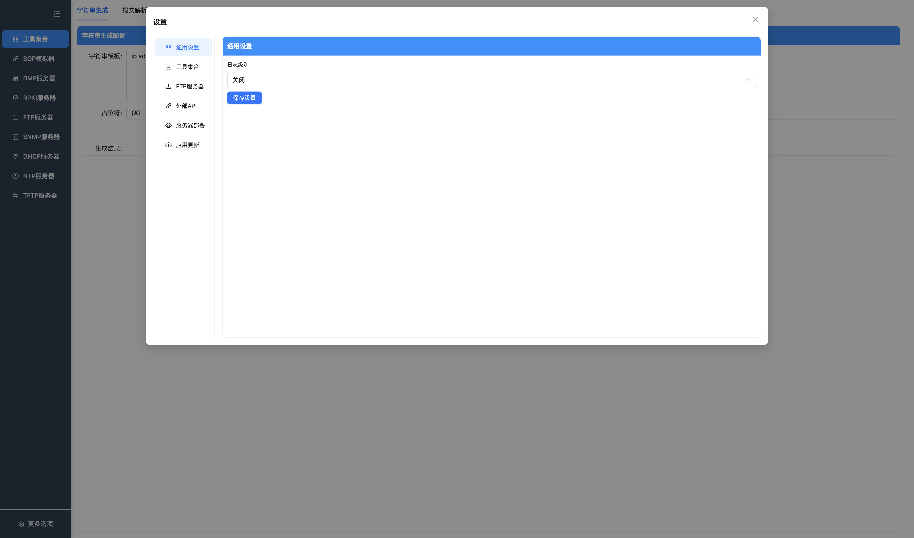
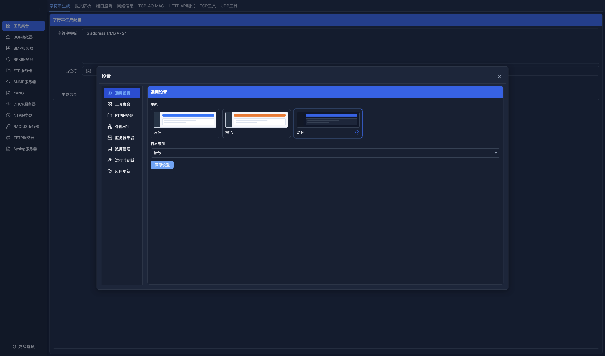
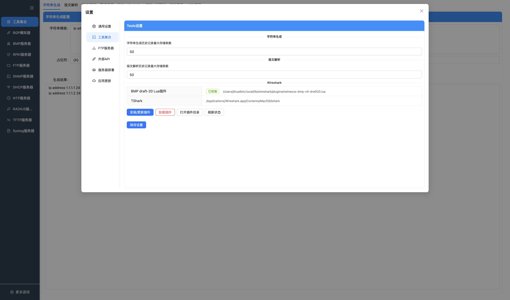
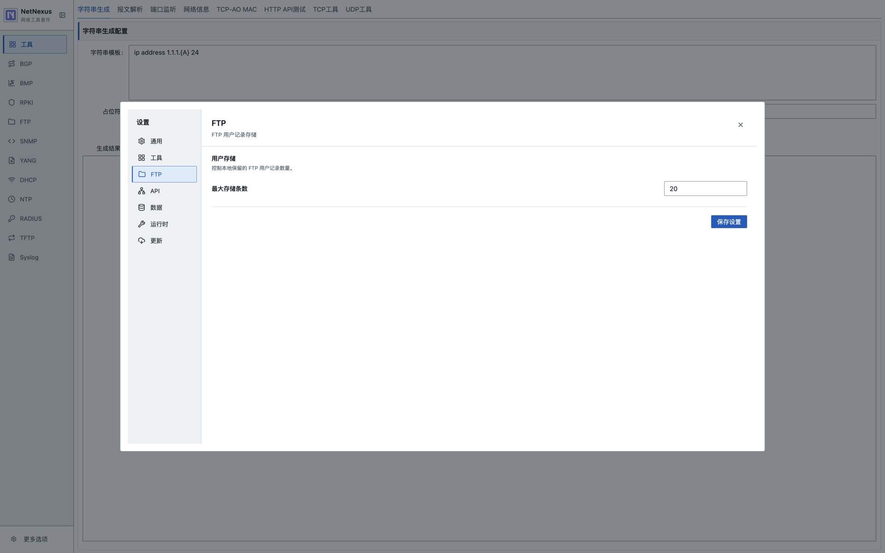
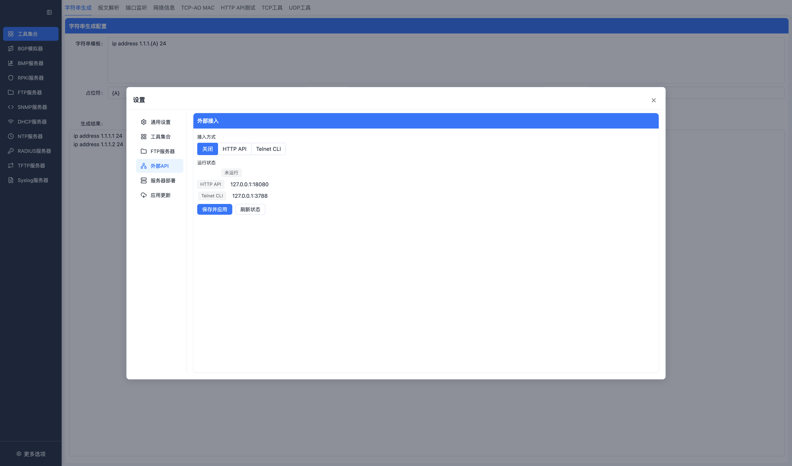
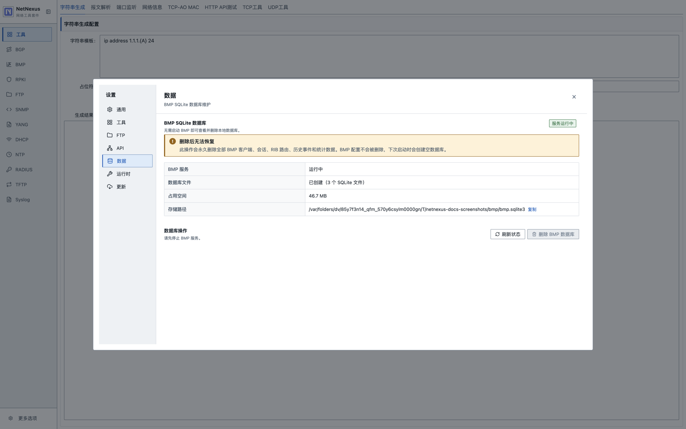
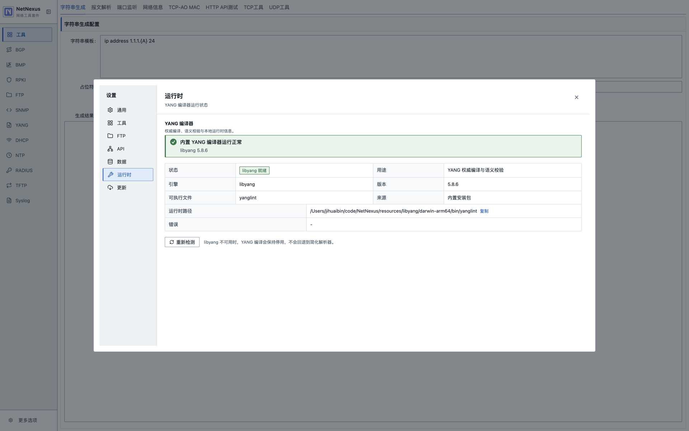
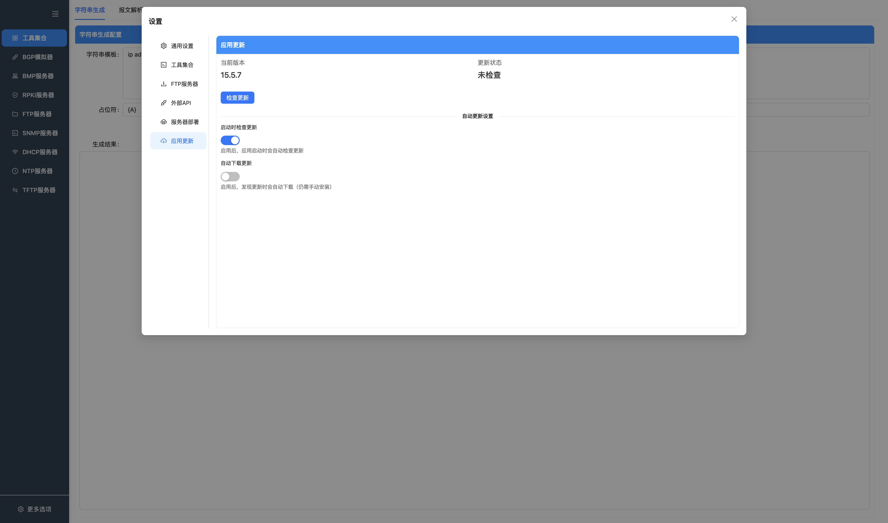

# 设置

设置页用于管理界面主题、全局运行选项、工具历史数量、FTP 用户数量、外部 HTTP API 和更新行为。

## 通用设置

按钮说明：

| 按钮 | 功能 |
| --- | --- |
| 保存 | 保存当前通用设置，并同步到已启动的协议 worker。 |
| 关闭 | 关闭设置窗口。 |

### 界面主题

通用设置提供蓝色、橙色和深色三套主题。点击主题预览可立即查看效果，点击“保存设置”后会持久化选择；再次启动应用时会自动恢复已保存的主题。

深色主题预览：

- 蓝色：默认浅色主题，使用蓝色作为主要操作色。
- 橙色：浅色布局保持不变，主要操作色切换为橙色。
- 深色：导航、内容区、表格、表单和弹窗统一切换为深色配色。
- 切换主题只改变显示效果，不影响协议服务和已填写的业务配置。

### 日志级别

可选值：

- `off`
- `debug`
- `info`
- `warn`
- `error`

行为：

- 保存后对主进程立即生效。
- 保存后会同步到已经启动的协议 worker。
- 后续新启动的协议服务会继承当前日志级别。
- 日志级别不持久化，应用重启后默认恢复 `off`。
- BMP SQLite 的 SQL 跟踪只在 `debug` 级别开启；切换级别后，正在运行的读、写和离线查询 worker 会立即同步。
- SQL 日志只记录带 `?`/命名占位符的 SQL 模板、执行耗时和结果摘要，不展开绑定参数，避免把路由属性 JSON 等业务数据写入日志。

建议：

- 日常使用保持 `off` 或 `warn`。
- 需要定位问题时临时切到 `debug` 或 `info`。
- 高频协议场景下，debug/info 会产生大量文件和控制台日志；其中 BMP 的 `debug` SQL 跟踪最密集，可能影响 CPU 和磁盘 IO，定位完成后应及时关闭。

## 工具集合设置

按钮说明：

| 按钮 | 功能 |
| --- | --- |
| 保存 | 保存字符串生成和报文解析历史记录上限。 |
| 关闭 | 关闭设置窗口。 |

配置工具历史记录数量：

- 字符串生成历史最大条数。
- 报文解析历史最大条数。

## FTP 设置

按钮说明：

| 按钮 | 功能 |
| --- | --- |
| 保存 | 保存 FTP 用户最大保存数量。 |
| 关闭 | 关闭设置窗口。 |

配置 FTP 用户最大保存数量。超过上限时，新增用户会触发旧数据淘汰逻辑。

## HTTP API 设置

按钮说明：

| 按钮 | 功能 |
| --- | --- |
| 保存 | 保存 API 启用状态、端口和分页上限；启用状态变化会立即启动或停止服务。 |
| 关闭 | 关闭设置窗口。 |

外部 HTTP API 是本机只读服务，当前已注册 BMP 查询接口。

行为：

- 监听地址固定为 `127.0.0.1`。
- 保存启用状态后立即启动或停止 API 服务。
- 端口可配置。
- 最大分页大小可配置。
- API 不负责启动 BMP；BMP 仍需在 BMP 页面启动。

详见 [外部 API 文档](API.md)。

## BMP 数据设置

数据页展示 BMP SQLite 数据库的服务状态、文件数量、占用空间和存储路径。BMP 服务停止后，可在这里刷新状态或删除全部 BMP 客户端、会话、RIB 路由、历史事件和统计数据；BMP 配置本身不会被删除。

## 运行时设置

运行时页展示内置 libyang/YANG 编译器的状态、版本、来源、可执行文件和实际路径。点击“重新检测”可再次验证运行时；编译器不可用时，YANG 编译保持停用，不会回退到简化解析器。

## TCP-AO 设置

TCP-AO 页集中管理 BMP 与 RPKI-RTR 共享的对端 Profile 和轮换密钥。该功能只支持 Ubuntu 24.04+、Linux kernel 6.7+ 且 `CONFIG_TCP_AO=y` 的桌面环境；应用还必须带有与当前 CPU 架构匹配的原生 TCP-AO helper。

最多可保存 32 个 Profile。每个 Profile 包含名称、规范的 IPv4/IPv6 地址或 CIDR，以及最多 16 把密钥。CIDR 必须填写网络地址，主机位应为 0；不接受带 zone/scope 的 IPv6 地址或 IPv4 映射 IPv6 地址。同一 Profile 内每把密钥的 Send ID、Receive ID 必须分别唯一。本端 `SndID` 应对应对端 `RcvID`，本端 `RcvID` 应对应对端 `SndID`。当前支持 `hmac(sha1)`、`hmac(sha256)` 和 `cmac(aes)`（AES-128）三种算法；时间输入按运行 NetNexus 的 Linux 主机本地时区解释。

每把密钥有四个可独立留空的时间边界：

所有时间窗口均采用半开区间 `[start, end)`：开始时刻立即生效，结束时刻立即失效。

| 边界 | 含义 | 留空 |
| --- | --- | --- |
| 接收开始 `acceptStart` | 从该时刻开始接受对端使用此密钥的报文。 | 无接收下界。 |
| 发送开始 `sendStart` | 从该时刻开始使用此密钥发送。 | 无发送下界。 |
| 发送结束 `sendEnd` | 到该时刻停止使用此密钥发送。 | 无发送上界。 |
| 接收结束 `acceptEnd` | 到该时刻停止接受对端使用此密钥的报文。 | 无接收上界。 |

有界时间必须满足 `acceptStart ≤ sendStart < sendEnd ≤ acceptEnd`。保存和启动还要求：

- 当前时刻恰好有一把发送有效的密钥。
- 各密钥发送窗口不能重叠。
- 从当前密钥开始，后续窗口必须首尾严格相接，不能有空档。
- 最后一把密钥的 `sendEnd` 可以留空以持续使用，也可以设置有限过期时间。若到期时没有下一把发送密钥，helper 会关闭连接并安全停止使用该 helper 的 BMP 或 RPKI-RTR 服务，不会降级为未认证 TCP。BMP 同时选择多个 Profile 时，其中任一 Profile 的发送计划耗尽都会停止整个 BMP 监听器。

轮换时，建议让新密钥的接收窗口提前开始，并让旧密钥的接收窗口延后结束，以容纳双方时钟偏差和在途报文。helper 会在 `acceptStart` 安装密钥、在 `sendStart` 切换发送密钥，并在 `acceptEnd` 删除旧密钥。单个已建立 socket 无法安全更新密钥时只关闭该连接；全局轮换失败、没有发送有效密钥、无法读取系统时间或检测到系统时钟回拨时，会停止 helper、对应协议服务和全部连接。BMP 或 RPKI 配置页会保留一条明确的红色提示，区分“发送密钥已过期”“时钟回拨”“时钟不可用”和“密钥轮换失败”；修正密钥计划或系统时间并重新启动成功后，提示自动清除。任何情况都不会降级为未认证 TCP。

这些时间窗由 NetNexus 在用户态执行，不会通过 TCP-AO 报文自动协商；对端必须配置相同的密钥材料、算法、MAC 长度和对应的 Key ID，并协调轮换时间。

密钥明文只在本次保存时提交，再次打开设置不会回填明文。Windows 和 macOS 使用 Electron `safeStorage`（Windows 为 DPAPI）；Linux 自动在应用数据目录创建权限为 `0600` 的本地主密钥文件，配置中只持久化带认证的 AES-256-GCM 密文。通过 SSH/X11 转发使用时无需初始化或解锁任何额外服务。BMP、RPKI 配置和渲染层启动参数只保存或传递 Profile ID，不包含密钥材料；主进程在启动服务时才解密所选 Profile，helper 一次性加载当前计划后即可按预设时间在线轮换。

进入“RPKI → RPKI配置”时可选择一个 Profile；进入“BMP → BMP配置”时可选择 1–32 个 Profile。BMP 根据连接对端地址匹配 Profile，因此同一监听器所选的 IPv4/IPv6 地址或 CIDR 不能互相重叠，避免一条连接对应多套密钥。只有落在所选范围内且通过内核 TCP-AO 双向验证的对端才能建立 BMP 会话；未选择的地址、缺失或错误的 Key ID/密钥以及普通 TCP 连接都会被拒绝。服务运行期间修改 Profile 后，必须停止并重新启动相应的 BMP 或 RPKI-RTR 服务才会加载新计划。

## 应用更新

更新方式按平台区分：

| 平台 | 更新方式 |
| --- | --- |
| Windows / macOS | 支持在应用内检查、下载，并在用户确认后安装更新。 |
| Linux `.deb` | 不执行应用内自动检查、下载或安装。请从 [GitHub Releases](https://github.com/jihuaib/NetNexus/releases) 下载匹配架构的 `.deb`，再运行 `sudo apt install ./NetNexus-*.deb` 安装或升级。 |

Linux 设置页会显示“Linux 请从 GitHub Releases 下载并用 apt 安装 .deb”，并提供打开 Releases 的按钮；检查更新和两个自动更新开关保持禁用。应用启动时也不会请求 Linux 自动更新元数据，因此不会因缺少 `latest-linux.yml` 产生 404。

Windows 和 macOS 按钮说明：

| 按钮 | 功能 |
| --- | --- |
| 检查更新 | 主动检查 GitHub Releases 是否存在新版本。 |
| 下载更新 | 下载已发现的新版本安装包。 |
| 重启并安装 | 退出当前应用并安装已下载版本。 |
| 保存 | 保存启动时检查更新和自动下载更新选项。 |
| 关闭 | 关闭设置窗口。 |

更新页包含：

- 当前版本。
- 检查更新。
- 下载更新。
- 重启并安装。
- 启动时检查更新。
- 自动下载更新。

注意：

- 更新能力只在打包后的应用中有意义。
- 开发模式下可能无法完整执行更新流程。
- Windows、macOS 的应用内更新源和 Linux 的手动安装包均使用 GitHub Releases。
