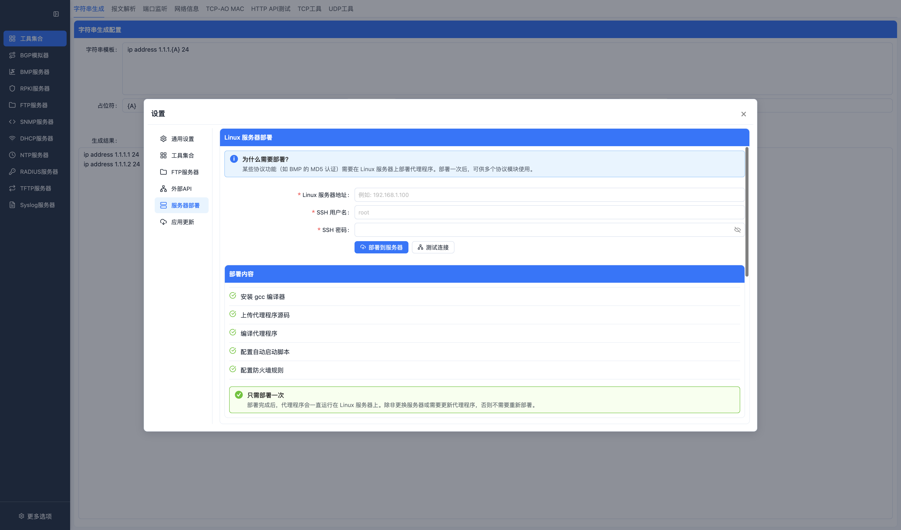

# 设置

设置页用于管理界面主题、全局运行选项、工具历史数量、FTP 用户数量、外部 HTTP API、TCP MD5 代理部署和更新行为。

## 通用设置

按钮说明：

| 按钮 | 功能 |
| --- | --- |
| 保存 | 保存当前通用设置，并同步到已启动的协议 worker。 |
| 关闭 | 关闭设置窗口。 |

### 界面主题

通用设置提供蓝色、橙色和深色三套主题。点击主题预览可立即查看效果，点击“保存设置”后会持久化选择；再次启动应用时会自动恢复已保存的主题。

深色主题预览：

- 蓝色：默认浅色主题，使用蓝色作为主要操作色。
- 橙色：浅色布局保持不变，主要操作色切换为橙色。
- 深色：导航、内容区、表格、表单和弹窗统一切换为深色配色。
- 切换主题只改变显示效果，不影响协议服务和已填写的业务配置。

### 日志级别

可选值：

- `off`
- `debug`
- `info`
- `warn`
- `error`

行为：

- 保存后对主进程立即生效。
- 保存后会同步到已经启动的协议 worker。
- 后续新启动的协议服务会继承当前日志级别。
- 日志级别不持久化，应用重启后默认恢复 `off`。

建议：

- 日常使用保持 `off` 或 `warn`。
- 需要定位问题时临时切到 `debug` 或 `info`。
- 高频协议场景下，debug/info 会产生大量文件和控制台日志，可能影响 CPU 和磁盘 IO。

## 工具集合设置

按钮说明：

| 按钮 | 功能 |
| --- | --- |
| 保存 | 保存字符串生成和报文解析历史记录上限。 |
| 关闭 | 关闭设置窗口。 |

配置工具历史记录数量：

- 字符串生成历史最大条数。
- 报文解析历史最大条数。

## FTP 设置

按钮说明：

| 按钮 | 功能 |
| --- | --- |
| 保存 | 保存 FTP 用户最大保存数量。 |
| 关闭 | 关闭设置窗口。 |

配置 FTP 用户最大保存数量。超过上限时，新增用户会触发旧数据淘汰逻辑。

## HTTP API 设置

按钮说明：

| 按钮 | 功能 |
| --- | --- |
| 保存 | 保存 API 启用状态、端口和分页上限；启用状态变化会立即启动或停止服务。 |
| 关闭 | 关闭设置窗口。 |

外部 HTTP API 是本机只读服务，当前已注册 BMP 查询接口。

行为：

- 监听地址固定为 `127.0.0.1`。
- 保存启用状态后立即启动或停止 API 服务。
- 端口可配置。
- 最大分页大小可配置。
- API 不负责启动 BMP；BMP 仍需在 BMP 页面启动。

详见 [外部 API 文档](API.md)。

## 服务器部署

按钮说明：

| 按钮 | 功能 |
| --- | --- |
| 保存 | 保存远端 Linux 主机和 SSH 登录配置。 |
| 测试连接 | 使用当前 SSH 参数测试远端连接是否可用。 |
| 部署 | 执行 TCP MD5 代理部署流程。 |
| 关闭 | 关闭设置窗口。 |

服务器部署用于向远端 Linux 主机部署 TCP MD5 代理程序，供 BMP/RPKI 的 MD5 认证场景使用。

配置项：

- Linux 服务器地址。
- SSH 用户名。
- SSH 密码。

页面提供：

- 保存部署配置。
- 测试 SSH 连接。
- 执行部署。
- 查看部署状态。

注意：

- 该能力依赖远端 Linux 环境、SSH 权限、编译工具和网络连通性。
- 部署脚本会在远端执行命令，使用前应确认目标机器用途和权限。
- 不需要 MD5 认证时，可以不使用该页面。

## 应用更新

按钮说明：

| 按钮 | 功能 |
| --- | --- |
| 检查更新 | 主动检查 GitHub Releases 是否存在新版本。 |
| 下载更新 | 下载已发现的新版本安装包。 |
| 重启并安装 | 退出当前应用并安装已下载版本。 |
| 保存 | 保存启动时检查更新和自动下载更新选项。 |
| 关闭 | 关闭设置窗口。 |

更新页包含：

- 当前版本。
- 检查更新。
- 下载更新。
- 重启并安装。
- 启动时检查更新。
- 自动下载更新。

注意：

- 更新能力只在打包后的应用中有意义。
- 开发模式下可能无法完整执行更新流程。
- 更新源使用 GitHub Releases。
