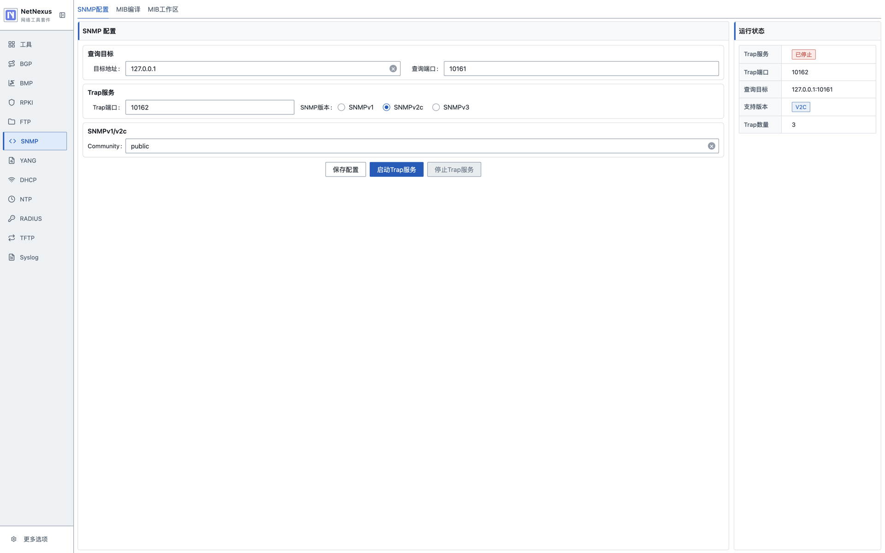
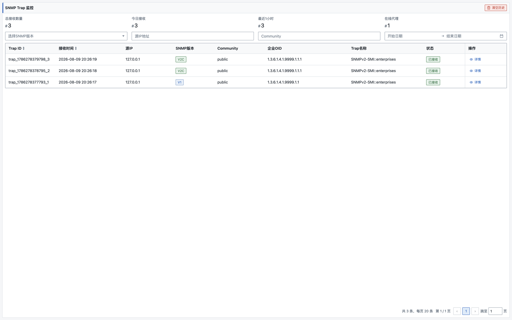
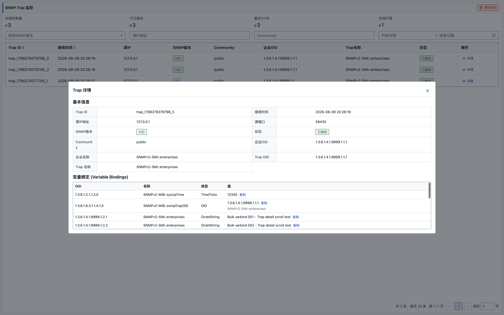
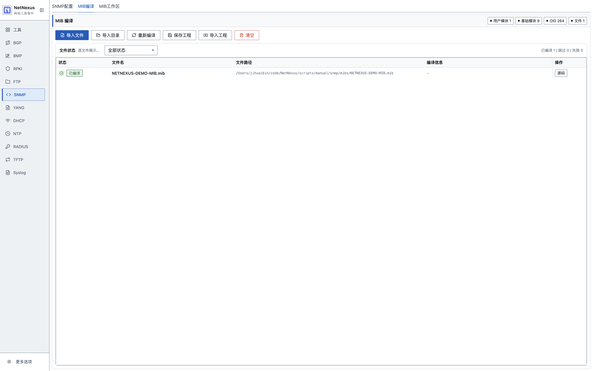
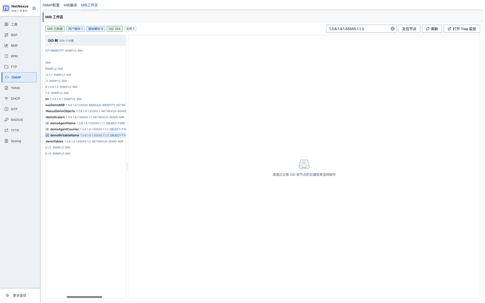
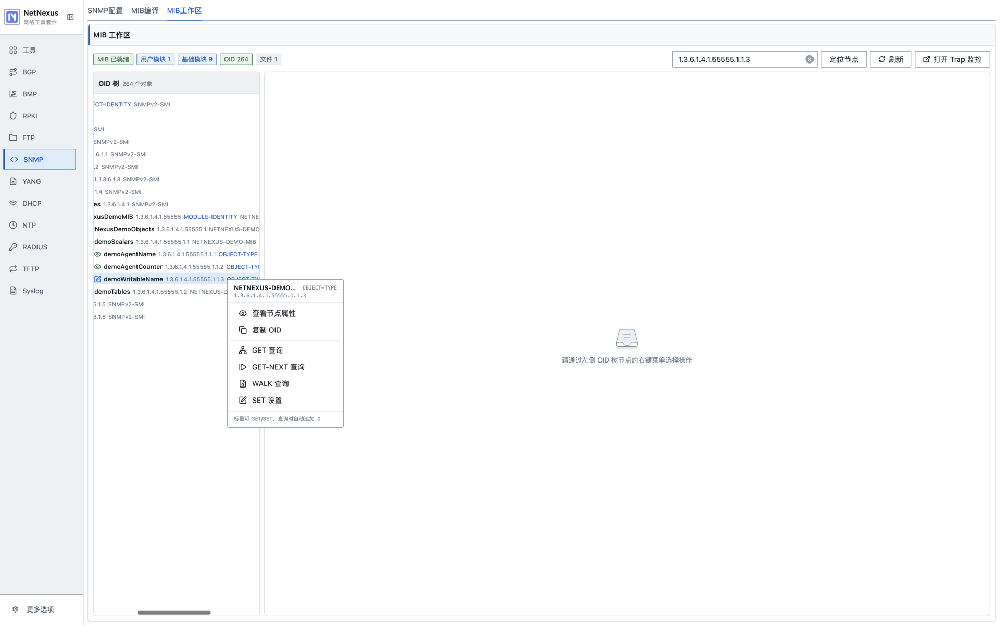
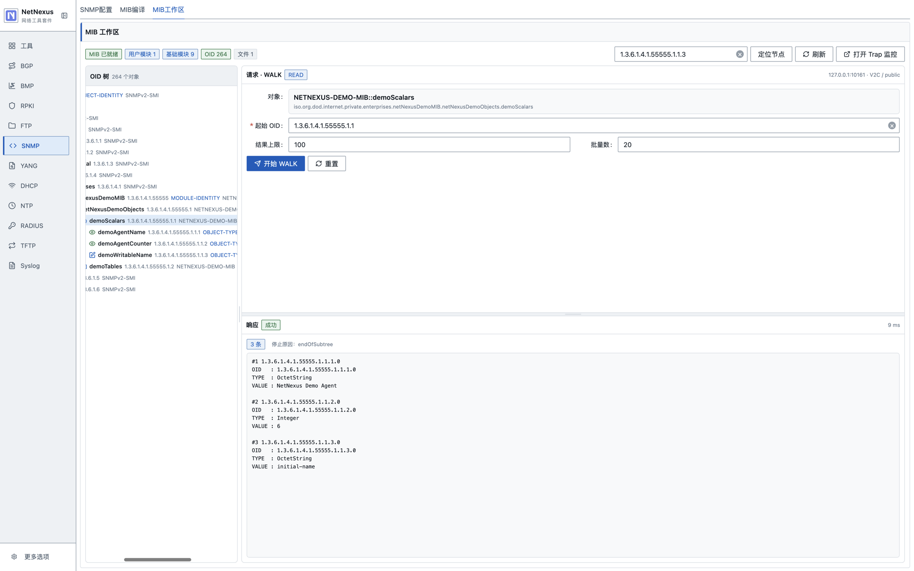

# SNMP 工具

SNMP 模块当前包含 Trap 接收、Trap 历史、MIB 管理和基础 SNMP 查询能力。

## 已实现能力

- SNMP Trap 服务启动和停止。
- Trap 历史列表和详情。
- SNMP v1 / v2c / v3 参数配置。
- MIB 文件或目录导入。
- MIB 后台编译和缓存。
- OID 树查看。
- OID 解析。
- MIB 工程保存和导入。
- GET、GET-NEXT、WALK、SET 等基础查询操作。

## 页面

### SNMP 配置

配置 Trap 服务和查询目标。

按钮说明：

| 按钮 | 功能 |
| --- | --- |
| 启动SNMP / 已启动 | 按 Trap 端口、查询端口、版本和认证参数启动 SNMP 服务。 |
| 停止SNMP | 停止 Trap 接收和查询服务，并关闭已经打开的 Trap 独立监控窗口。 |
| 打开 Trap 监控 | 打开或切换到独立 Trap 监控窗口。 |

主要字段：

- 查询目标地址。
- 查询端口。
- Trap 端口。
- SNMP 版本。
- v1/v2c Community。
- v3 用户名、安全级别、认证协议、认证密码、加密协议、加密密码。

配置页可以启动或停止 Trap 服务，并展示当前运行状态。

### Trap 监控

Trap 历史从配置页右上角打开，并在独立窗口中展示。窗口打开时会先加载当前历史，之后按批量变化刷新；窗口不存在时不会投递 Trap 监控事件，配置页只接收轻量计数快照。

按钮说明：

| 按钮 | 功能 |
| --- | --- |
| 查询 / 刷新 | 按过滤条件重新加载 Trap 历史。 |
| 清空 | 清空当前运行期内的 Trap 历史。 |
| 详情 | 打开单条 Trap 的来源、OID 和变量绑定详情。 |

Trap 详情：

支持：

- Trap 列表。
- Trap 详情。
- Trap 历史清空。
- Trap 来源、版本、OID、变量绑定等信息展示。

### MIB 管理

MIB 页面用于导入、编译和浏览 MIB。

MIB 编译页展示导入工具、模块与 OID 统计，以及逐文件编译结果：

MIB 工作区用于浏览已编译的 OID 树并执行查询：

按钮说明：

| 按钮 | 功能 |
| --- | --- |
| 导入文件 | 选择一个或多个 MIB 文件并加入当前编译集合。 |
| 导入目录 | 选择目录并递归导入目录内的 MIB 文件。 |
| 重新编译 | 按当前文件集合重新编译 MIB 并刷新 OID 树。 |
| 保存工程 | 将当前 MIB 文件集合和缓存保存为 MIB 工程。 |
| 导入工程 | 从已保存的 MIB 工程中恢复文件集合和编译缓存。 |
| 清空 | 清空当前 MIB 文件、编译缓存和 OID 树。 |
| 解析OID | 解析输入的 OID，并自动展开 OID 树定位到匹配节点。 |

OID 树节点支持右键操作：

右键菜单说明：

| 菜单项 | 功能 |
| --- | --- |
| 复制OID | 将当前节点 OID 写入剪贴板；失败时回填到 OID 输入框。 |
| 解析OID | 解析当前节点 OID 并显示对象、模块、路径、语法和访问权限。 |
| GET 查询 | 对可读节点发起 SNMP GET；标量节点会自动补 `.0`。 |
| GET-NEXT 查询 | 从当前节点 OID 发起 SNMP GET-NEXT。 |
| WALK 查询 | 从当前节点 OID 发起 WALK，并展示返回的 varbind 列表。 |
| SET 设置 | 对可写节点打开 SET 表单，填写类型和值后发送。 |
| Trap变量 | 标识该节点仅用于 Trap/Inform 变量绑定，不用于普通 GET/SET。 |

WALK 查询界面：

WALK 界面说明：

| 区域 | 功能 |
| --- | --- |
| 查询目标 | 显示当前 SNMP 查询目标、端口、版本和 Community。 |
| 对象信息 | 显示从 MIB 树带入的对象名称和对象路径。 |
| 起始OID | 以右键节点 OID 作为 WALK 起点，可手动调整。 |
| 返回上限 | 控制单次 WALK 最多返回的 varbind 数量。 |
| Max Repetitions | SNMP v2c 下控制 GETBULK 的批量返回规模。 |
| 开始 WALK | 发起 WALK 查询，并在下方文本区展示序号、OID、对象名、类型和值。 |

支持：

- 导入单个或多个 MIB 文件。
- 导入目录。
- 重新编译。
- 保存 MIB 工程。
- 导入 MIB 工程。
- 清空当前 MIB。
- OID 树查看。
- OID 解析。
- 从树节点右键发起 GET、GET-NEXT、WALK 和 SET。
- 节点详情展示。
- 文件编译状态展示。

## 基础查询

配置查询目标后，可以基于 MIB 节点或 OID 执行基础 SNMP 查询。当前能力以手工查询为主。

支持的操作以页面和当前 `net-snmp` 实现为准：

- GET。
- GET-NEXT。
- WALK。
- SET。

## 注意事项

- Trap 默认端口 `162` 在部分系统上需要管理员/root 权限，可改用高位端口测试。
- SNMPv3 的认证和加密参数必须与目标设备配置一致。
- MIB 编译结果依赖文件依赖关系；缺少依赖 MIB 时，部分对象可能无法解析。
- 当前 Trap 历史保存在运行内存中，应用重启后不会恢复。

## 常见问题

**Q: Trap 收不到怎么办？**  
A: 检查 Trap 端口、防火墙、设备 Trap 目标地址、Community 或 SNMPv3 用户参数。

**Q: MIB 导入失败怎么办？**  
A: 检查是否缺少依赖 MIB，或者使用目录导入把相关 MIB 一起导入。
