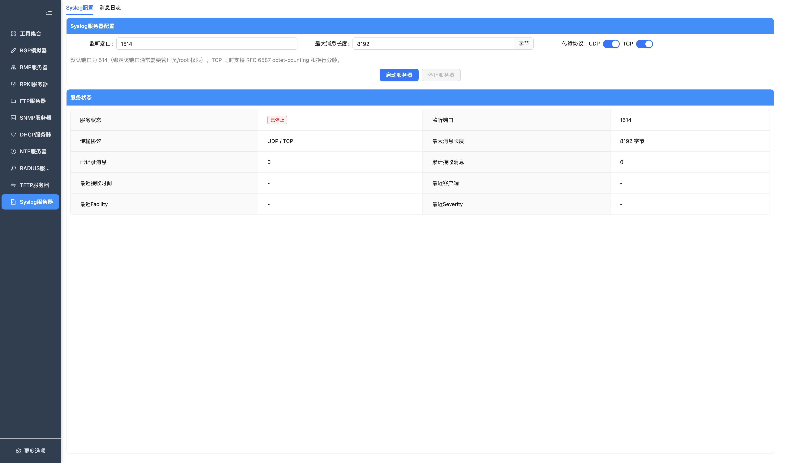
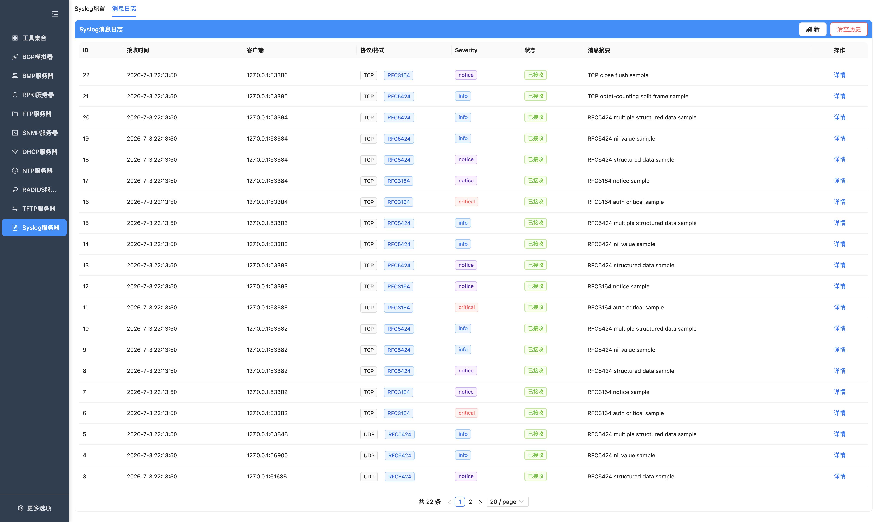
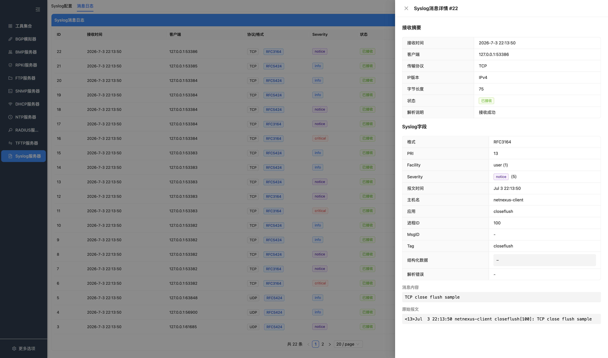

# Syslog 服务器

Syslog 模块提供本地 UDP/TCP Syslog 接收服务，用于实验室联调、日志格式验证和客户端上报测试。当前实现覆盖常用接收、解析、列表和详情查看能力，不是完整日志平台。

## 已实现能力

- Syslog 服务启动和停止。
- 自定义监听端口，默认 `514`。
- UDP 和 TCP 接收开关。
- TCP 支持 RFC 6587 octet-counting、换行分帧和 NUL 分帧。
- RFC3164 和 RFC5424 消息解析。
- RAW、PRI 异常、结构化数据异常等格式状态展示。
- 最大消息长度限制和截断状态。
- 消息日志分页、刷新、清空和详情查看。
- 服务状态统计，包括已记录消息、累计接收消息、最近客户端、最近 Facility 和 Severity。

## 页面

### Syslog 配置

按钮说明：

| 按钮 | 功能 |
| --- | --- |
| 启动服务器 / 已启动 | 按端口、最大消息长度和 UDP/TCP 开关启动 Syslog 服务。 |
| 停止服务器 | 停止 Syslog 服务并关闭 TCP 连接。 |

配置页用于设置监听端口、最大消息长度、UDP/TCP 传输协议，并启动或停止服务。服务启动后会展示当前状态和最近接收摘要。

### 消息日志

按钮说明：

| 按钮 | 功能 |
| --- | --- |
| 刷新 | 重新加载当前运行期内的 Syslog 消息列表。 |
| 清空 | 清空当前运行期内的消息历史。 |
| 详情 | 打开单条消息的接收摘要、解析字段、结构化数据和原始报文。 |

消息详情：

消息日志展示接收时间、客户端、协议/格式、Severity、状态和消息摘要。点击详情可查看接收摘要、Syslog 字段、结构化数据、消息内容和原始报文。

## 使用步骤

1. 进入 `Syslog服务器`。
2. 在 `Syslog配置` 中设置监听端口、最大消息长度和传输协议。
3. 点击 `启动服务器`。
4. 使用外部 Syslog 客户端发送消息。
5. 在 `消息日志` 页面查看列表和详情。

## 注意事项

- 默认端口 `514` 在部分系统上需要管理员/root 权限，测试时可改用高位端口。
- UDP 不保证可靠投递，丢包和乱序取决于系统和网络环境。
- TCP 长连接会受空闲超时和缓冲区限制影响。
- 消息历史保存在当前运行进程内，应用重启后不会恢复。
