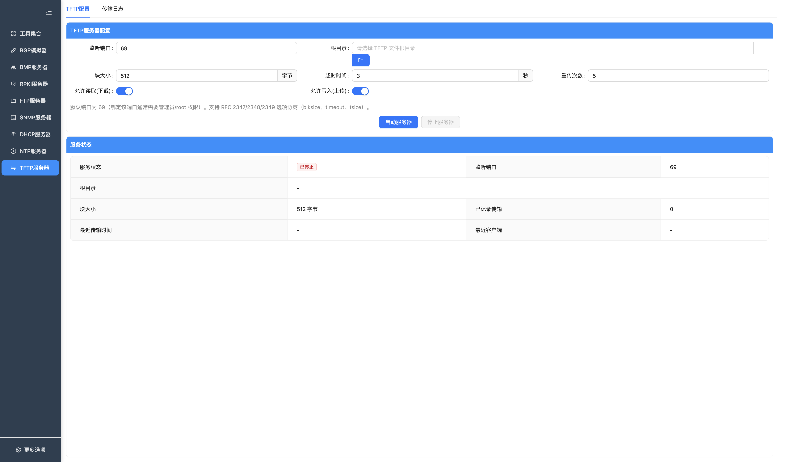
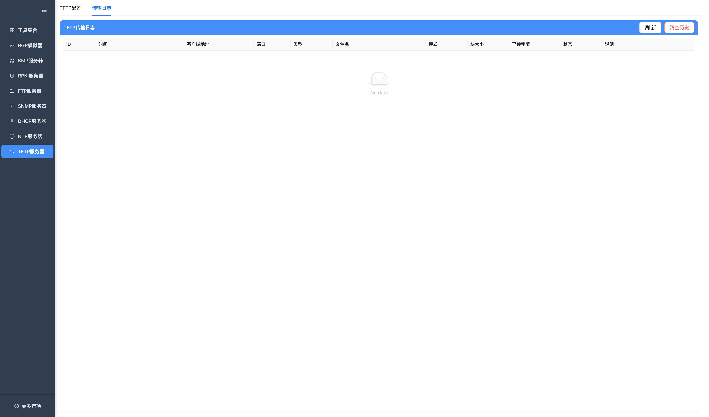

# TFTP 服务器

TFTP 模块提供本地 TFTP 服务，适合固件、配置文件和协议联调测试。当前支持基础上传/下载和常见选项协商。

## 已实现能力

- TFTP 服务启动和停止。
- 监听端口配置，默认 `69`。
- 根目录选择。
- 块大小配置。
- 超时时间和重传次数配置。
- 允许读取/允许写入开关。
- RFC 2347/2348/2349 常见选项协商：`blksize`、`timeout`、`tsize`。
- 传输日志查看。
- 传输日志清空。

## 页面

### TFTP 配置



主要字段：

- 监听端口。
- 根目录。
- 块大小。
- 超时时间。
- 重传次数。
- 允许读取。
- 允许写入。

### 传输日志



传输日志展示当前运行期内的传输记录，包括客户端、文件名、方向、状态和时间等信息。

## 使用步骤

1. 进入 `TFTP服务器`。
2. 选择 TFTP 根目录。
3. 设置监听端口、块大小、超时和重传次数。
4. 按需要开启读取或写入。
5. 点击 `启动服务器`。
6. 使用 TFTP 客户端上传或下载文件。
7. 在传输日志中查看结果。

## 注意事项

- 默认端口 `69` 在部分系统上需要管理员/root 权限，测试时可改用高位端口。
- TFTP 没有用户名密码认证，建议只在可信测试网络或本机环境使用。
- 根目录限制用于防止路径穿越。
- 当前日志是运行期记录，应用重启后不会恢复。

## 测试

CI 中包含 TFTP 端到端传输测试：

```bash
npm test
```

测试覆盖小文件、多块传输、选项协商、整数倍块大小、文件不存在、禁止写入和 IPv6 场景。
