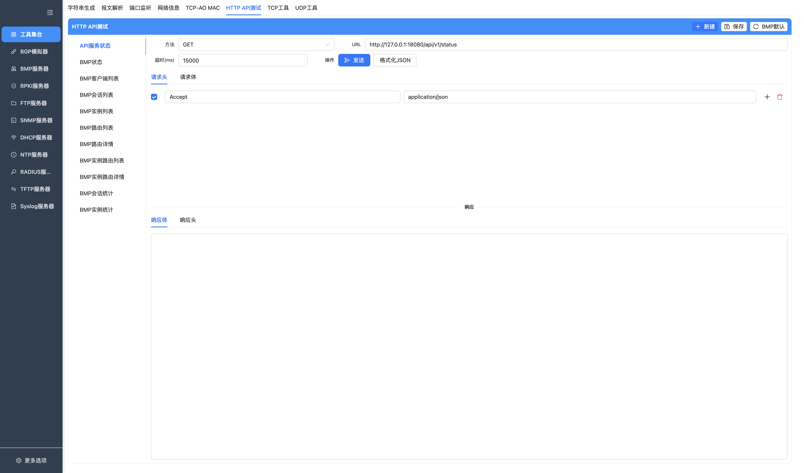
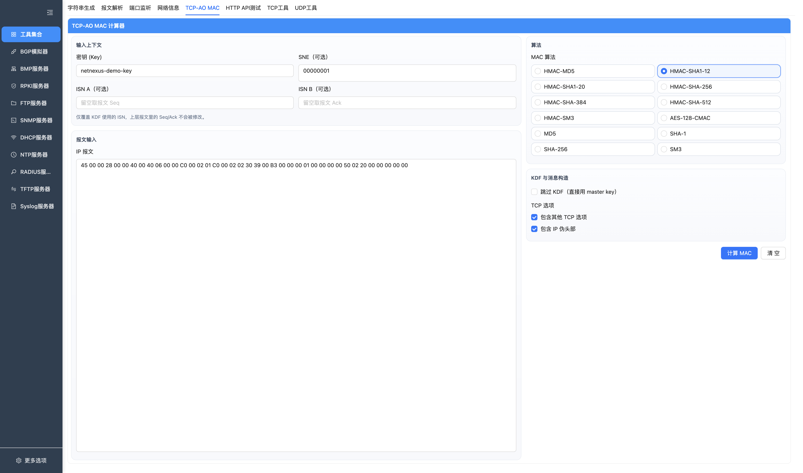
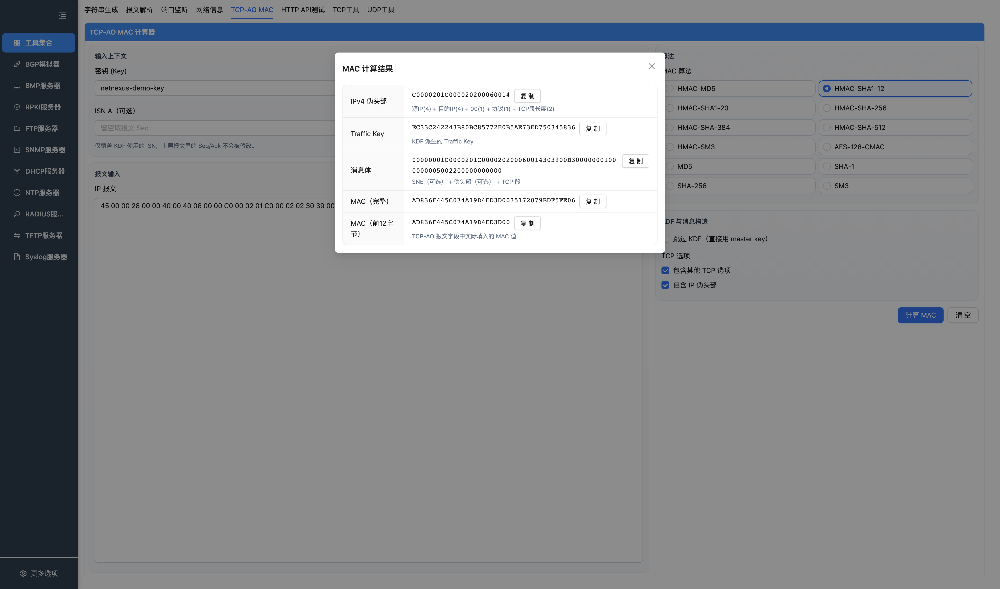
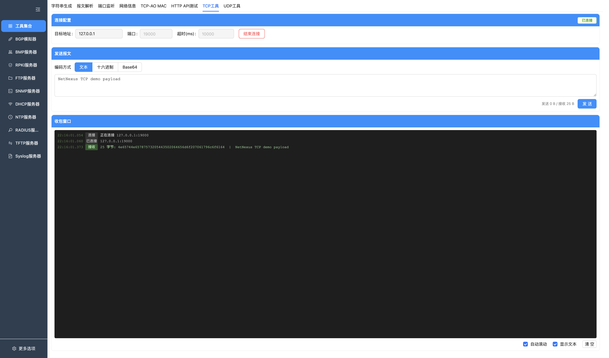
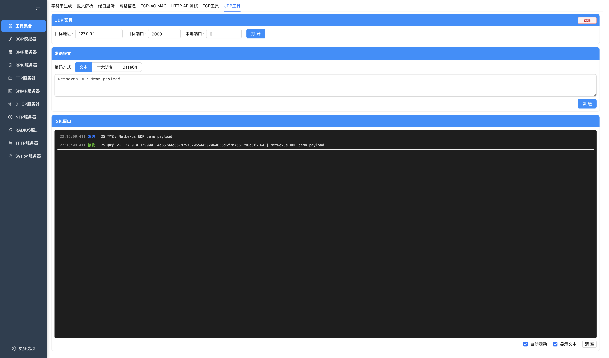

# 工具集合

工具集合包含本地调试常用的小工具。当前页面包括字符串生成、报文解析、端口监控、网络信息、HTTP API 测试、TCP-AO MAC 计算、TCP 工具和 UDP 工具。

## 字符串生成器

按模板批量生成字符串。

按钮说明：

| 按钮 | 功能 |
| --- | --- |
| 生成 | 按模板、占位符和起止值批量生成字符串。 |
| 清空 | 清空当前输入或生成结果。 |
| 历史 | 打开生成历史列表。 |
| 复制 | 复制生成结果。 |

支持：

- 模板输入。
- 自定义占位符。
- 起始值、结束值。
- 生成结果展示。
- 生成历史查看和清空。

## 报文解析器

解析十六进制报文，并展示协议字段树。

按钮说明：

| 按钮 | 功能 |
| --- | --- |
| 解析 | 按当前解析入口解析十六进制报文。 |
| 清空 | 清空输入和解析结果。 |
| 历史 | 打开报文解析历史。 |
| 复制树 | 复制协议字段树文本。 |

当前解析能力覆盖项目内置解析器支持的协议，常用包括：

- Ethernet。
- ARP。
- IPv4 / IPv6。
- TCP / UDP。
- ICMP。
- BGP。
- BMP。

支持：

- 粘贴十六进制字符串。
- 选择解析入口。
- 查看字段树和原始数据。
- 解析历史查看和清空。

## 端口监控器

查看本机端口和连接信息。

按钮说明：

| 按钮 | 功能 |
| --- | --- |
| 刷新 | 重新扫描本机端口和连接信息。 |
| 自动刷新 | 开启或关闭周期性刷新。 |
| 结束进程 | 对选中 PID 执行结束操作。 |

支持：

- TCP/UDP 连接列表。
- 本地地址、远程地址、状态、PID、进程名展示。
- 关键字过滤。
- 手动刷新和自动刷新。
- 对可终止进程执行结束操作。

说明：

- 端口数据来自本机系统命令或原生能力，字段完整度与当前系统有关。
- 结束进程会影响本机正在运行的程序，使用前需要确认 PID 和进程名。

## 网络信息

查看本机网络接口和地址信息。

按钮说明：

| 按钮 | 功能 |
| --- | --- |
| 刷新 | 重新读取本机网络接口、地址和路由信息。 |
| 添加地址 | 在支持的平台上为接口添加 IP 地址。 |
| 删除地址 | 在支持的平台上删除接口地址。 |

支持：

- 网络接口列表。
- MAC、IPv4、IPv6 等地址信息。
- 部分系统上的地址配置操作。

说明：

- 网络配置能力依赖操作系统权限和当前平台实现。

## HTTP API 测试

用于调试本机或远端 HTTP API。

按钮说明：

| 按钮 | 功能 |
| --- | --- |
| 发送 | 按当前方法、URL、请求头和请求体发送 HTTP 请求。 |
| 保存 | 保存当前 API 连接配置。 |
| 重置 | 恢复当前 API 连接到默认模板或清空编辑状态。 |
| 新建 | 新增一个 API 连接配置。 |
| 删除 | 删除当前 API 连接配置。 |
| 格式化 | 格式化 JSON 请求体。 |

支持：

- 多 API 连接管理。
- GET、POST、PUT、DELETE、PATCH、HEAD、OPTIONS。
- 请求头编辑。
- JSON 请求体编辑和格式化。
- 超时设置。
- 响应状态、耗时、大小、响应头、响应体展示。
- BMP 默认 API 模板。
- API 连接保存和重置。

页面使用 keep-alive，切换到其他页面再切回来不会重置当前编辑内容。

## TCP-AO MAC

用于计算 TCP-AO 报文认证码。

按钮说明：

| 按钮 | 功能 |
| --- | --- |
| 计算 MAC | 按输入报文、Key、算法和 KDF 参数计算 TCP-AO MAC。 |
| 清空 | 清空当前报文输入和计算结果。 |
| 复制 | 复制伪头部、Traffic Key、消息体或 MAC 字段。 |

计算结果：

支持：

- TCP 报文输入。
- Key、算法等参数配置。
- MAC 计算结果展示。
- 页面状态保存。

## TCP 工具

用于发起 TCP 客户端连接、发送报文并查看收包窗口。

按钮说明：

| 按钮 | 功能 |
| --- | --- |
| 连接 | 按目标地址、端口和超时参数发起 TCP 连接。 |
| 断开 | 关闭当前 TCP 连接。 |
| 发送 | 按文本、十六进制或 Base64 编码发送数据。 |
| 清空日志 | 清空当前 TCP 收发日志。 |

支持：

- 目标地址、端口和连接超时配置。
- 文本、十六进制、Base64 三种发送编码。
- 发送字节数、接收字节数统计。
- 收包窗口展示十六进制和文本内容。
- 手动断开连接和清空日志。

## UDP 工具

用于打开本地 UDP socket，向目标地址发送数据报并查看回包。

按钮说明：

| 按钮 | 功能 |
| --- | --- |
| 打开 / 关闭 | 打开或关闭本地 UDP socket。 |
| 发送 | 按目标地址、端口和编码发送 UDP 数据报。 |
| 清空日志 | 清空当前 UDP 收发日志。 |

支持：

- 目标地址、目标端口和本地端口配置。
- 文本、十六进制、Base64 三种发送编码。
- 发送字节数、接收字节数统计。
- 收包窗口展示来源地址、十六进制和文本内容。
- 手动关闭 socket 和清空日志。

## 历史和存储

当前有明确本地历史或状态保存的工具：

- 字符串生成器：生成历史。
- 报文解析器：解析历史。
- HTTP API 测试：API 连接配置。
- TCP-AO MAC：页面状态。
- TCP 工具和 UDP 工具：当前运行期连接和收包日志。

历史数量可在设置页配置。
