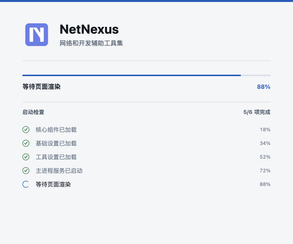

## 统一、清晰的桌面体验

NetNexus 将常用协议实验、数据查看和开发工具集中在同一个桌面界面中。文档中的页面截图由项目脚本基于当前实现生成。

## 从哪里开始

- 想快速运行源码，请看[开发与运行](DEVELOPMENT.md)。
- 想生成或查看 BGP 路由，请看[BGP 模拟器](BGP_SIMULATOR.md)。
- 想分析设备上报的 BMP 数据，请看[BMP 监控器](BMP_MONITOR.md)。
- 想通过本地 HTTP 接口读取 BMP 数据，请看[外部 API](API.md)。
